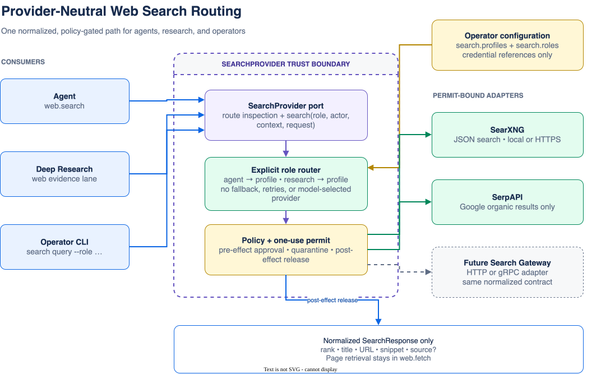

# Provider-Neutral Web Search

Colossus exposes one stable search boundary to agents, Deep Research, and operator
diagnostics. Operators choose a named profile for each logical role. The model supplies a
query and result limit, but it never chooses a provider, endpoint, credential, retry, or
fallback policy.



The editable source is
[`diagrams/search-routing.drawio`](diagrams/search-routing.drawio). The checked-in SVG is
exported from that source so this page renders on GitHub and in mdBook without a Mermaid
preprocessor.

## Configuration

Configure profiles at top level and route `agent` and `research` independently:

```yaml
search:
  profiles:
    local:
      kind: searxng
      endpoint: http://127.0.0.1:8888/search
      timeoutMs: 30000
    paid:
      kind: serp_api
      endpoint: https://serpapi.com/search.json
      credentialReference: env:SERPAPI_API_KEY
      timeoutMs: 30000
  roles:
    agent: local
    research: local

access:
  profile: development
  tools:
    include: []
    exclude: []
  actions:
    allow: []
    requireApproval: []
    deny: []

sandbox:
  networkDestinations:
    - http://127.0.0.1:8888
    - https://serpapi.com
```

Routes are exact. Colossus does not automatically fall back, load balance, or retry.
`development` and `allow_all` expose `web.search` when `search.roles.agent` resolves to a
valid profile. `pinned` additionally requires an exact `access.tools.include` entry.
Deep Research uses the same normalized path, but its web lane is disabled unless
`search.roles.research` is configured.

`schemaVersion` remains `1`; search profiles do not migrate canonical state.

## Search Contract

The model-visible `web.search` input is:

```json
{"query":"provider-neutral search","limit":10}
```

- `query` is required, non-empty, and at most 4,096 bytes.
- `limit` is optional, defaults to 10, and must be from 1 through 20.
- Results contain only `rank`, `title`, `url`, `snippet`, and optional `source`.
- Result URLs must use HTTP or HTTPS. Invalid result URLs are dropped.
- Titles, snippets, and source labels are bounded untrusted external content.
- Search does not retrieve result pages. Use `web.fetch` for an exact selected URL.

All consumers receive the same normalized `SearchResponse`. Provider-specific response
objects and arbitrary metadata never leave the adapter.

## Local SearXNG

SearXNG must enable JSON output. One development setup is:

```bash
docker run --name colossus-searxng --rm \
  -p 127.0.0.1:8888:8080 \
  -e SEARXNG_BASE_URL=http://127.0.0.1:8888/ \
  searxng/searxng:latest
```

If the image's settings disable JSON, mount a SearXNG `settings.yml` that includes
`json` in `search.formats`. Configure the exact `/search` endpoint and the exact loopback
origin as shown above. The adapter sends `q` and `format=json` and maps SearXNG `title`,
`url`, `content`, and `engine` fields. See the
[SearXNG Search API](https://docs.searxng.org/dev/search_api.html).

Run diagnostics without exposing the provider to the model:

```bash
colossus --config config.yaml search profiles
colossus --config config.yaml search query "Colossus security" --role agent --limit 5
colossus --config config.yaml search query "local models" --role research
```

`search profiles` never resolves credentials or opens a socket. `search query` uses the
normal policy gateway and therefore may request operator approval.

## SerpAPI

SerpAPI profiles require an environment-backed credential reference:

```yaml
search:
  profiles:
    paid:
      kind: serp_api
      endpoint: https://serpapi.com/search.json
      credentialReference: env:SERPAPI_API_KEY
      timeoutMs: 30000
  roles:
    agent: paid

sandbox:
  networkDestinations: [https://serpapi.com]
```

Set `SERPAPI_API_KEY` in the Colossus process environment. The adapter resolves it only
after receiving a one-use execution permit, injects it as `api_key`, forces
`engine=google`, and releases only normalized organic results. Live diagnostics can
consume paid quota; Colossus never retries a dispatched call automatically. See the
[SerpAPI Search API](https://serpapi.com/search-api).

## Security And Failure Semantics

Every first-party adapter enforces all of the following inside the permit-bearing
boundary:

- HTTPS is mandatory except for loopback HTTP development endpoints.
- The configured origin must exactly match `sandbox.networkDestinations` and the permit.
- DNS answers are resolved once and pinned into a proxy-free client.
- Redirects and ambient HTTP proxy settings are disabled.
- Response bodies and normalized fields are bounded.
- Credential references are the only secrets allowed in configuration and audit input.
- Resolved credentials are removed from provider output before parsing or release.
- Pre-effect denial happens before credential resolution or socket creation.
- Provider content remains quarantined until mandatory post-effect policy allows release.
- A transport failure after dispatch is `outcome_unknown`; callers must not silently
  retry a potentially billable request.

The `development` profile classifies `web.search` as approval-required by default.
Operators can explicitly allow the action for a trusted unattended route while
preserving post-effect quarantine.

## Compatibility

The native integration tool `searxng.search` remains available and unchanged for
integration workflows. `web.search` is the recommended model-facing interface because it
is provider-neutral.

The v0.8 research-only form remains a deprecated compatibility path when top-level
`search` is absent:

```yaml
research:
  search:
    kind: searxng
    endpoint: http://127.0.0.1:8888/search
    userAgent: colossus/0.8
```

It is translated internally to a `research` route through the same normalizer and
retains its existing `network.http` policy intent. Colossus rejects configurations that
contain both legacy `research.search` and top-level `search` because the active route
would otherwise be ambiguous.

## Future HTTP Or gRPC Gateway

The extension boundary is the `SearchProvider` port, not `web.search` arguments. A future
gateway adapter must:

1. Resolve an operator-selected role to safe route metadata without network access.
2. Accept `SearchRequest`, actor identity, and `ExecutionContext` through the port.
3. Cross the effect gateway before resolving credentials or creating transport state.
4. Enforce its exact HTTP origin or gRPC authority from the permit.
5. Return the existing normalized `SearchResponse`; never expose gateway envelopes.
6. Classify pre-dispatch failures, known terminal failures, denials, and
   `outcome_unknown` distinctly.
7. Preserve the no-fallback, no-implicit-retry rule.

This permits a gateway to live with the agent infrastructure in an offline environment
without coupling its custom HTTP or gRPC transport to the Colossus harness, CLI, research
workflow, or model schema.

## Troubleshooting

- `unmet prerequisite: agent search route`: add an exact `agent` route, exclude
  `web.search`, or remove its exact include.
- `origin ... is absent from sandbox.networkDestinations`: add the exact scheme, host,
  and port; paths do not belong in the origin allowlist.
- `search route unavailable`: configure the requested `agent` or `research` role. There
  is no fallback.
- `search credential unavailable`: verify the `env:VARIABLE` reference and process
  environment without placing the secret in YAML.
- `search outcome is unknown`: inspect provider state or billing before retrying.
- SearXNG returns an HTML or 403 response: enable JSON format and verify its limiter or
  authentication settings.
