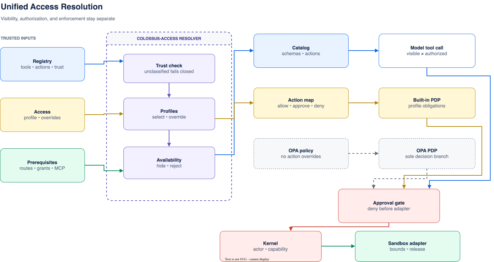

# Access and approvals

Colossus resolves every capability through three separate questions:

1. **Visibility:** may the model see the tool?
2. **Authorization:** is the tool's exact action allowed, denied, or approval-required?
3. **Enforcement:** do trust, the Safety Kernel, a one-use permit, and the sandbox allow
   this exact effect and resource?

<div class="diagram-scroll" markdown tabindex="0" role="region" aria-label="Access resolution diagram">



</div>

Reading the diagram without color: capability metadata and access configuration produce
the model-visible catalog and built-in decision; workspace plus sandbox configuration
produce separate resource obligations. Workflow lineage removes development inheritance.
Authorization, optional risk review, approval, the Safety Kernel, and a one-use permit
converge before the sandbox may reach the protected workspace or HTTP(S) egress proxy.
OPA replaces the built-in decision branch only. The editable source is
[`access-resolution.drawio`](../diagrams/access-resolution.drawio).

## Profile behavior

| Profile | Tool selection | Built-in action baseline |
| --- | --- | --- |
| `minimal` | Pure support; contextual support when applicable | Provider calls allowed; other effects denied |
| `development` | Applicable core and configured trusted extensions | Reads and Colossus state changes allowed; mutation, execution, external network, installation, and administration require approval |
| `allow_all` | All applicable trusted tools | Registered trusted actions allowed |
| `pinned` | Exact includes only | Denied except `provider.echo`; exact overrides opt in |

Tool inclusion never grants its effect action. An action override never supplies a
missing configured resource, credential, extension trust decision, or post-effect
release. A separate acknowledged full-access execution boundary can supply ambient
resource authority after the action decision; it does not create a capability.

## Exact override rules

- `tools.include` and `tools.exclude` contain exact tool names.
- `tools.include: ["*"]` selects all applicable trusted tools; excludes do not accept
  a wildcard.
- Action lists contain exact action names and cannot overlap.
- A deny is never repaired by changing the approval mode.
- Plan Mode, Goal Mode, interactive constraints, and child-agent scope can narrow the
  catalog but cannot widen it.

Use:

```bash
colossus --config .colossus/config.yaml config effective
colossus --config .colossus/config.yaml tools list
```

The first command explains selection and prerequisites. The second shows the active
schemas, effect identities, decisions, and output bounds. See
[Tools and action classes](../reference/tools-actions.md) for the canonical catalog.

## Approval modes

The global `--approval-mode` flag controls how an existing approval obligation is
satisfied:

| Mode | Behavior |
| --- | --- |
| `deny` | Fail closed without prompting |
| `ask` | Prompt on an interactive terminal |
| `risk-auto` | Automatically approve eligible low-risk shell, read-only network, and exact top-level MCP effects after review |
| `full-access` | Satisfy approval obligations automatically |

Approval modes do not convert policy denials into allows and do not add authority.

An active TUI can inspect its mode with `/permissions` and select one of the same four
values with `/permissions MODE`. The selection is process-local and applies to subsequent
interactive agent and plan operations from that TUI. A worker-backed TUI sends the
selection as a client-scoped override for each authenticated interactive operation; it
does not rewrite the worker default used by other clients or background work.

Colossus Desktop exposes the same four choices beside the Work composer when its
app-owned **Managed Local** target is selected. That native control updates the running
worker's default for subsequent Desktop and background work; client-scoped TUI choices
still take precedence for requests from that TUI. Desktop requires an operating-system
confirmation before elevation to `risk-auto` or `full-access`, rejects changes while a
managed run is active, and resets the worker default to `ask` on runtime restart. The
control is intentionally unavailable for External targets, whose approval behavior is
administered by their owner.

## Development shell

`development` keeps `shell.run` approval-required. It becomes visible when an executable
prerequisite exists; the `workspace-development` sandbox preset supplies the trusted
platform shell, Git when found, a read/write grant for the selected workspace, read-only
command/runtime roots, and an isolated `HOME`, temp directory, and sanitized `PATH`.

```bash
colossus -w /absolute/path/to/repository \
  --approval-mode ask tui
```

Use `--approval-mode risk-auto` only when the configured risk evaluator is trusted for
this role. Automatic proof minting is restricted to model or child-agent `shell.run`,
`web.search`, bodyless `network.http` GET, and configured top-level `mcp.call` effects
outside workflow lineage, and only a valid low-risk `allow` assessment qualifies. MCP
review is bound to the exact endpoint identity, server, tool, fresh schema hash, and
validated arguments. Descriptions and annotations are evaluator inputs only and remain
untrusted advisory hints. Other network methods, integrations, pack-provided MCP
actions, workspace mutations, unsupported metadata, and medium, high, malformed, or
unavailable assessments fall back to explicit approval or denial. Effect output remains
quarantined and post-effect authorized. Evaluator metadata omits resolved credentials
and authentication configuration.

When an eligible review is approved automatically, attached terminal and TUI clients
show an **Automatic approval review** notice with the action, resource, low-risk result,
`risk-auto` authorization, and released reason. This is an informational emission after
the durable `approval.granted.v1` record; it never replaces audit evidence.

If the evaluator is unavailable or its response fails strict validation, attached clients
first show an **Automatic approval review failed** warning with a sanitized failure
category. Colossus then falls back to the ordinary explicit approval prompt; provider
diagnostics and malformed model output are not released in the warning. A valid medium-
or high-risk assessment proceeds directly to explicit approval because the review itself
completed successfully.

Approval-mode `full-access` satisfies approval requirements without a prompt; it is not
the execution-boundary setting. The sparse configuration default separately uses
`access.profile: allow_all` plus sandbox `danger_full_access`, which is why ordinary
fresh configurations have few built-in approval prompts and ambient resources.

## Workflows and OPA

Durable workflows, system actors, and agents carrying workflow lineage never inherit
the `workspace-development` preset or `risk-auto` proof. With built-in policy they do
receive ambient authority when the acknowledged full-access boundary is active. Under
an isolating boundary they need exact configured filesystem, executable, environment,
and network grants.

OPA remains the sole action decision point when selected. Automatic
`workspace-development` grants are rejected with OPA; the OPA decision must return the
complete resource obligations. Full access does not rewrite an OPA decision: return
`obligations.resource_authority: ambient` when that exact effect should use the
acknowledged danger boundary, or omit it/use `declared` to keep exact obligations. The
Safety Kernel rejects `ambient` unless the runtime is configured for acknowledged
`danger_full_access`. Permit, quarantine, sandbox, and post-effect checks remain
mandatory in either mode.
