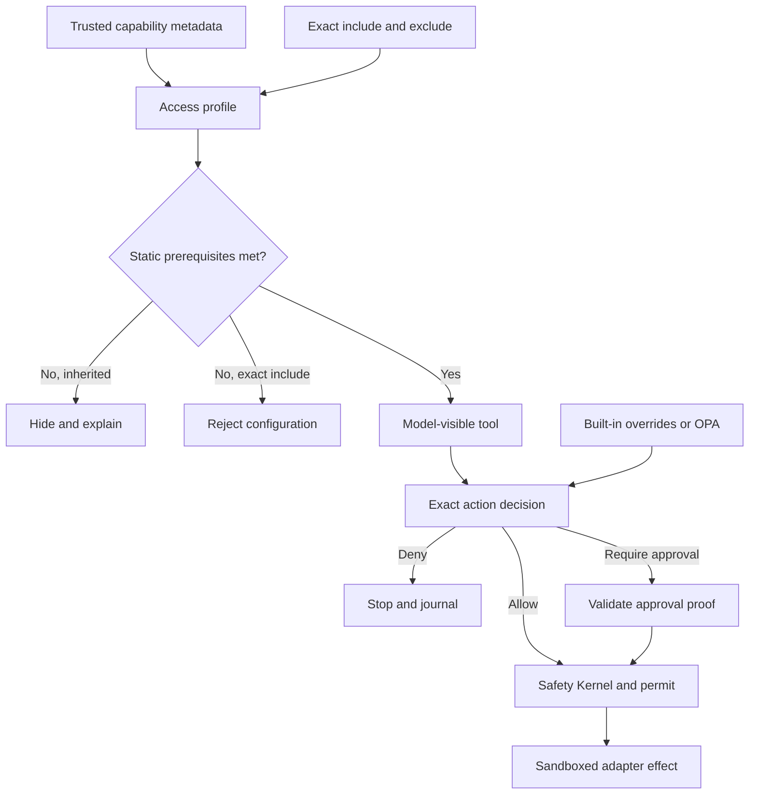

# Access and approvals

Colossus resolves every capability through three separate questions:

1. **Visibility:** may the model see the tool?
2. **Authorization:** is the tool's exact action allowed, denied, or approval-required?
3. **Enforcement:** do trust, the Safety Kernel, a one-use permit, and the sandbox allow
   this exact effect and resource?

<div class="diagram-scroll" markdown tabindex="0" role="region" aria-label="Access resolution diagram">



</div>

Reading the diagram without color: metadata and explicit selection determine
visibility; visibility leads to an independent action decision; only an allowed or
properly approved request can reach the local enforcement and adapter stages.

## Profile behavior

| Profile | Tool selection | Built-in action baseline |
| --- | --- | --- |
| `minimal` | Pure support; contextual support when applicable | Provider calls allowed; other effects denied |
| `development` | Applicable core and configured trusted extensions | Reads and Colossus state changes allowed; mutation, execution, external network, installation, and administration require approval |
| `allow_all` | All applicable trusted tools | Registered trusted actions allowed |
| `pinned` | Exact includes only | Denied except `provider.echo`; exact overrides opt in |

Tool inclusion never grants its effect action. An action override never supplies a
missing sandbox root, executable, origin, credential, extension trust decision, or
post-effect release.

## Exact override rules

- `tools.include` and `tools.exclude` contain exact tool names.
- `tools.include: ["*"]` selects all applicable trusted tools; excludes do not accept
  a wildcard.
- Action lists contain exact action names and cannot overlap.
- A deny is never repaired by changing the approval mode.
- Plan Mode, Goal Mode, interactive constraints, and child-agent scope can narrow the
  catalog but cannot widen it.

Use:

```bash
colossus --config .colossus/config.yaml config effective
colossus --config .colossus/config.yaml tools list
```

The first command explains selection and prerequisites. The second shows the active
schemas, effect identities, decisions, and output bounds. See
[Tools and action classes](../reference/tools-actions.md) for the canonical catalog.

## Approval modes

The global `--approval-mode` flag controls how an existing approval obligation is
satisfied:

| Mode | Behavior |
| --- | --- |
| `deny` | Fail closed without prompting |
| `ask` | Prompt on an interactive terminal |
| `risk-auto` | Automatically approve only eligible low-risk shell effects after review |
| `full-access` | Satisfy approval obligations automatically |

Approval modes do not convert policy denials into allows and do not add authority.
