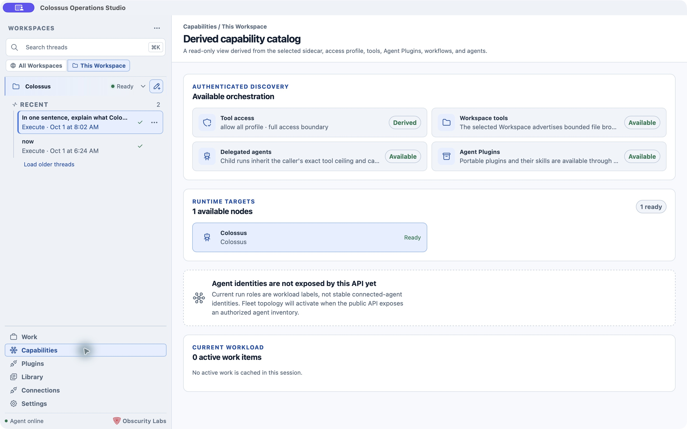
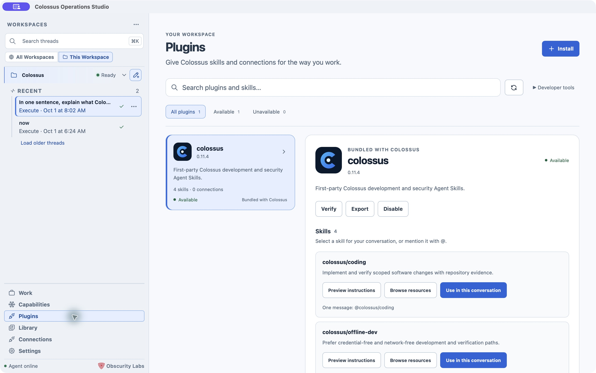

# Capabilities and plugins

The left navigation shows what the selected workspace or runtime makes available. **Capabilities** is the read-only starting point; **Plugins** is where you inspect and manage installed Agent Plugins.

## See what this workspace advertises

Open **Capabilities** to see the effective tool access profile and execution boundary, available workspace tools, delegated agents, workflows, and Agent Plugins. The runtime-target section shows which local or External nodes are ready, and the current workload lists active work items you can open.

This view is derived from authenticated runtime discovery. A listed capability means the selected runtime advertises it; its use still depends on policy, configuration, and approvals. Current run roles are workload labels. Desktop does not yet expose a stable inventory of connected agent identities or a live fleet topology from the public API.

## Use an installed skill

Open **Plugins** to search or filter installed plugins. Select a plugin to see its description, version, availability, skills, and MCP servers. A skill can show **Preview instructions** and **Browse resources** before you use it. Choose **Use in this conversation** to add its mention to the composer, or type `@` and select the skill there. The skill influences that conversation; it does not silently grant extra tools or authority.

On Managed Local, the plugin page can install, verify, export, disable, and manage plugins when the runtime offers those operations. **Developer tools** exposes validate, package, pull, push, and garbage-collection actions. An External target may offer read-only plugin discovery instead. Review a plugin's origin and capabilities before installing or enabling it. [Learn about Agent Plugins](../extend/plugins.md).

Plugin-provided MCP servers are listed in the plugin details. Enable each one explicitly in the workspace's [plugin settings](settings.md#connections-search-and-telemetry); storing a credential alone does not enable it. Standalone MCP server definitions live in Global and Workspace settings. [MCP guide](../use/mcp-servers.md)

Classic Outlook is a special case on Windows: its live COM connection needs the
**Connect Outlook session** control in the signed plugin's details. The older published
alpha.3 package has only a sandboxed stdio server and cannot attach to the running
Outlook session. [Plugin installation and Outlook requirements](../use/outlook-classic.md)

## Other navigation destinations

- **Library** lists released artifacts and their safe metadata for the current Desktop session. Open a thread's **Resources** or **Artifacts** pane for its specific outputs.
- **Connections** shows folder-backed workspaces and saved External daemons. Select a target there to route subsequent Work actions to it. [External target setup](external-targets.md)
- **Settings** manages shared definitions and the selected workspace's accepted configuration. [Settings guide](settings.md)

## Next step

Start a [Desktop task](work.md#start-a-task) with a skill, or open [Session views](session-views.md) to inspect the result and its released evidence.
