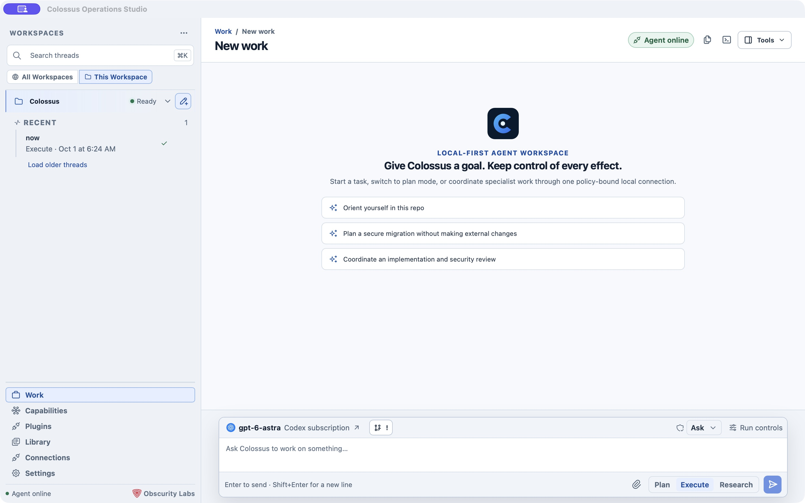

# Colossus Desktop

Colossus Desktop puts a local agent workspace around your projects. Choose a folder, connect a model, and give the agent work in **Plan**, **Execute**, or **Research** mode. The app keeps conversations, plans, sources, and released outputs together while you decide which effects it may perform.

-   :lucide-apple:{ .lg .middle } **macOS**

    ---

    Install the Apple silicon app, choose a folder, and connect a model.

    [Start on macOS :lucide-arrow-right:](../get-started/desktop.md)

-   :lucide-monitor:{ .lg .middle } **Windows**

    ---

    Install the signed x64 app and start Managed Local in a workspace.

    [Start on Windows :lucide-arrow-right:](../get-started/windows-desktop.md)

*Captured from a locally running development build with Managed Local ready and a connected Codex model. The exact controls shown depend on the platform and the selected runtime.*

## Find your way around

The left side is your workspace and thread list. **Work** is where you start or resume conversations. The other destinations show what the selected runtime can do and how it is configured.

| Go to | Use it for |
| --- | --- |
| [Workspaces](workspaces.md) | Add a folder, switch runtimes, search threads, and archive old work. |
| [Work and threads](work.md) | Start a run, switch modes, queue a follow-up, search or organize threads. |
| [Session views](session-views.md) | Inspect a conversation, plan, activity, sources, snapshots, and other resources. |
| [Tools beside your work](tools.md) | Browse files, inspect changes, open a terminal, view artifacts, or ask in an Aside. |
| [Capabilities and plugins](capabilities.md) | See the selected runtime's advertised tools and use installed skills or plugin connections. |
| [Settings and access](settings.md) | Choose a model, set workspace access, manage shared connections, and run diagnostics. |
| [External targets](external-targets.md) | Connect Desktop to an enrolled daemon instead of a managed local workspace. |

## What runs locally

Each Desktop workspace is a folder you select with the native picker. **Managed Local** starts the app's bundled runtime for that folder; there is no separate daemon to install for the normal path. Desktop stores its own configuration and conversations in a private Colossus home partition rather than writing them into the selected repository. The folder still supplies the working context for tools and relative paths.

The workspace name and **Ready** state appear in the sidebar. **Agent online** means Desktop has a usable authenticated connection to its selected runtime. A real model response also requires a configured provider and model. An offline self-test can check local startup without a model credential.

Selecting a folder does not itself restrict every tool to that folder. Review the [access profile and execution boundary](settings.md#access-and-execution-boundaries) before running on a sensitive project.

## Desktop or CLI?

Desktop is useful when you want conversations, run controls, files, plans, and settings in one window. The [CLI quickstart](../get-started/quickstart.md) and [Terminal UI](../use/terminal-ui.md) are available when you prefer a shell. Desktop can also open its bundled Colossus TUI beside a conversation on supported Managed Local workspaces. CLI and Desktop state stay in separate partitions even when they point at the same repository.

## Start here

1. [Install and set up Desktop](../get-started/desktop.md) on macOS, or follow the [Windows installation](../get-started/windows-desktop.md).
2. [Start your first Desktop task](work.md#start-a-task).
3. [Explore the tools beside the conversation](tools.md).

Organizations can share provider and model choices through a [Desktop setup file](../get-started/desktop-setup-files.md). Desktop reviews that file locally before importing it; API keys are entered separately.
