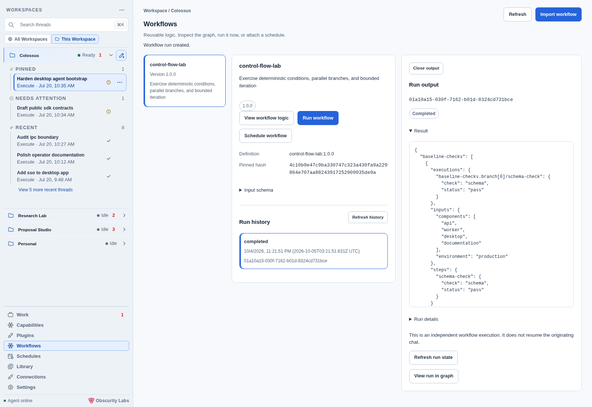
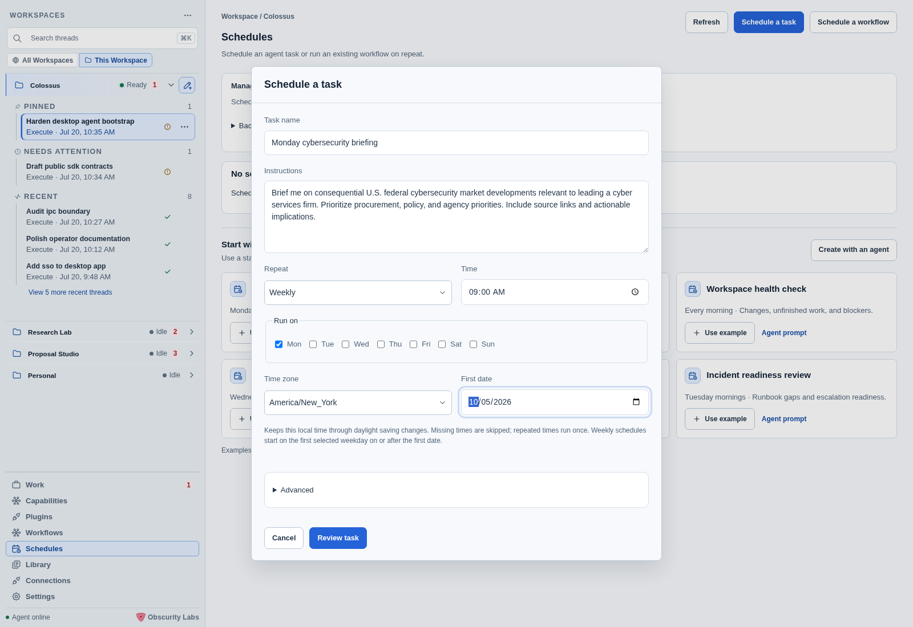
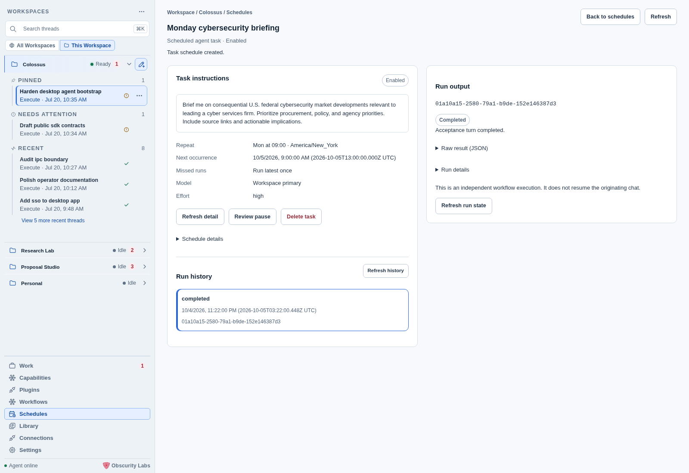
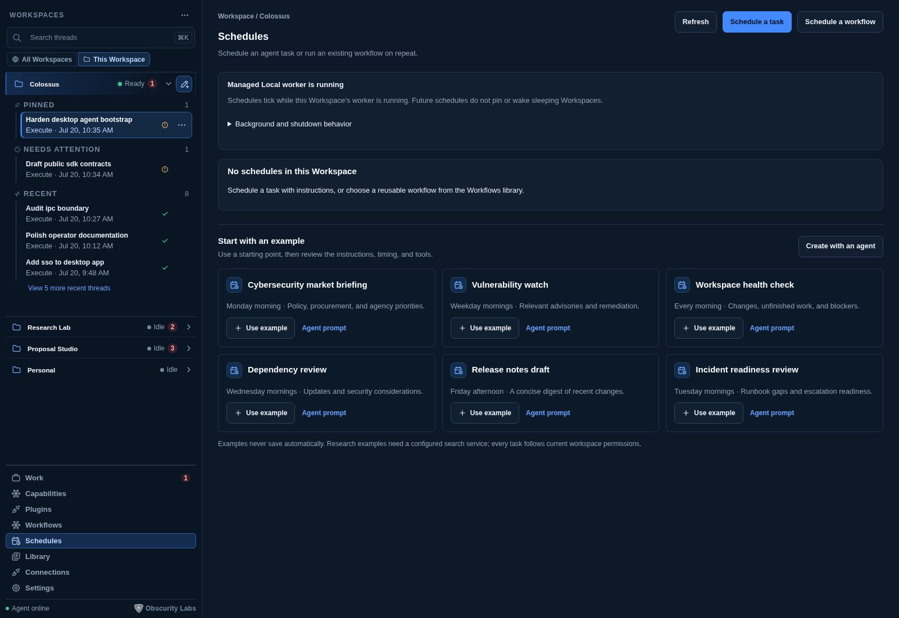
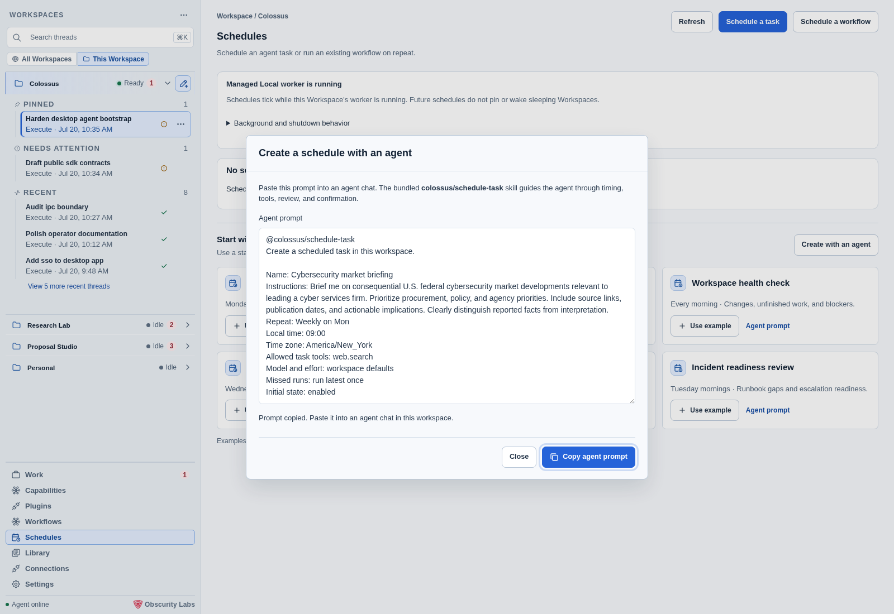
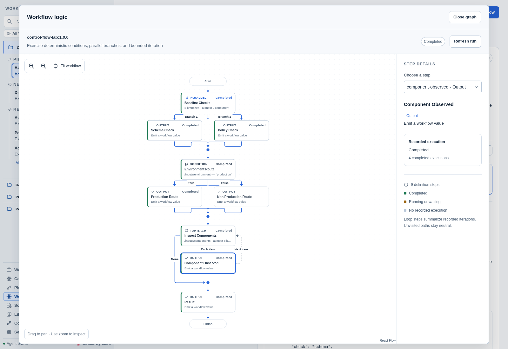
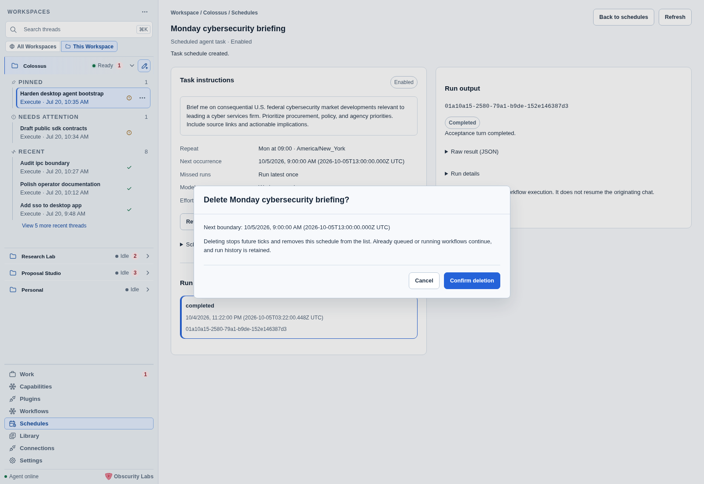

# Workflows and schedules

Open **Workflows** to manage reusable definitions, inspect their logic, and run them
with structured inputs. Open **Schedules** to choose when a workflow or agent task runs.
A workflow defines the work; a schedule supplies its timing.

## Import and run a workflow

1. In **Workflows**, choose **Import workflow**, paste existing declarative YAML, and
   select **Validate and review**. Check the name, version, input schema, and exact hash.
2. Select **Register workflow**. Registration does not execute the definition. Different
   content needs a new version; registration cannot replace an existing version.
3. Select the workflow and choose **View workflow logic**. The graph is available before
   creating any schedule.
4. Choose **Run workflow**. Simple input schemas provide labeled fields; **Edit JSON**
   preserves access to the full input object. Nested or complex schemas use JSON directly.
5. Review the exact definition and inputs, then choose **Start workflow**. Inspect the
   independent run and refresh **Workflow run history** to see owned executions.

Workflow resources captured through the production managed SDK and an isolated real
sidecar; surrounding Workspace navigation uses the Desktop test fixture.

History lists this application's runs for the selected definition, newest first.
Selecting a run shows its status, recorded step states, and bounded final JSON result
in the output panel on the right. At compact widths the panel appears below the
details. **Close output** returns to the definition and history. A result larger
than 64 KiB is omitted. Run allocation preserves the
reviewed definition hash and a durable retry identity. If its response is unconfirmed,
**Confirm same run request** repeats that exact identity after an explicit action.

Managed Local stores definitions and schedules in its private Workspace partition.
Separate CLI registrations are not imported automatically. See
[Your first workflow](../extend/workflows/first-workflow.md) for definition authoring.

## Schedule a task

In **Schedules**, choose **Schedule a task**, give it a name, and write instructions in
plain language. Choose **Daily** or **Weekly**, a local time, an IANA timezone, and a
first date. Weekly schedules start on the first selected weekday on or after that date.

**Advanced** provides a configured model profile, reasoning effort, allowed tool names,
missed-run policy, and initial enable state. The selected provider must support the
chosen effort. **Model default** preserves the profile's configured effort; Echo
requires that default. Every tool call follows current Workspace permissions and
approval rules. New task schedules default to enabled.

Select **Review task**, inspect the instructions, recurrence, first UTC occurrence,
model, tools, and policy, then choose **Create task schedule**. Each occurrence starts a
fresh agent session on the selected runtime. The worker must be running. Managed Local
runs on this computer; an external target runs on its configured host.

A task uses an internal one-step workflow. Its definition and schedule are allocated
atomically, and internal task definitions stay out of the reusable Workflows library.
Select the schedule to open its own task detail page, with instructions, timing,
controls, and run history. **Back to schedules** returns to the inventory.

Select a run to read the agent's response in the output panel on the right.
**Raw result (JSON)** exposes its exact released result; run metadata stays in
**Run details**. **Refresh history** loads newer executions.

## Start with an example or an agent

The Schedules page includes six editable starting points: a cybersecurity market
briefing, vulnerability watch, workspace health check, dependency review, release
notes draft, and incident readiness review. **Use example** fills the task form,
including its suggested recurrence and tool ceiling. Review and adapt these fields
before creating anything. Research examples need a configured search service.

**Agent prompt** opens a copyable prompt for that example, using your local IANA
timezone. Paste it into an agent chat in the same Workspace. The bundled
`colossus/schedule-task` skill guides the agent through timing, permissions, exact
allocation, and confirmation.

You can also ask directly:

> @colossus/schedule-task Every Monday at 9 AM America/New_York, brief me on federal
> cybersecurity procurement and policy changes. Include source links and actionable
> implications. Use workspace model defaults and run the latest once if missed.

The dedicated `workflow.task.schedule` tool accepts instructions and calendar timing
without a registered workflow or JSON input object. It uses the same policy, review,
ownership, and retry protections as ordinary schedule creation. Managed Local exposes
it to agents; external applications must explicitly grant the tool and the required
scopes. The skill's tool metadata does not expand authority. An uncertain response
must be reconciled using the same schedule ID and retry identity.
Agent task instructions and preferences must fit the 48 KiB inline approval review
bound; a larger request needs smaller instructions before allocation.

## Schedule a reusable workflow

Choose **Schedule workflow** from a selected definition in **Workflows**, or
**Schedule a workflow** in **Schedules**. Select the registered definition, enter a
unique schedule ID, and provide its schema-based fields or JSON inputs.

Choose calendar timing or a **Fixed interval** from one minute through 31 days.
Review the exact definition hash, immutable input snapshot, UTC start, recurrence,
missed-run policy, and initial state before choosing **Create schedule**. Workflow
schedules default to paused.

Calendar recurrence preserves the selected local time across daylight saving changes.
Missing local times are skipped; repeated local times run once at the earlier instant.
A first occurrence in a missing local time is rejected so the reviewed start is explicit.
Fixed intervals measure elapsed time: every 24 hours can shift its local hour across DST.

With one due occurrence, both missed-run policies queue a run. With multiple overdue
occurrences, **Run latest once** queues the latest once; **Skip catch-up runs** queues
none and advances to the next future boundary. Calendar reconciliation is bounded to
10,000 occurrences; a larger backlog blocks and pauses the schedule for inspection.

If creation is unconfirmed, choose **Check stored schedule**. Preserve the original
reviewed request and retry key. Desktop never automatically repeats a mutation or
allocates a new key after a lost response.

## Inspect workflow logic and execution

**View workflow logic** displays the exact definition. Parallel checks separate into
lanes; conditions label True and False paths; bounded loops show their body, next-item
path, and exit. Child workflow nodes identify the referenced definition. Explicit
recovery steps appear as a separate failure path.

This example completed through the real managed runtime. Select a node or use
**Choose a step** to inspect logic and recorded execution. Zoom, pan, and **Fit workflow**
help navigate larger graphs. Completed steps carry recorded evidence; unvisited paths
remain neutral. Loop counts summarize distinct executions. Desktop checks the definition
hash against the selected schedule or run before displaying an execution overlay.

## Control future work

Select a schedule to inspect its timing, ownership, next occurrence, last dispatch, and
last independent run on a dedicated detail page. The overview and examples stay in the
inventory. Select a past run to see its output beside the task; **Schedule details**
expands additional metadata. **Queued** describes dispatch rather than execution success.
**Inspect last workflow run** shows queued, running, waiting, completed, failed,
cancelled, or interrupted state.

**Review pause** stops future ticks without cancelling existing runs. **Review enable**
preserves the retained boundary and can reconcile overdue occurrences. A tick or control
change invalidates a stale review: refresh and review again. To change immutable fields,
create a replacement schedule and pause the previous one.

**Delete task** or **Delete schedule** opens a confirmation using the latest stored
revision. Confirming removes it from the inventory and stops future ticks. Already
queued or running executions continue, and owned run history remains available through
the run API. Reusable workflow history also remains in Workflows. A stale review requires another inspection and
confirmation; Desktop never automatically retries deletion. External runtimes must
advertise `schedules.delete` before the control is available. Legacy records cannot
be deleted through application control.

If deletion is unconfirmed, **Refresh schedules** reloads the owned inventory without
repeating the mutation. Confirm the stored state before taking another action.

A blocked definition is never repinned automatically. Restore its exact definition and
dependencies, or register a new version and create a new schedule. Legacy schedules
with unknown ownership expose metadata only; Desktop cannot claim their inputs, task
instructions, run details, or control authority.

## Availability and agent requests

Managed Local ticks while its worker runs. Retained unselected workers keep ticking;
Desktop retains up to four workers. Future schedules do not pin or wake an idle
Workspace when another needs capacity. Queued, running, or waiting work counts as active
for eviction and configuration drain. Closing the main window leaves Desktop running
in the macOS menu bar or Windows system tray; shutting down Colossus stops workers.
Resume reconciles missed occurrences using the selected policy.

Agent schedule requests use the ordinary policy and approval path. Default policy
requires review for creation, including paused schedules, enabled-state changes, and deletion.
Ask and Risk auto prompt; Deny rejects approval obligations. Explicitly elevated Full
access can satisfy an approval obligation, while policy denials continue to deny.
Future occurrences undergo current workflow and effect authorization independently.

External targets need advertised resources and explicit enrolled scopes. Older runtimes
can retain fixed workflow scheduling while unavailable calendar, task, manual-run, or
history features remain disabled. See [External runtime targets](external-targets.md).
Desktop does not widen their grants.

## Next step

Use [Triggers and recovery](../extend/workflows/triggers-recovery.md) for worker operation
and reconciliation of interrupted effects.
