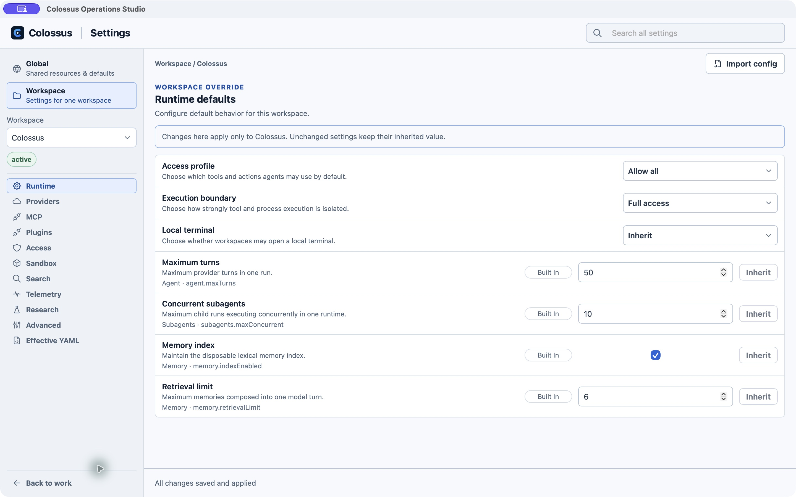

# Settings and access

Open **Settings** from the left navigation or type `/settings` in Work. The dedicated settings view has a searchable sidebar. Choose **Global** for shared resources and defaults, or **Workspace** for the selected folder's effective configuration. **Back to work** returns to the conversation.

## Global and Workspace

Global settings hold reusable providers, models, credentials, MCP servers, search services, telemetry connections, defaults, and Desktop preferences. Each workspace selects and overrides the resources it needs. A workspace setting shows whether its value is **Built In**, inherited from **Global**, or overridden for that workspace. Choose **Inherit** to remove an override instead of copying a current value.

Under **Global → Desktop**, **Appearance** sets the color theme and text size and shows a live palette preview. Choose **Light colors** or **Dark colors** to edit each theme's accent, background, surface, and icon colors separately. Icon colors apply to navigation and common tool icons; status and warning icons retain their semantic colors. The active theme changes immediately; the other palette appears in the preview and takes effect when that theme becomes active, including when **System** follows your operating system. Background, surface, and icon choices must keep content readable. **Reset light colors** and **Reset dark colors** restore the corresponding default palette. **Git** controls automatic refresh and whether Changes or History opens first. Turning off automatic refresh leaves the Git pane's manual Refresh action available. **Browser** sets an optional full HTTP or HTTPS address for new tabs; leave it blank to open an empty tab. **Terminal** has one local terminal switch and a default session choice. New workspaces select terminal access by default, and the first terminal action asks for native confirmation. You can also confirm from the Terminal settings page. These view preferences stay on this device. The Browser page is available in Settings even if the current build does not offer the native Browser pane.

| Global section                 | Workspace section                  | What you change                                                                 |
| ------------------------------ | ---------------------------------- | ------------------------------------------------------------------------------- |
| Providers, Models, Credentials | Providers                          | Available model connections and the model this workspace uses.                  |
| MCP, Plugins                   | MCP, Plugins                       | Shared definitions and the servers or plugin capabilities enabled here.         |
| Search, Telemetry              | Search, Telemetry, Research        | Services, routing, and policy for this workspace.                               |
| Defaults                       | Runtime, Access, Sandbox, Advanced | Default limits and workspace-specific behavior.                                 |
| Desktop                        | Effective YAML                     | App preferences and a sanitized view of the workspace's accepted configuration. |

Use **Search all settings** when you know a setting's name but not its category. Workspace **Import config** inspects a repository's `.colossus/config.yaml` and proposes Desktop resources and overrides for review; it does not rewrite that file. Same-name conflicts require an explicit choice. Secret references must be mapped to Desktop credentials.

Saving a Global provider, model, MCP, search, or telemetry resource creates a new revision. Credentials keep a stable named identity when their tokens change. Idle workspaces can accept compatible configuration updates automatically; active runs keep their current configuration until they finish. Changes needing broader authority require native confirmation. Workspace edits are applied with **Apply Workspace changes** after validation. If a workspace is busy, Desktop drains active work before restarting its managed runtime; the settings footer reports pending, failed, or applied updates.

## Choose a provider and model

In **Global → Providers**, add a provider preset or compatible endpoint. Add or edit its models in **Global → Models**; then choose the model under **Workspace → Providers**. The provider list can show configured models and workspaces using a connection. A saved provider or credential means it is configured, not that a network test succeeded. Use the workspace's **Test** action to check the effective connection through its running worker.

API keys and manual tokens are entered in a native prompt and saved in Desktop's private credential vault. **Global → Credentials** shows availability without exposing values. Use **Re-enter token** when a credential is missing after an upgrade; use **Rotate** to replace a token while retaining its named entry, type, and references. An empty credential imported from a setup file offers **Add token**. Active workspaces refresh when idle, though open terminal sessions may defer the refresh. You can delete a credential after no current definition or workspace-pinned revision uses it. OAuth-based MCP connections may need a new sign-in. Codex subscription connections use **Sign in with ChatGPT** through the official Codex CLI.

If your organization distributes its catalog, [import a Desktop setup file](../get-started/desktop-setup-files.md). Review the endpoint, model limits, instructions, and any certificate trust request before applying it. Importing a catalog does not automatically select every provider for a workspace.

## Access and execution boundaries

In **Workspace → Runtime**, review two independent controls before an agent works in a project:

- **Access profile** decides which tools and actions are available by default. **Allow all** is broad; **Development** and **Minimal** narrow access.
- **Execution boundary** decides how strongly execution is contained. **Full access** permits authorized tools to use host resources beyond the chosen folder. **Workspace isolated** contains execution around derived workspace resources. **Offline isolated** uses a narrower platform isolation profile and hides generic model-visible HTTP/fetch tools, while still allowing the selected provider's required service and sign-in destinations. It is not an air gap.

The selected folder is the working context even under Full access; it is not automatically a filesystem wall. Use [Access and approvals](../admin/access-and-approvals.md) and [Sandbox](../admin/sandbox.md) for the full authority model. For a deployment with no remote transport, see [Offline operation](../admin/offline-airgap.md).

### Approval mode

The permission selector beside the Work composer controls approval-required effects for subsequent Managed Local work:

| Mode            | Behavior                                           |
| --------------- | -------------------------------------------------- |
| **Deny**        | Rejects effects that require an approval.          |
| **Ask**         | Shows an approval card so you can decide.          |
| **Risk auto**   | Allows eligible low-risk effects after evaluation. |
| **Full access** | Satisfies approval obligations without asking.     |

Managed Local starts in **Risk auto**. Manually increasing approval authority to Risk auto or Full access requires native operating-system confirmation. You cannot change it during an active managed run. It returns to **Risk auto** after Managed Local restarts. This mode does not change policy decisions, the tool ceiling, the access profile, or the execution boundary. External targets are administered independently and do not expose this local selector.

For a command requiring approval, **Review command…** opens a dedicated window with its full command and working directory. Choose **Allow once**, **Always allow**, or **Deny** there; closing the window leaves the command unapproved. **Always allow** remembers that exact executable, arguments, and working directory for this local workspace. A changed command, replaced workspace directory, or changed workspace configuration requires another decision. Redacted commands and External targets offer **Allow once** only. Remembered decisions survive app restarts, stay on this computer, and are omitted from setup exports. Clear them under **Workspace → Access → Clear remembered commands**. Policy denials and sandbox restrictions still apply.

## Connections, search, and telemetry

Define reusable standalone MCP servers under **Global → MCP**, then enable and test the selected servers under **Workspace → MCP**. Plugin-provided servers are managed through **Plugins** settings. A health check reports bounded connection diagnostics from the authenticated workspace runtime. If a server works in the CLI but not Desktop, compare its effective endpoint, credential bindings, CA trust, and runtime permissions; Desktop and CLI can use different configuration and state. [MCP guide](../use/mcp-servers.md)

**Global → Search** stores search services; **Workspace → Search** chooses routing for this workspace. **Workspace → Research** contains its research behavior. **Global → Telemetry** defines connections, while **Workspace → Telemetry** controls what this workspace exports. Saved destinations do not imply successful delivery; use their available health tests and diagnostics.

## Desktop preferences and support

Under **Global → Desktop**, adjust appearance, additional CA certificates, a client certificate and key, update checks, and diagnostic export. A PEM CA bundle is copied into private native storage after validation; Desktop displays its certificate count and fingerprints, not the original path. Importing or removing it restarts Managed Local. Use this when a private provider or organizational TLS gateway requires extra trust.

For services that require mutual TLS, import a PEM client certificate chain and its matching PEM private key under **Client identity**. Desktop validates the pair, saves it in private native storage, and restarts Managed Local so Colossus-owned provider, HTTP MCP, and other authorized TLS calls can present it. Treat this as a global identity for the destinations you allow the app to contact. The updater does not present it because downloads can redirect to another origin. External MCP processes manage their own TLS credentials.

Stable builds with a configured signed update channel can use **Check for updates** and **Install update**. Preview and development builds may have no update channel; install a newer release manually after checking its release notes. **Export diagnostics** produces a bounded local report without prompt text, model output, credentials, or private paths. Reproduce a connection failure before export so its latest health report is included.

The main window can close while Desktop continues from the menu bar or notification area. On Windows, left-clicking the tray icon restores the existing window; right-clicking opens its menu. Launching the app again also restores that instance. When a running thread needs input, finishes, or fails while the window is hidden or unfocused, an operating-system notification may show its title and a short response or error preview. Desktop removes common Markdown formatting from the preview, suppresses duplicates, and limits notification bursts. Control notification visibility in your operating system's settings.

## Next step

Return to [Work](work.md) to try the configuration, or use [Capabilities](capabilities.md) to see what the selected runtime now advertises.
