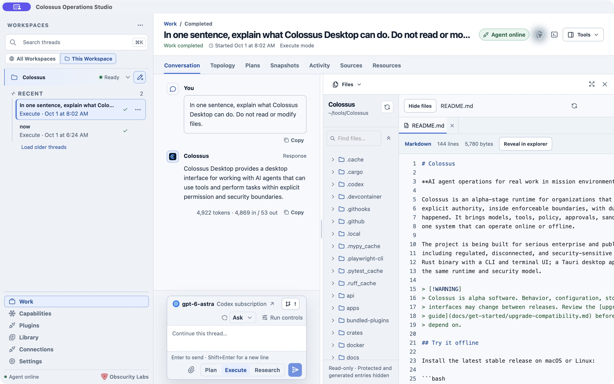

# Tools beside your work

Select **Tools** above a conversation to open a pane on the right. The tool switcher changes the pane without leaving your thread. Files and Terminal also have quick buttons in the Work header when available. Close the pane to give the conversation more room; opening it again restores its current context. Available tools depend on the platform, selected runtime, and workspace capabilities.

## Files

**Files** is a read-only browser for the selected workspace. Expand folders or search by filename and path, then open a file for syntax-highlighted preview. Open multiple files in tabs. When a run releases a file reference or diff, Desktop can open it in this pane. Protected and generated entries are hidden by the file browser; the pane itself does not edit files.

## Changes

**Changes** shows the current Git branch, changed-file count, and staged, unstaged, untracked, or conflicted files. **History** lists recent commits and affected files. Choose **Refresh Git** if you need a fresh view. This is inspection: Desktop does not stage, commit, switch branches, or contact remotes from this pane.

Under **Settings → Global → Git**, choose the opening view and whether Desktop refreshes Git on focus and periodically. You can still refresh manually when automatic refresh is off.

For a linked worktree or a folder inside a larger repository, **Connect Git** asks for native confirmation before reading repository metadata outside the selected folder. Git inspection is local to a Managed Local workspace; External targets do not expose it through the local reader.

## Active shells

**Active shells** lists managed commands and background servers started through the runtime. They can continue across model turns until stopped or until their deadline. Select one to inspect its bounded output; use **Stop** to request termination. This is different from the interactive local Terminal below.

## Terminal

Local terminals are enabled by default for new workspaces. Confirm native terminal access on first use; existing workspaces keep their saved choice. **Open Colossus TUI** attaches the bundled CLI to the *existing* managed worker. **Open Shell** opens a regular system shell in the selected workspace. The tab bar can add another TUI or shell session; closing a terminal tab ends that session. Switching workspaces closes terminal sessions belonging to the old workspace.

The TUI uses normal Colossus policy and audit. The shell is a local-user convenience outside agent policy, approvals, and the agent journal; commands you type there have your operating-system authority. A TUI needs Managed Local to be ready, while the shell can remain useful if the runtime is unavailable. External targets do not offer the bundled TUI. See [Terminal UI](../use/terminal-ui.md) for its commands and keys.

Under **Settings → Global → Terminal**, choose whether opening the Terminal tool selects a session automatically or starts a system shell. Automatic opens the TUI when Managed Local is ready and a shell otherwise. The explicit **Open Shell** and **Open Colossus TUI** actions keep their own behavior.

## Browser

Where the Desktop build offers it, **Browser** opens websites and local previews beside your conversation. Its temporary session is separate from your usual browser and ends when its last tab closes or Desktop exits. Open downloads, file-upload flows, and sites requiring device permissions in your system browser. Browser availability varies by platform and release; Windows builds expose the native browser, while macOS browsing is still preview-only.

Under **Settings → Global → Browser**, set a new-tab page with a full HTTP or HTTPS address. The default is an empty tab. This preference does not restore tabs or browsing history.

## Artifacts

**Artifacts** previews files released by the current thread. Switch between artifact tabs to inspect output without leaving Work. **Library** in the left navigation shows metadata for released artifacts across the current Desktop session. A file appears only after the runtime has released it; an unreleased tool result does not automatically become a Desktop artifact.

## Thread details and Aside

**Thread details** gives you the run status, participants, duration, workspace, and links to its plans, sources, snapshots, and other resources. **Aside** opens a separate conversation from the main thread's messages up to that moment. Use it to explore a question without changing the main thread. Aside replies stay separate; past Asides can be reopened from the pane.

## Next step

Read [Session views](session-views.md) for durable plans and source records, or [Settings](settings.md) to enable and configure available tools.
