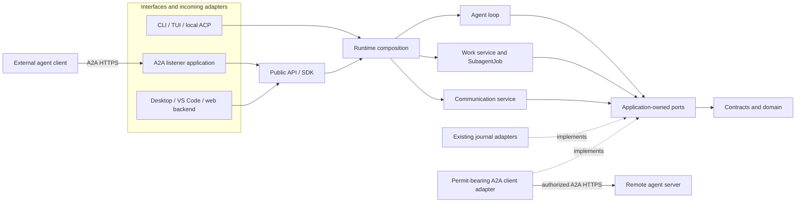

# ADR 0007: Agent communication and A2A boundary

- Status: accepted for implementation
- Date: 2026-10-09
- Review baseline: Colossus `b4399d213f10a86bbb3d05919d5ac2294da811af`
- Protocol baseline: A2A specification `v1.0.1`, wire version `1.0`

This ADR records the accepted design. Capability availability is established by
the implementation and its checks; this decision alone does not advertise support.

## Context

Colossus needs both communication between local executions, including a parent and
its delegated child, and interoperability with independently operated agents.
These capabilities share message and execution concepts but have different trust,
transport, and lifecycle boundaries.

The [architecture](../architecture.md) already places Desktop, VS Code, CLI, TUI,
web backends, and SDK applications outside application services. The
[public application API](../application-sdk.md) owns authenticated, durable runs;
the agent loop is an internal application service. The
[interface decision](0002-interface-presentation-boundary.md) and
[cloud decision](0006-cloud-control-plane.md) should continue to hold.

### Findings at the review baseline

| Evidence | Current behavior | Design implication |
| --- | --- | --- |
| `colossus-contracts/src/work.rs`, `SubagentJob` | A durable job records parent run/call, an isolated child session, inherited tools, status, and released terminal output. `child_run_id` is populated on successful completion. | Preserve the job aggregate. Add an independently discoverable participant for the current attempt rather than treating the completed child run ID as a live address. |
| `colossus-runtime/src/gateway_tool_dispatch/work.rs` | `agent.delegate`, `agent.result`, and `agent.list` create and inspect work. Delegation captures instructions and the offered-tool ceiling. | Messaging is an additional use case; existing delegation and result retrieval remain useful. |
| `colossus-runtime/src/agent_runs.rs`, `subagents.rs`, and `agent_tools.rs` | Child scheduling runs alongside the parent. Retained watch generations prevent lost scheduling wakeups. Child lifecycle events reach parent observers. | These mechanisms signal scheduling and display changes. They are not an agent inbox or provider input channel. |
| `colossus-agent/src/engine.rs` | The loop loads session messages into an in-memory transcript, then prepares provider requests from that transcript. A final assistant response completes the execution. | Appending arbitrary session text will not steer a running agent. Inbox delivery needs an explicit loop boundary, including a check before completion. |
| `colossus-agent/src/service.rs`, `run_subagent_with_skills_as`, and runtime `cancel_subagent` | The child entry point supplies neither a released observer nor a caller-provided `RunControl`. Job cancellation records a terminal job and suppresses late result commitment; this path does not supply a cooperative stop signal to the child loop. | Add deliberate child input/control integration. Closing an inbox or marking a job cancelled does not prove an in-flight effect stopped. |
| `colossus-ports/src/journal.rs` and session repositories | The journal supports atomic batches and stream-version concurrency checks. Session tool turns have a durable marker and atomic transcript settlement. | Reuse the journal for acceptance and input inclusion. Delivery must respect the complete assistant/tool transcript boundary. |
| `colossus-api` and `colossus-api-runtime` | Runs have application ownership, atomic create idempotency, durable feeds, waiting interactions, and explicit uncertain outcomes. | Build on these guarantees. A2A request IDs, sender roles, and metadata cannot replace them. |
| `colossus-api/src/repository.rs` | Public run discovery traverses an application-owned creation index, newest first. | A2A `ListTasks` requires ordering by status update time. Directly forwarding `ListRuns` would not satisfy that contract. |
| `colossus-tools/src/observation.rs` and `colossus-context` | User-message boundaries drive tool-observation budgets and context preparation. | Agent input needs trusted origin metadata. Treating every peer message as a new human turn would change budgets and compaction behavior. |

At the review baseline, the public API did not expose agent message send, receipt, inbox, or
participant discovery operations. Existing tests cover delegation scope, scheduling,
lifecycle publication, and interruption recovery; those are foundations for the
feature, not evidence that messaging already works.

## Decision

Introduce a transport-neutral local communication service, expose it through the
existing public API and SDKs, and implement the A2A listener as a separate application
that consumes those SDK contracts. Outgoing A2A calls, when supported, are
permit-bearing infrastructure effects behind an application-owned port.

Internal messages use typed application operations and the canonical journal.
They do not make HTTP calls back into the local A2A listener. The A2A schema stays
outside the domain, work, session, and agent crates.

SDK applications share the public contract; terminals keep their existing
runtime/private-worker entry points. Local ACP remains an editor interface,
with its existing runtime composition and approval boundary. It is not an A2A
peer listener. The runtime wires local
communication into the agent loop and delegated work. Storage and remote effects
implement inward-facing ports; neither a renderer nor a protocol handler owns
delivery or execution policy.

### Ownership and dependency placement

| Owner | Proposed responsibility |
| --- | --- |
| `colossus-domain` | Dependency-free participant-kind and delivery-state rules where useful. No HTTP, Protobuf, A2A, storage, or async dependencies. |
| `colossus-contracts` | Typed participant references, message content, provenance, receipts, and released communication events. |
| `colossus-ports` | Communication repository, safe-boundary input, and future remote-agent effect ports. |
| New `colossus-communication` application crate | Validate relationships, accept/deduplicate messages, prepare inbox input, close recipients, and expose durable receipts. Its event-sourced repository uses the existing journal port. |
| `colossus-work` | Continue owning job creation, lifecycle, and deliberate requeue. Supply durable job-attempt lineage to communication registration. |
| `colossus-agent`, `colossus-session`, `colossus-context` | Consume an injected inbox port at safe provider boundaries and preserve transcript, context, budget, and continuation invariants. The agent does not construct or depend on the concrete communication service. |
| `colossus-runtime`, access, policy, and tools | Compose the services, register strict message tools/capabilities, and route model-issued sends through the normal effect boundary. |
| `colossus-api`, API runtime, Protobuf, gRPC, and SDKs | Expose caller-scoped operations and released data, including the missing execution-query semantics required by A2A. |
| New `colossus-a2a-server` application | Authenticate external clients, select fixed operator-reviewed bindings, translate A2A to public SDK operations, and serve discovery and streaming. It does not link agent/runtime implementation crates. |
| A2A wire library and future client adapter | Keep pinned wire types, serialization, and bindings outside core contracts. The outgoing adapter implements a permit-bearing remote-agent port. |

Prefer a maintained A2A protocol library after checking its exact `1.0` compatibility,
bounded decoding, dependencies, and hooks for Colossus persistence and authorization.
The official Rust SDK is a candidate, not a selected dependency. Its default task
store or agent executor must not become a second source of execution authority.
Do not build every A2A binding merely because the library supports it.

## Local communication contract

### Entities and identity

Keep the existing meanings of model roles, `Actor`, sessions, public runs,
`TaskRecord`, and `SubagentJob`. A model role names routing; a job names durable
delegated work; a run names an execution attempt. None is automatically a globally
addressable agent service.

Add these narrow concepts:

| Concept | Meaning and required information |
| --- | --- |
| `CommunicationScope` | A root execution and its admitted participants, bound to its canonical runtime/workspace partition and authenticated owner. A session ID alone does not grant membership. |
| `AgentParticipant` | An opaque address for one parent execution or one queued/running child attempt, with scope, job/run linkage, generation, and open/closed state. |
| `AgentMessage` | Server-generated identity, scope, authenticated sender, exact recipient, bounded text, optional same-scope reply reference, recipient ordering sequence, and acceptance time. |
| `MessageReceipt` | Durable acceptance and input-inclusion evidence or a categorical delivery failure. It does not claim the model understood or obeyed the text. |
| `AgentProfile` at the listener | Operator-reviewed external service identity and fixed workspace/role/tool/limit binding. It is deployment configuration, not a replacement runtime agent aggregate. |

Allocate the participant and attempt generation before a child is eligible to run,
so a parent can address queued work. Record the active child run linkage before its
first provider request. Preserve the current meaning of `child_run_id`; use a
separate attempt record for active execution identity.

Explicit requeue allocates a new participant generation. An old message cannot
silently attach to the next attempt. Legacy jobs have no messaging participant
until a verified application operation registers a queued/new attempt. Running
legacy jobs found after process loss remain interrupted under existing recovery.

Participant discovery exposes opaque addresses alongside the relevant job identity.
The model chooses a recipient; trusted execution context establishes the sender.
An SDK application similarly acts as its authenticated application principal.
Message parameters cannot nominate an application owner, sender actor, workspace,
tool ceiling, or run provenance.

Initially permit parent-to-child and child-to-parent edges inside one scope.
Siblings, unrelated sessions, other application owners, recursive delegation, and
cross-workspace delivery require a separately designed relationship grant.
Conversation sharing remains a read boundary and does not grant message control.

### Commands, receipts, and ordering

The communication service provides send, participant discovery, bounded message
and receipt reads, inbox preparation, and participant closure. A bounded wait can
hold a live parent at a safe boundary while a child produces a message; it returns
availability/timeout metadata and does not independently consume message content.

Expose `agent.send_message` as a strict tool with a recipient, text, optional
reply reference, and stable request identity. Its effect action is
`agent.message.send`. A separate read tool can inspect messages and receipts;
`agent.await_message` can support bounded waiting without polling the provider.
The wait consumes the execution's existing time budget and does not increase
turn limits, create work, or revive a completed execution.

Before recipient visibility, message content must pass the ordinary policy and
disclosure boundary. A quarantined envelope is not an admitted inbox entry.
Known secrets, hidden reasoning, and private tool/effect arguments cannot escape
through message content, error text, receipts, observers, or logs. Receiving peer
text cannot widen the recipient's accepted role/tool/scope ceiling, replace its
captured system instructions, or change its policy or sandbox authority.

Acceptance atomically records the caller-scoped idempotency claim, canonical
message, recipient index entry, and receipt under the recipient's open generation.
Namespace the idempotency key by authenticated sender and operation, and bind its
request fingerprint to scope, target generation, and canonical payload hash. A
matching retry returns the original message/receipt; different content or routing
under the same key conflicts. Do not use the JSON-RPC request ID as a durable
message key.

Order messages by their committed recipient sequence. No total delivery ordering
across independent recipients is promised. Notifications carry a retained
generation/cursor and only wake readers; indexed durable state proves availability.
Subscription setup reads the durable cursor and rechecks after registering its
wakeup source, so an enqueue between those steps cannot be lost.

The receipt states are `accepted`, `included_in_turn`, and `not_delivered` with a
bounded reason. `included_in_turn` records the run, attempt, turn, and message IDs
in a prepared provider request. It is evidence of inclusion, not provider success
or completed agent work. Transport watches can replay; deduplication prevents a
single message from being newly inserted twice into the same attempt's transcript.

### Delivery at the agent boundary

The agent loop drains a bounded batch before context preparation and the next
provider request, after any preceding tool turn has fully settled. It persists
trusted-origin input references, the consumed inbox cursor, and prepared-turn
inclusion evidence atomically with version checks. Extend the relevant repository
operation to support that transaction; sequential writes to two repositories do
not provide this guarantee.

The provider projection may use a supported non-system conversation role, but
canonical origin stays `agent_message` with authenticated sender metadata. Never
promote peer text into system/developer instructions or manufacture a tool result
without a matching tool call. Context preparation and tool-observation projection
must use trusted logical-turn provenance rather than inferring a new human turn
from this projection. Agent messages must not reset the aggregate observation
budget, protected-turn boundary, or run limits.

Preparing new input also rebinds the provider continuation to the new transcript.
An already prepared request or provider continuation cannot remain authoritative
after inbox content changes. This is an explicit provider/context integration,
not a background append into a session the agent already loaded.

| Recipient condition | Required behavior |
| --- | --- |
| Queued child | Accept into that attempt's inbox; include after its initial objective when it starts. |
| Provider request or effect in flight | Queue and deliver at the next safe boundary. Sending text does not cancel the request or effect. |
| Assistant/tool batch unsettled | Wait for transcript settlement before adding input. |
| Waiting for a prompt or approval | General messages remain queued. Only the separately bound interaction operation can resolve the interaction. |
| Agent is about to complete | Check the inbox and close with an optimistic version condition. If accepted input won the race, take another permitted turn or explicitly settle it as undelivered. |
| Turn/time budget exhausted, cancellation, or failure | Close the participant and settle accepted pending receipts with a categorical reason. |
| Already terminal or an old attempt | Reject new messages with `RecipientClosed` or `StaleRecipient`; do not start another run. |
| Process loss | Preserve messages/receipts. Recover queued work using its accepted authority; interrupt started work and retain uncertainty under existing rules. |

Closing the participant and accepting a message must contend on the same canonical
inbox version. A successful send cannot disappear between a final inbox check and
completion. A parent that has finished provider execution is closed even if the
scheduler is still draining children for display/result persistence. Late child
messages then receive explicit delivery failures; `agent.result` remains available
for later deliberate work.

The initial feature is communication between bounded executions. Persistent idle
agents, automatic task restarts, and perpetual conversation loops are separate
lifecycle features.

### Bounds, storage, and recovery

Use the configured canonical journal for file-backed redb and PostgreSQL runtimes;
ephemeral mode retains its existing process-lifetime limits. Communication indexes
and display projections are replaceable. Queries use bounded stream/index pages,
not global-history scans. Compose lifecycle registration/closure with existing run
ownership instead of making the managed-process registry own messaging.

Initial ceilings are 16 KiB of text per message, 64 pending messages and
256 KiB of pending content per recipient, and at most eight messages/32 KiB of new
input per provider boundary. Also bound aggregate scope retention, participants,
subscriptions, rates, wait duration, and query pages. Validate these defaults
against context windows before acceptance. Reject admission overflow explicitly;
do not truncate commands silently or evict accepted messages to make room.

Crash after acceptance preserves the receipt. Crash after input preparation
preserves its exact inclusion evidence. Neither case authorizes replay of an
uncertain provider/tool effect. Explicit requeue creates a new generation and
requires an explicit decision about carrying forward any old content.

## Public application and SDK contract

Add an optional `AgentCommunicationApi` and additive Protobuf service with:

| Operation | Public contract |
| --- | --- |
| `ListAgentParticipants` | Discover bounded participants for an owned root run. |
| `SendAgentMessage` | Admit an idempotent message to an exact participant; return its receipt. |
| `GetAgentMessage` | Read the caller-visible message and current durable receipt. |
| `ListAgentMessages` | Read a bounded owner/participant-scoped page with an exclusive cursor. |
| `WatchAgentMessages` | Stream released message/receipt updates after a verified cursor. |

Introduce explicit scopes such as `agent_messages:send` and
`agent_messages:read`, and advertise the capability only when implemented and
authorized for the caller. Existing grants do not silently acquire these scopes
or message tools. Rust, TypeScript, Python, and Go SDKs expose the same DTOs and
semantics. Embedded and gRPC placements use the same application operations.

Use a dedicated typed communication feed rather than disguising messages as
`agent.subagent_update` tool previews. This also avoids inserting unrelated message
updates into the current run feed while a pending interaction protects its state
and event budget. Hosts combine released feeds for presentation; they do not
implement delivery. Old clients can continue using existing run operations.

A2A also needs caller-scoped, bounded execution queries ordered by status update
time, including context/status/time filters, and task-specific released history.
Add these semantics behind a transport-neutral API operation or additive query
option. Keep the current `ListRuns` default unchanged. History must retain external
message identity and trusted origin without exposing original private execution
requests, other tasks' history, system instructions, or tool transcripts.

Any CLI/TUI private-transport additions follow that protocol's existing version
rules. No A2A-specific methods belong in private worker IPC.

### Message and inbox inspection in applications

Message inspection is part of the feature's application contract. Desktop, the
web UI, and VS Code expose the same caller-authorized message and participant
records through their existing host transports. Desktop and web provide an
inbox inspector alongside the session's journal-backed activity views for plans,
goals, and delegated work. Inspection remains available after execution stops
and after the application or durable runtime restarts.

The inspector shows the sender, recipient, parent/job relationship, exact attempt,
message text, acceptance time, recipient sequence, and delivery receipt. Users can
filter by participant and delivery state, inspect queued messages, and see why a
message was not delivered. `included_in_turn` is labeled as input inclusion rather
than evidence that the agent followed the request. Closed and interrupted inboxes
remain inspectable; a new attempt has its own address and history.

Use bounded cursor pages and released communication updates for refresh. Shared
UI components own presentation and keyboard-accessible detail views; each host
owns transport, permissions, selection, and capability detection. Render messages
as untrusted text. Application inspectors do not decrypt journal payloads, infer
delivery from tool previews, or acquire sending/approval authority from read access.
Unsupported runtimes show an unavailable capability instead of an empty inbox.

## External A2A listener

### Hosting and authenticated ownership

Run an opt-in, independently supervised listener beside a persistent daemon.
It holds its own enrolled SDK credentials and the independent local TLS pin.
Its external HTTPS listener has separate TLS/authentication and admission limits.
The existing public worker API remains pinned, authenticated, and loopback-only.
Desktop-managed sidecar lifetimes remain Desktop-owned; enabling a remote service
does not become a renderer setting that keeps an arbitrary sidecar alive.

For the initial deployment, map each independently authorized external principal
to an operator-provisioned application identity and fixed agent profile. The
profile fixes the workspace, role, exact tool ceiling, bounds, and available input
modes. Verify bearer issuer/audience/expiry or an explicitly provisioned mTLS
identity before selecting that binding. External `tenant`, role, message metadata,
`contextId`, or caller-asserted `end_user_id` never establishes ownership.

Do not place mutually isolated peers behind one broad runtime application grant
and rely on an in-memory task map for separation. Separate enrolled identities
make daemon ownership enforce the boundary after listener restart. A future
multi-tenant broker may provide another design, but it needs durable principal
and authorization binding before it can replace this initial model.

The listener translates requests through `colossus-sdk`. It cannot inspect the
journal, call private worker methods, mint `CallerContext`, choose a filesystem
workspace from remote input, or invoke runtime tools directly. Adapter-specific
authentication/configuration belongs to the listener; durable execution,
message admission, relationship grants, receipts, and query rules stay behind
the application API.

### Protocol profile and translation

Use A2A `1.0` JSON-RPC over HTTPS and SSE first. The reference sources are the
[pinned v1.0.1 specification](https://github.com/a2aproject/A2A/blob/3303592588e388e62e0f69f701af531d2f4e3991/docs/specification.md)
and its [authoritative Protobuf model](https://github.com/a2aproject/A2A/blob/3303592588e388e62e0f69f701af531d2f4e3991/specification/a2a.proto).
Patch version `1.0.1` is not the wire negotiation value.

Serve `/.well-known/agent-card.json` with bounded, reviewed profile metadata,
`supportedInterfaces` containing `protocolBinding: "JSONRPC"` and
`protocolVersion: "1.0"`, declared security, and accurate capabilities/input modes.
A card describes a service; it does not grant authority or publish private
instructions, plugin source, paths, credentials, or the full local tool catalog.

Use the `1.0` method names `SendMessage`, `SendStreamingMessage`, `GetTask`,
`ListTasks`, `CancelTask`, and `SubscribeToTask`. JSON fields use camelCase and
ProtoJSON enum names such as `ROLE_USER` and `TASK_STATE_WORKING`. Older
`message/send` recipes and lower-case status/role values are not this wire profile.
Requests use `A2A-Version: 1.0`. Missing/empty version denotes `0.3` under the
specification and receives `VersionNotSupportedError` when only `1.0` is hosted;
there is no implicit downgrade.

| A2A concept/operation | Proposed Colossus translation |
| --- | --- |
| New task from a client message | `CreateRun` using the peer's enrolled identity, fixed profile, and a durable idempotency key derived from authenticated sender plus `messageId`. |
| `Task.id` | The opaque public root `Run.id`. A2A tasks are execution resources, not Colossus planning `TaskRecord` values. |
| `contextId` | The opaque owned public session identity. Validate ownership, profile binding, and consistency with any supplied task ID. |
| Additional message with a live `taskId` | `SendAgentMessage` to that root execution's participant after authorization and state validation. Child endpoints are not directly exposed by the generic A2A task operation. |
| New task in an existing context | A new owned run in the same session under normal session admission. A terminal task ID cannot be reopened. |
| `GetTask`, `ListTasks` | Released run/task projection and the required bounded execution query/history API. |
| `CancelTask` | Owner-bound `CancelRun` with current concurrency validation. Return the actual current state; repeated cancellation reconciles durable cancellation rather than issuing another effect. |
| `SubscribeToTask` and streaming send | Snapshot-first translation over the durable SDK watch. Socket loss does not cancel execution. |
| Output artifact | A stable task-scoped artifact containing the released final run result. It does not imply permission to read a server-local file. |

The public run/session identities avoid a second independently authoritative
task-allocation database in the listener. Required protocol message IDs and
profile/origin correlation are recorded through typed application input/history
metadata, not hidden in the prompt. Two-phase listener-map/daemon-create writes
would otherwise leave a duplicate-allocation window after a lost response.

Record external message identity atomically with the initial run/input allocation
or follow-up acceptance. Namespace it by authenticated owner and fixed profile
across initial and follow-up inputs. A retry that supplies the assigned task ID
after an initial response must reconcile the original input, not inject it again.
Bind canonical content and resolved routing; delivery preferences such as blocking
versus immediate return do not create a different execution identity.

For `SendMessage`, respect `configuration.returnImmediately`: false/unset waits
until a terminal or input/auth-required state; true returns accepted current state
while the run continues. Apply bounded request/wait budgets. A connection timeout
does not convert accepted work into a failed task or authorize a new allocation.
Matching message retries reconcile through the same durable message identity.

For streams, emit the current `Task` first, then ordered status/artifact events,
and close on a terminal state. Establish the watch after the snapshot's exact
durable cursor so updates during subscription are retained. The A2A core does not
promise the SDK's exclusive replay cursor: resubscription supplies a current
snapshot and subsequent updates. Do not promise exactly-once network delivery.
The first profile can stream state changes and the final artifact. Token-level
artifact streaming should wait for a turn-aware mapping that avoids duplicating
intermediate assistant text or the terminal result.

`ListTasks` needs last-status-update descending ordering, owner-bound cursor
pagination, correct context/status/time filters, and its 1..100 page-size semantics.
When `includeArtifacts` is false, omit artifacts entirely. Always include
`nextPageToken`, using an empty string at the end. Respect `historyLength`, including
zero, and apply bounded service limits when it is unset. Sorting a fetched
creation-ordered page does not establish correct global task ordering.

### Task states, approvals, and uncertainty

| Colossus evidence | A2A projection |
| --- | --- |
| Queued | `TASK_STATE_SUBMITTED` |
| Running or cooperatively cancelling | `TASK_STATE_WORKING`; cancellation is not yet confirmed. |
| Waiting for ordinary input | `TASK_STATE_INPUT_REQUIRED` with released prompt details supported by the profile. |
| Waiting for local effect approval | `TASK_STATE_INPUT_REQUIRED` with a bounded local-operator notice. Remote text is not approval. |
| Completed | `TASK_STATE_COMPLETED` with the released final artifact. |
| Durably cancelled | `TASK_STATE_CANCELED` |
| Typed, deliberate task refusal | `TASK_STATE_REJECTED`; pre-admission authentication/authorization failures remain protocol errors. |
| Failed, interrupted, or outcome unknown | `TASK_STATE_FAILED` with safe categorical uncertainty where applicable. Failure does not establish that a remote effect did not occur. |

Only use `TASK_STATE_AUTH_REQUIRED` for an actual supported out-of-band
authentication requirement. A local sandbox/policy approval is a different
condition. Do not send credentials as A2A messages or turn a peer's text into a
one-use approval answer.

The initial listener grant excludes `approvals:respond` and exposes a bounded
text-only Execute profile. Disable ordinary question tools unless their response
path is supported. If execution requires approval, use an independently configured
trusted broker for that owning application or deny the operation. General follow-up
messages cannot bypass a waiting interaction. Remote ordinary-prompt responses
need a separately reviewed mapping that binds interaction identity, response etag,
and exact displayed choices; text alone is insufficient for that binding.

Advertise streaming only when hosted. Initially advertise no push notifications,
extended cards, automatic URL fetching, binary/data input, or required extensions.
Return the specified unsupported-feature errors. Future file input must reuse
owner-bound artifact validation; future callbacks need independent destination,
credential, SSRF, retry, and durable-outbox design.

## Outgoing communication and remote delegation

The listener solves incoming interoperability. Calling another agent belongs on
the infrastructure side through a `RemoteAgentClient` port, distinct effect
actions, strict tools, and runtime-constructed one-use permits.

An operator-reviewed peer registry supplies a stable peer ID, allowed HTTPS
origin/binding/version, credential reference, limits, and released card metadata.
Models select peer IDs rather than arbitrary URLs, redirect targets, bearer tokens,
or client credentials. Discovery, sends, cancellation, and artifact fetches each
use the existing effect, audit, quarantine, and disclosure path.

Persist remote peer/task/context/message identity and local parent correlation
before claiming remote acceptance. A lost remote reply retains an uncertain
outcome. A2A permits but does not require send idempotency; poll or reconcile known
tasks where possible and never blindly retry an unknown task allocation because
the network failed. A remote agent's card is descriptive and its execution
authority is governed by that remote deployment. Local ceilings and sandbox
constraints cannot be assumed to control remote tools.

Do not redefine local `SubagentJob` as a remote execution with local sandbox
guarantees. A future remote delegation record can retain its own remote status
and uncertainty while participating in an explicitly authorized collaboration.
Sharing local instructions, workspace content, or memory with a peer requires
the corresponding disclosure decision.

## Consequences and review criteria

This proposal preserves one local execution/delivery authority across apps and
keeps standardized wire evolution at the edges. It also requires substantive
core work: attempt identity, journal transactions, safe-boundary input,
origin-aware context preparation, closure races, optional SDK contracts, and
A2A-compliant queries. An HTTP listener added only to existing create/get/watch
operations would not deliver the requested feature correctly.

Before advertising support, prove bidirectional parent/child delivery across
queued and in-flight execution, acceptance/closure races, lost notifications,
duplicate sends, attempt changes, prompt/approval barriers, observation budgets,
provider continuations, and crash recovery. Prove owner isolation and unchanged
delegation ceilings through both embedded and authenticated gRPC paths. Test the
pinned A2A profile with an independent client, including blocking sends,
snapshot-first streams, terminal-task rejection, correct list ordering,
unsupported versions/features, and disconnect/restart reconciliation.
Verify that Desktop and web can inspect the same durable messages and receipts,
including closed attempts, without exposing other application owners' inboxes.

The recommended first scope is local parent/child communication and an
authenticated text-only incoming listener beside a daemon. Outgoing remote
delegation, cross-owner collaboration, sibling messaging, persistent idle agents,
callbacks, and media input can follow explicit designs for their added boundaries.
Product review should confirm that deployment/profile scope and whether live
two-way waiting belongs in the initial release. The authority and delivery
invariants above apply regardless of those scope choices.
