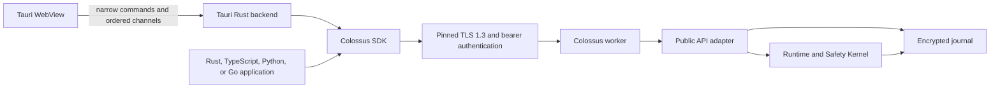

# Public API and application SDKs

Applications integrate with Colossus through the public application API, not the
private worker protocol and not `colossus-agent` internals. The initial contract is
`colossus.api.v1alpha1`; its implemented surface provides authenticated system
metadata and durable agent runs.

Reading the diagram without color: untrusted renderer code calls a narrow native
interface; native or server applications use an SDK; the SDK authenticates a pinned
loopback gRPC connection; the worker translates public resources into the existing
runtime and durable journal.

## Why gRPC is at the worker boundary

Protobuf and gRPC give non-Rust applications a generated, versioned contract and an
ordered streaming transport. The public server belongs at the long-running worker
boundary because runs must survive a UI reload, SDK disconnect, or client-process
restart. `colossus-agent` remains an internal application service and never becomes a
network authority.

The public API is distinct from the private worker IPC protocol:

| Boundary | Intended callers | Contract | Authentication |
| --- | --- | --- | --- |
| Public application API | Enrolled desktop and server applications | Protobuf `colossus.api.v1alpha1` | Per-application bearer credential over pinned TLS |
| Private worker IPC | Colossus-owned CLI and TUI components | Internal Rust worker protocol | Independent worker key |
| Embedded Rust backend | One trusted application process | `colossus-sdk` Rust traits and DTOs | Caller context bound during trusted composition |

The keys and credentials for these boundaries are independent. Do not derive one from
another.

## Runtime placement

The Rust SDK uses one public API across three explicit placements:

- **Daemon** connects to the installed shared worker. This is the preferred desktop
  topology because durable work continues when a window closes.
- **Sidecar** supervises an application-bundled isolated worker. It is appropriate when
  the application needs separate state and lifecycle ownership. A sidecar gRPC host
  must explicitly advertise `Sidecar`; the host API defaults to `SharedDaemon` and its
  bounded deployment-mode type cannot advertise `Embedded`.
- **Embedded** calls an application-private runtime in process. It needs no gRPC
  transport, but it still uses the SDK interface so application code does not depend on
  runtime internals.

TypeScript, Python, and Go SDKs connect to a daemon or sidecar over gRPC. They are
native/backend SDKs, not browser SDKs.

A browser-only web application needs its own authenticated backend-for-frontend. That
backend may use the TypeScript, Python, or Go SDK, but the browser must not receive the
local daemon descriptor or application bearer credential. The worker does not expose
gRPC-Web or permissive cross-origin transport.

## Tauri integration

Tauri can call Rust directly, so a Tauri application does not need a separate
JavaScript-to-Colossus transport SDK. It should hold one cloneable Rust `Colossus`
client in managed state and expose only product-level Tauri commands:

- `create_run`
- `get_run`
- `list_runs`
- `watch_run`
- `cancel_run`
- `respond_interaction`

Use a Tauri channel for the ordered `watch_run` feed. The WebView receives released
run DTOs only. It must never receive the bearer credential, certificate file contents,
daemon descriptor path, raw gRPC channel, caller scopes, tool arguments, hidden
reasoning, or quarantined output.

The Rust client can use either placement without changing that WebView contract:
`Embedded` calls the trusted runtime in process and uses no gRPC, while `Daemon` or
`Sidecar` keeps durable work in another process and uses authenticated gRPC behind the
Rust command layer. In both cases, depend on the stable Rust SDK boundary rather than
calling runtime internals from Tauri commands.

Keep Tauri capabilities deny-by-default. Grant each window only the commands it needs,
and enforce resource scope again inside each command. Do not add generic “run process,”
“read path,” “call URL,” or “invoke SDK method” commands; those would turn the WebView
into a capability-confused deputy.

## Connection and enrollment

A daemon connection deliberately has four separate inputs:

1. an owner-only endpoint descriptor with an exact literal loopback HTTPS endpoint,
   instance identity, PID, API version, and lowercase leaf-certificate SHA-256;
2. an owner-only PEM containing exactly one `BasicConstraints CA=false` public leaf
   certificate whose DER digest matches the descriptor;
3. the expected instance identity and certificate SHA-256 provisioned independently
   during trusted enrollment; and
4. a one-application bearer credential loaded directly from a platform credential
   store into native memory.

The descriptor is mutable readiness metadata, not a trust anchor or authorization. It
contains no token or private key. Every native convenience connector requires the
independent pin and checks descriptor pin equals expected pin and presented leaf equals
expected pin before loading the bearer. SDKs reject plaintext, `localhost`, public
interfaces, URL credentials, unknown descriptor fields, certificate-pin mismatch,
malformed credentials, and oversized transport messages.

The Rust gRPC connector also requires the independently provisioned instance ID and
API major. Its TLS verifier hashes the leaf presented in the live handshake, rejects
intermediates, and compares that digest to the expected pin. Before returning a usable
backend it makes only the authenticated `GetServerInfo` compatibility call and verifies
the exact instance ID, API package, and daemon-versus-sidecar deployment mode; no
credential-bearing application RPC can run first.

Trusted enrollment code creates an exact application grant:

- application ID and placement;
- `runs:execute`, `runs:read`, `runs:control`, `prompts:respond`, and/or
  `approvals:respond`;
- allowed logical roles; and
- allowed tools.

Empty role and tool grants deny all. Credential issuance first persists a pending
keyed verifier and the grant in the encrypted journal. Pending credentials cannot
authenticate. Trusted bootstrap transfers the one-time bearer directly to an
operating-system credential store, then records a separate durable activation. The
bearer must not enter a file, descriptor, URL, command line, environment variable,
crash report, or log. Rotation activates a new credential for the same application ID
before revoking the old credential; revocation permanently invalidates either state.
If old-credential revocation cannot be confirmed, the active replacement remains in
the destination and administration reports both non-secret IDs for reconciliation.

A generic OS-keyring `service`/`account` pair is a lookup namespace, not portable
process identity or an application sandbox. On some platforms another process running
as the same OS user can read an unlocked generic store; on macOS an item created by the
CLI may require an access prompt or may not be readable by a separately signed target
without an appropriate access policy. Applications that must defend against hostile
same-user processes must supply a platform-specific, application-bound credential
provider and keep the independent pin in signed configuration or app-owned protected
storage. The built-in generic provider protects against files, logs, argv, environment
leaks, other OS users, and accidental credential reuse; it does not claim same-UID
process isolation.

Public runs cannot use `agent.delegate`, even if that tool name appears in a grant.
Delegation remains disabled until Colossus can durably propagate the application's
exact scope, role, and tool ceilings into each child run. This fail-closed restriction
prevents a child job from acquiring the worker's broader internal authority.

Public v1alpha1 runs also cannot activate installed skills. `selected_skills` must be
empty, and prompt text such as `@skill-name` does not trigger skill discovery or
composition. Skill activation remains disabled until the durable application grant has
an explicit allowed-skill ceiling and recovery can prove that the same ceiling is
preserved. This prevents an application from discovering private installed skill
metadata or expanding its instructions and tool context indirectly.

The installed Unix worker provides the first-party bootstrap path: perform
`worker --public-api-dir ... --enroll-application ...` while the worker is stopped,
then start `worker --public-api-dir ...`. Enrollment requires exact scope and role
ceilings and writes the one-time bearer directly to the application's named OS-keyring
entry. See [Storage and worker](../admin/storage-worker.md#first-application-enrollment)
for the complete command and rotation procedure.

Enrollment output includes the stable non-secret instance ID and certificate SHA-256.
Provision both into trusted application configuration separately from the discovery
directory. Never compute the expected pin by rereading `endpoint.json` or
`certificate.pem`; doing so would make a same-directory replacement self-validating.

The initial server also bounds each TLS handshake to five seconds, accepts at most 128
simultaneous connections, permits at most 80 concurrent request setups globally and
per connection, permits 128 HTTP/2 streams per connection, expires connections after
15 minutes, limits each request decode and handler setup to 30 seconds, limits HTTP/2
headers to 16 KiB, limits decoded request messages to 2 MiB, and limits encoded
responses to 4 MiB. Only eight authenticated protobuf decodes may run concurrently,
with at most two for one application; the permits are acquired after authentication
but before message decoding. A streaming protobuf wire guard rejects the 129th
top-level `CreateRun.input` field, the first forbidden `selected_skills` field, and the
tenth packed or unpacked `ListRuns.statuses` value before Prost can allocate their
decoded collections; post-decode validation remains as defense in depth. The transport
independently caps active watches at 64, leaving 16 request slots that watches cannot
consume for cancellation, interaction responses, and system RPCs. These effective
transport limits are advertised through
`GetServerInfo`. The Rust client verifier also rejects TLS 1.2 signatures, preserving
the TLS 1.3-only contract even if a future server configuration regresses. Run input is
limited to 128 parts and 1 MiB, and `max_turns` cannot exceed 100.

Default application-resource limits are 32 active runs globally and eight per
application, with fresh-create token buckets of four runs/second (burst 16) globally
and one run/second (burst four) per application. Watches are limited to 64 globally
and eight per application. Owner-index listings allow four concurrent requests
globally and one per application, with separate global and per-application rate
limits. The server advertises the effective values through `GetServerInfo`.

`ListRuns` reads only the authenticated application's durable run index, newest first;
it never scans the shared global journal. `CreateRun` appends the idempotency claim,
run creation, and owner-index entry in one transaction, retrying an owner-index head
conflict without exposing a partially indexed run. A page contains at most three runs.
One request reads owner-index events in batches of eight, advances through at most 64
index entries, reconstructs at most 16,396 run events, and accepts at most 4,099
events from any one valid run stream. Sparse filters can therefore return a short or
empty page with a continuation token; clients continue while that token is present.
Ordinary nonterminal appends stop when the durable sequence reaches 4,096; three
reserved lifecycle events allow interaction closure, the cancelling transition, and
one terminal event without making that valid stream unlistable.

Each encrypted run-update event carries a versioned projection of the public state
immediately before that update and the cumulative released-byte count. A mutation
authenticates the creation event and two-event tail, derives the current state and byte
count from the predecessor, validates the tail projection against them, then uses
optimistic stream concurrency for its append; its work is independent of run history
length. While an interaction is pending, only its resolution or a conservative
terminal settlement may append, preventing repeated projection of its bounded prompt.
Full reads still replay every transition and cross-check every embedded projection and
byte count, so the fast mutation path does not replace journal-chain verification with
an in-memory cache.

The opaque continuation token binds the application and canonical filters and carries
the owner-index snapshot head plus an exclusive resume version. The server validates
both referenced index versions before continuing. Runs created after the first page
do not shift that traversal, and per-request work stays bounded independently of
unrelated journal growth.

## Durable run contract

`CreateRun` durably claims an idempotency key before execution. A caller can then fetch
the run or call `WatchRun` with an exclusive `after_sequence` cursor. Watch delivery is
at least once; SDKs deduplicate exact `(run_id, sequence)` replays and fail on gaps.
Dropping a watch never cancels its run. SDKs reconnect only after an explicitly
retryable transport failure. All SDK watch paths reconcile a clean stream close with
`GetRun` and complete only when it proves the same run is terminal at the exact
verified cursor. Daemon and sidecar streams can resume a non-terminal watch under
their bounded read-only retry policy. Embedded and custom checked streams instead
fail closed when reconciliation is unavailable or does not exactly match; a clean
close is never accepted as silent completion.

When `CreateRun` omits `session_id`, the durable run receives a server-owned session
identity. The canonical session is materialized during agent initialization if
execution proceeds; cancellation before start can leave that identity associated only
with the run. The initial hosted surface does not expose `SessionService`.

Prompts and approvals are durable, one-use interactions bound to the owning
application. Prompt choices echo the exact displayed choice. Approval answers echo a
fresh randomized one-use binding; the private policy request hash never crosses the
native boundary. Approval DTOs expose only a fixed public action taxonomy plus a
bounded display category or an HTTP(S) origin; they never disclose raw internal action
or tool names, absolute paths, executable names, URL credentials, paths, queries,
fragments, raw policy reasons, effect arguments, or deterministic commitments to those
private values.
The server revalidates responses against the private request and applies current scope
checks to cancellation and response operations.

Loopback limits bound resource consumption but cannot guarantee availability against a
hostile local process, including one running as another OS user: loopback TCP does not
carry filesystem-style ownership. Such a process can open unauthenticated sockets and
consume some finite connection or handshake slots. Deployments with that threat model
need an ACL-bound local transport or operating-system process isolation in addition to
application-bound credentials.

After an unclean worker stop:

- a durable queued run can resume with its accepted authority snapshot;
- a run waiting for user input becomes `interrupted`;
- a run that may have started an external effect becomes `outcome_unknown`; and
- SDKs never automatically retry an operation whose outcome is unknown.

Recovery uses the grant captured when the run was accepted. The request that notices an
orphan cannot lend broader current authority to it.

Revoking a bearer prevents future requests made with that credential; it does not
rewrite or silently weaken already accepted durable work. To terminate accepted work,
use another credential for the same application with `runs:control` to cancel the run.
This distinction keeps recovery deterministic and avoids treating a credential rotation
as an ambiguous partial cancellation.

## Source and release workflow

- Protobuf source: `api/colossus/api/v1alpha1`
- Rust SDK: `crates/colossus-sdk`
- TypeScript, Python, and Go packages: `sdk/`
- Generated binding command: `./sdk/scripts/generate`
- Generated binding gate: `./sdk/scripts/check-generated`

Generated sources are replaced from the local Protobuf tree. Do not upload a private
schema to a hosted generator. A release runs Protobuf lint/build, generated-tree checks,
each language's tests and type checks, Rust workspace checks, and a live TLS/authentication
round trip.

The alpha package may make breaking corrections before a stable `v1` package exists.
Once `v1` is published, reserve removed field numbers and names, add fields and RPCs
compatibly, and support adjacent API versions during migrations.
