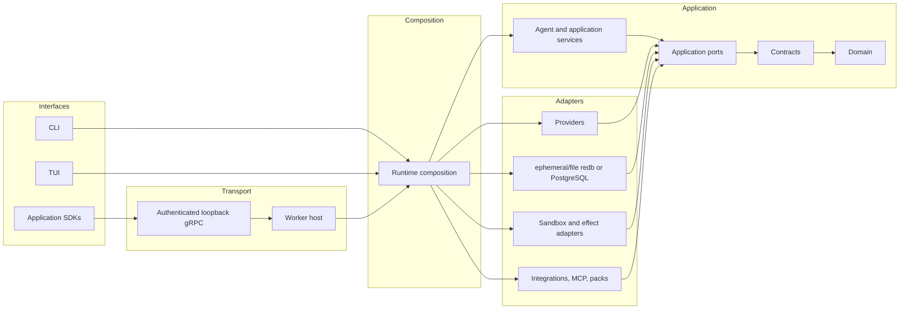

# Architecture overview

Colossus uses ports and adapters with explicit inward dependency direction. Domain
contracts do not depend on infrastructure, and user interfaces never own model, tool,
policy, workflow, or persistence behavior.

Reading the diagram without color: interfaces enter the composition root; application
services depend inward through ports, contracts, and the dependency-free domain;
infrastructure adapters implement ports and are assembled only by the runtime.

## Workspace layers

| Layer | Representative crates | Responsibility |
| --- | --- | --- |
| Domain and contracts | `colossus-domain`, `colossus-contracts` | Dependency-free domain and stable typed contracts |
| Ports | `colossus-ports` | Application-owned interfaces for providers, state, tools, policy-adjacent services, and adapters |
| Application services | `colossus-agent`, `colossus-session`, `colossus-context`, `colossus-work`, `colossus-memory`, `colossus-workflow`, `colossus-research`, `colossus-telemetry` | Use cases and durable behavior |
| Security and catalog | `colossus-access`, `colossus-policy`, `colossus-tools` | Capability metadata, decisions, permits, and strict tool schemas |
| Infrastructure | `colossus-provider`, `colossus-codex-auth`, journal/projection crates, `colossus-sandbox`, `colossus-integrations`, `colossus-mcp`, `colossus-packs`, `colossus-search` | External systems, authentication, and storage adapters |
| Public API and SDK | `colossus-api-proto`, `colossus-api`, `colossus-api-runtime`, `colossus-grpc`, `colossus-sdk` | Version public resources, authenticate applications, host durable runs, and provide transport-neutral clients |
| Composition and interfaces | `colossus-runtime`, `colossus-worker-protocol`, `colossus-worker`, `colossus-cli`, `colossus-tui`, `colossus-presentation` | Narrow private transport contracts, wire services, host application contracts, and released-data rendering |

## Boundary rules

- `colossus-domain` has no dependencies.
- Ports are owned by the application, not infrastructure.
- The runtime owns adapter construction and opaque permit-bearing executors.
- Runtime composition canonicalizes one explicit workspace. CLI `-w, --workspace`,
  embedded open options, and worker workspace matching all feed the same repository
  context and state identity. An isolating execution boundary may confine resources to
  it; acknowledged full access deliberately does not.
- Shared home resolution selects absolute `COLOSSUS_HOME` or the platform user home,
  validates its owner-private no-follow boundary, and derives one opaque partition from
  canonical workspace path and object identity. Interfaces consume the resolved
  context; they do not independently invent configuration or state paths.
- Configuration resolution selects one explicit, repository-local, or user-level
  document without merging. Runtime composition receives the selected source and
  resolved storage path after `storage.location` confinement has succeeded.
- CLI/TUI and Desktop use distinct children of the same workspace partition. Their
  database leases, worker identities, provider credentials, and lifecycle ownership do
  not cross interface boundaries.
- Access resolution produces visibility and action decisions; execution-boundary and
  sandbox-profile resolution independently produce explicit, derived, or ambient
  resource obligations. Ambient obligations remain request-bound and require the
  acknowledged danger runtime envelope.
- CLI and TUI construct requests, invoke application services, and render typed results.
- Desktop persists folder-backed `WorkspaceProfile` records and presents them as
  Spaces. One natively selected Space projects its workspace, provider/model, access,
  execution-boundary, and terminal configuration into the existing command boundary;
  renderer actions cannot nominate a background Space. A native manager may retain up
  to four independently supervised sidecars and evicts only the least-recently-used
  idle entry.
- Desktop Asides create a separate session through the exact canonical end of the
  selected source run. The renderer supplies only that owned run identity; the runtime
  resolves the message boundary so a visible final response cannot be omitted by an
  incomplete activity-feed projection. The sidecar materializes a conversation
  projection containing visible user and assistant messages only; system messages,
  assistant tool-call records, tool results, and their payloads are not copied into the
  Aside.
- Desktop workspace browsing remains an interface-only, read-only view. Its native
  commands accept the opaque selected-Space workspace identity plus a validated
  relative path; they do not add model, tool, policy, state, or mutation logic to the
  renderer.
- Desktop's native Managed Local permission selector uses the narrow authenticated
  `colossus-worker-protocol` control client. The Desktop process does not link runtime,
  model, tool, policy, or worker-host implementation crates.
- Desktop Codex account commands remain native interface adapters: they delegate login
  and logout to `colossus-codex-auth`, while runtime/provider construction stays in the
  sidecar and `colossus-runtime`. The renderer receives status only.
- Top-level user-facing runs snapshot bounded home and repository `AGENTS.md`
  instructions before provider execution. Goal iterations and delegated subagents
  carry that immutable snapshot and provenance; internal risk, summarization, and
  diagnostic model roles do not consume it.
- External applications enter through the authenticated public worker API or a
  caller-bound embedded SDK backend; they never depend on agent internals.
- Crate roots expose a focused API or composition surface; nontrivial logic belongs in
  named modules.
- Canonical writes append journal events. Read models and indexes are replaceable.
- Event-sourced repositories discover aggregate streams through bounded pages of the
  journal-maintained stream identifier index. Listing integrations, packs, sessions,
  work, research, memory, or workflows must not rescan the global event history.
- Public run creation atomically appends its per-application owner-index entry;
  `ListRuns` traverses that index newest-first instead of scanning the shared journal.
- The complete effect path is centralized; an adapter cannot mint its own authority.

See [Rust crate structure](crate-structure.md) for module and public-surface conventions,
[Runtime and ports](runtime-ports.md) for service ownership, and
[Public API and application SDKs](application-sdk.md) for external application
integration. See [Security architecture](security-architecture.md) for the effect
boundary.
