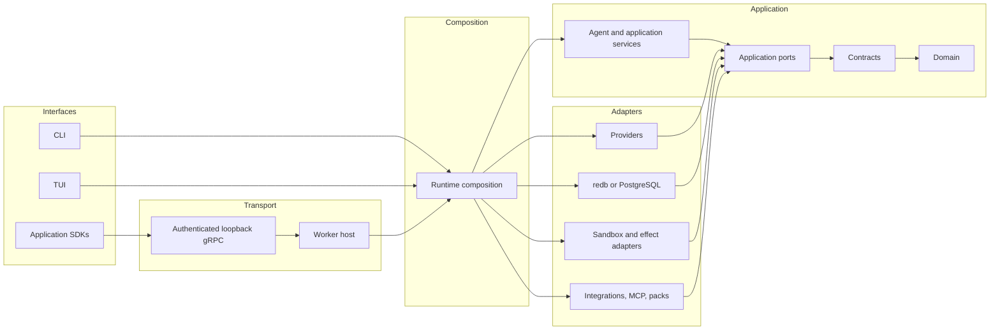

# Architecture overview

Colossus uses ports and adapters with explicit inward dependency direction. Domain
contracts do not depend on infrastructure, and user interfaces never own model, tool,
policy, workflow, or persistence behavior.

Reading the diagram without color: interfaces enter the composition root; application
services depend inward through ports, contracts, and the dependency-free domain;
infrastructure adapters implement ports and are assembled only by the runtime.

## Workspace layers

| Layer | Representative crates | Responsibility |
| --- | --- | --- |
| Domain and contracts | `colossus-domain`, `colossus-contracts` | Dependency-free domain and stable typed contracts |
| Ports | `colossus-ports` | Application-owned interfaces for providers, state, tools, policy-adjacent services, and adapters |
| Application services | `colossus-agent`, `colossus-session`, `colossus-context`, `colossus-work`, `colossus-memory`, `colossus-workflow`, `colossus-research`, `colossus-telemetry` | Use cases and durable behavior |
| Security and catalog | `colossus-access`, `colossus-policy`, `colossus-tools` | Capability metadata, decisions, permits, and strict tool schemas |
| Infrastructure | `colossus-provider`, journal/projection crates, `colossus-sandbox`, `colossus-integrations`, `colossus-mcp`, `colossus-packs`, `colossus-search` | External systems and storage adapters |
| Public API and SDK | `colossus-api-proto`, `colossus-api`, `colossus-api-runtime`, `colossus-grpc`, `colossus-sdk` | Version public resources, authenticate applications, host durable runs, and provide transport-neutral clients |
| Composition and interfaces | `colossus-runtime`, `colossus-worker`, `colossus-cli`, `colossus-tui`, `colossus-presentation` | Wire services, host application contracts, and render released data |

## Boundary rules

- `colossus-domain` has no dependencies.
- Ports are owned by the application, not infrastructure.
- The runtime owns adapter construction and opaque permit-bearing executors.
- Runtime composition canonicalizes one explicit workspace. CLI `-w, --workspace`,
  embedded open options, and worker workspace matching all feed that same boundary.
- Access resolution produces visibility and action decisions; sandbox-profile
  resolution independently produces explicit and derived resource obligations.
- CLI and TUI construct requests, invoke application services, and render typed results.
- Desktop workspace browsing remains an interface-only, read-only view. Its native
  commands accept one opaque selected-workspace identity plus a validated relative
  path; they do not add model, tool, policy, state, or mutation logic to the renderer.
- External applications enter through the authenticated public worker API or a
  caller-bound embedded SDK backend; they never depend on agent internals.
- Crate roots expose a focused API or composition surface; nontrivial logic belongs in
  named modules.
- Canonical writes append journal events. Read models and indexes are replaceable.
- Public run creation atomically appends its per-application owner-index entry;
  `ListRuns` traverses that index newest-first instead of scanning the shared journal.
- The complete effect path is centralized; an adapter cannot mint its own authority.

See [Rust crate structure](crate-structure.md) for module and public-surface conventions,
[Runtime and ports](runtime-ports.md) for service ownership, and
[Public API and application SDKs](application-sdk.md) for external application
integration. See [Security architecture](security-architecture.md) for the effect
boundary.
