# Tiered CI/CD

## Goal

Keep routine pull-request feedback cheap while preserving deliberate multi-platform and
release acceptance at the points where that evidence is needed.

## Prerequisites

- A pull request in the Colossus repository.
- Repository write permission to request `ci:full`, or administrator permission to
  bootstrap the ruleset.
- The local toolchain described in [Source setup and test tiers](setup-testing.md).

Colossus separates fast pull-request feedback, deliberate pre-merge acceptance, and
complete release validation. Expensive hosted runners are allocated only after a
repository writer requests them for a reviewed commit or an annotated release tag is
pushed.

```mermaid
flowchart LR
    PR["Pull request update"] --> C["Fail-closed path classifier"]
    C -->|"documentation only"| D["Documentation build"]
    C -->|"code, CI, dependency, or unknown"| L["Linux workspace validation"]
    C -->|"dependency files"| S["Supply-chain policy"]
    D --> PG["Colossus PR gate"]
    L --> PG
    S --> PG
    PG --> R["Resolve human and automated review"]
    R --> F["Writer applies ci:full"]
    F --> E["Draft, actor, and current-head eligibility"]
    E --> A["macOS ARM + Windows x64 + live security"]
    A --> MG["Colossus pre-merge gate"]
    MG --> M["Merge to main"]
    M --> T["Annotated vX.Y.Z tag"]
    T --> V["Release readiness + six native targets"]
    V --> RG["Colossus release gate"]
    RG --> DR["Draft GitHub Release for human approval"]
```

<div class="diagram-scroll diagram-scroll--wide" markdown tabindex="0" role="region" aria-label="Tiered CI and release flow diagram">



</div>

## Tiers and cost ceilings

| Tier | Trigger | Hosted coverage | Stable gate | Planning ceiling |
|---|---|---|---|---:|
| PR validation | Open, edit, reopen, synchronize, or mark ready | Linux and selected documentation/dependency jobs | `Colossus PR gate` | $0.15 per update |
| Pre-merge acceptance | Apply `ci:full` | macOS 14 ARM, Windows 2025 x64, bounded fuzzing, supply chain, Chroma, PostgreSQL, OCI, OPA, and mTLS | `Colossus pre-merge gate` | $0.75 per final run |
| Release | Push annotated `vX.Y.Z` tag | macOS, Linux-musl, and Windows on x64 and ARM64 | `Colossus release gate` | $4 per release |

These ceilings are planning targets based on hosted-runner rates and observed durations,
not billing or runtime enforcement. A job timeout remains mandatory for every hosted job.

## Steps

## Pull-request validation

The classifier fails closed. Documentation-only paths build the documentation site and
skip Rust. Code, configuration, build, release, CI, renamed unknown paths, and unknown
new paths run the complete Linux Rust gate. Dependency manifests and lockfiles also run
license, source, ban, and advisory policy.

The Rust job combines Conventional Commit validation, formatting, crate-root structure,
locked metadata, Clippy, exact AppArmor installation, the complete workspace suite, and
fuzz-harness linting. It does not allocate macOS or Windows runners. The aggregate gate
accepts a skipped job only when the classifier explicitly marked that job unnecessary.

Documentation deployment is separate: pull requests build documentation in PR
validation, while `main` changes are deployed by the Documentation workflow.

## Request pre-merge acceptance

Apply `ci:full` only after the PR is ready to merge:

1. Make the branch current with `main` and wait for `Colossus PR gate` on the current
   PR merge commit.
2. Resolve every human and automated review conversation and address actionable findings
   in code and tests.
3. Mark the PR ready for review if it is still a draft.
4. As a repository writer, apply the label:

    ```bash
    gh pr edit PR_NUMBER --add-label ci:full
    ```

Eligibility is checked on a cheap Linux runner before macOS or Windows is allocated. It
rejects draft PRs, actors below write permission, and a missing or failed current-head PR
gate. The required pre-merge gate fails on failed, cancelled, or unexpectedly skipped
acceptance work.

Do not push a new commit while acceptance is running. A `synchronize` event cancels the
old run and removes `ci:full`; the old result cannot authorize the new head. After the new
PR gate passes, resolve any new review and apply the label again.

The `Colossus pre-merge gate` sentinel runs on every pre-merge workflow event. A new
commit or a label event other than `ci:full` therefore leaves a failing gate without
allocating the acceptance runners. Only a successful `ci:full` run on the current head
replaces that sentinel result; a skipped gate can never satisfy the ruleset.

## Failure path

- If classification is wrong or empty, fix the classifier or path contract; do not force
  a skipped gate through the aggregate job.
- If pre-merge eligibility fails, verify draft status, actor permission, branch currency,
  and the PR gate on the current merge commit before relabeling.
- If an acceptance job fails, diagnose that job, push the fix, wait for the new PR gate,
  and reapply `ci:full`.
- If a release target fails, do not publish partial artifacts. Fix the source and create a
  new annotated tag according to the release policy.

## Release flow

A release tag must be annotated, match `vX.Y.Z`, point to a commit contained in `main`,
and match both the workspace version and changelog heading. Tag pushes run local
release-readiness verification and exactly six native targets. Each target combines its
security acceptance, locked release build, archive and checksum generation, clean
installation, offline echo/audit, and signed-bundle smoke.

```bash
git tag -a vX.Y.Z -m "Colossus vX.Y.Z"
git push origin vX.Y.Z
```

Only the final publication job receives `contents: write`. After all six artifacts pass,
automation creates or updates a draft GitHub Release. A human reviews the draft and
publishes it. Manual dispatch is artifact-only and cannot create a release:

```bash
gh workflow run release.yml --ref BRANCH -f version=vX.Y.Z
```

## Expected result

Routine PR updates allocate only selected Linux/documentation jobs, one deliberate final
run provides representative pre-merge evidence, and release tags alone allocate all six
architecture jobs. Each tier has one stable fail-closed aggregate check.

## Bootstrap repository enforcement

The tracked ruleset starts in evaluation mode. After this change is merged, a repository
administrator uses the audited helper to create `ci:full` and apply the ruleset:

```bash
./scripts/ci/configure-repository.sh plan OWNER/REPOSITORY
./scripts/ci/configure-repository.sh evaluate OWNER/REPOSITORY
```

Exercise a documentation PR and a code PR, then run `ci:full` once. Confirm both stable
gate names, stale-label removal, resolved-conversation enforcement, and billing entries.
Only then activate protection:

```bash
./scripts/ci/configure-repository.sh activate OWNER/REPOSITORY
```

The `main` ruleset requires a pull request with zero mandatory approvals, resolved review
conversations, an up-to-date branch, and both Colossus gates. It permits no bypass actors
and blocks direct pushes, deletion, and non-fast-forward updates. GitHub merge queues are
not part of this topology because they are unavailable for this private Team repository.

## Verification

Run the workflow contracts, linter, documentation build, and local completion gates:

```bash
./scripts/ci/test-contracts.sh
actionlint
./scripts/docs-site build
./scripts/check_crate_roots.sh
cargo fmt --all -- --check
cargo clippy --workspace --all-targets -- -D warnings
cargo test --workspace
```

## Local completion versus hosted tiers

Hosted tiering reduces repeated platform spending; it does not weaken the local completion
contract. Before handoff, run the focused tests needed while iterating and then the
repository completion gates in [Source setup and test tiers](setup-testing.md). Release
operators additionally run `./release/verify-release-readiness.sh`.

## Next step

For a normal contribution, resolve review and follow
[Request pre-merge acceptance](#request-pre-merge-acceptance). For repository rollout,
follow [Bootstrap repository enforcement](#bootstrap-repository-enforcement) without
skipping the evaluation run.
