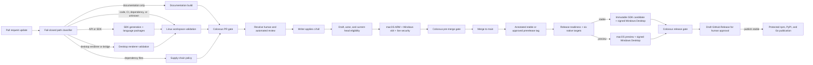

# Tiered CI/CD

## Goal

Keep routine pull-request feedback cheap while preserving deliberate multi-platform and
release acceptance at the points where that evidence is needed.

## Prerequisites

- A pull request in the Colossus repository.
- Repository write permission to request `ci:full`, or administrator permission to
  bootstrap the ruleset.
- The local toolchain described in [Source setup and test tiers](setup-testing.md).

Colossus separates fast pull-request feedback, deliberate pre-merge acceptance, and
complete release validation. Expensive hosted runners are allocated only after a
repository writer requests them for a reviewed commit or an annotated release tag is
pushed.

<div class="diagram-scroll diagram-scroll--wide" markdown tabindex="0" role="region" aria-label="Tiered CI and release flow diagram">


```mermaid
flowchart LR
    PR["Pull request update"] --> C["Fail-closed path classifier"]
    C -->|"documentation only"| D["Documentation build"]
    C -->|"code, CI, dependency, or unknown"| L["Linux workspace validation"]
    C -->|"API or SDK"| SDK["SDK generation + language packages"]
    C -->|"desktop renderer or bridge"| UI["Desktop renderer validation"]
    SDK --> L
    UI --> L
    C -->|"dependency files"| S["Supply-chain policy"]
    D --> PG["Colossus PR gate"]
    L --> PG
    S --> PG
    PG --> R["Resolve human and automated review"]
    R --> F["Writer applies ci:full"]
    F --> E["Draft, actor, and current-head eligibility"]
    E --> A["macOS ARM + Windows x64 + live security"]
    A --> MG["Colossus pre-merge gate"]
    MG --> M["Merge to main"]
    M --> T["Annotated stable or approved prerelease tag"]
    T --> V["Release readiness + six native targets"]
    V -->|"stable"| SDKR["Immutable SDK candidate + signed Windows Desktop"]
    V -->|"preview"| DPR["macOS preview + signed Windows Desktop"]
    SDKR --> RG["Colossus release gate"]
    DPR --> RG
    RG --> DR["Draft GitHub Release for human approval"]
    DR -->|"publish stable"| RP["Protected npm, PyPI, and Go publication"]
```

</div>

## Tiers and cost ceilings

| Tier                 | Trigger                                             | Hosted coverage                                                                                                            | Stable gate               | Runner cost                                                                           |
| -------------------- | --------------------------------------------------- | -------------------------------------------------------------------------------------------------------------------------- | ------------------------- | ------------------------------------------------------------------------------------- |
| PR validation        | Open, edit, reopen, synchronize, or mark ready      | Parallel standard Linux formatting, lint, unit, SDK, Desktop, documentation, and dependency jobs selected by changed paths | `Colossus PR gate`        | Free standard public runners                                                          |
| Pre-merge acceptance | Apply `ci:full`                                     | macOS 14 ARM, Windows 2025 x64, Linux integration, bounded fuzzing, supply chain, Chroma, PostgreSQL, OCI, OPA, and mTLS   | `Colossus pre-merge gate` | Larger Linux and Windows Desktop runners are billed; standard public runners are free |
| Release              | Push an annotated stable or approved prerelease tag | Six CLI targets; signed Windows CLI and Desktop; stable SDK or macOS Developer Preview                                     | `Colossus release gate`   | Larger runners are billed                                                             |

A job timeout remains mandatory for every hosted job.
The four-core `ubuntu-latest-m` larger runner is reserved for final Linux integration,
live OCI/OPA acceptance, release
readiness, and the x86_64 Linux release artifact. Short control jobs, documentation,
dependency inspection, service-backed integration tests, and bounded single-process
fuzzing stay on standard or slim runners so larger-runner capacity is not spent where it
does not materially shorten the critical path. The repository's
`.github/actionlint.yaml` registers the provisioned larger-runner name so local workflow
linting recognizes it.

## Rust build caches

GitHub scopes a cache written by a pull-request run to that PR's merge ref. Another
PR cannot restore it, even when its cache key is identical. The `Warm Rust build
caches` workflow writes dependency build archives on `main` after Rust manifests,
lockfiles, toolchain files, or the cache workflows change. Writers can also run it
manually to fill a missing archive. It uses standard public Linux and macOS runners
and is not a merge gate. The `recipe-v1` key is shared by each warmer and its
consumers. When changing warm-up commands without changing the Rust environment,
bump this key in all eight cache steps to create fresh archives; GitHub cannot
replace an existing exact cache entry.

The Linux PR lint and unit jobs restore one shared dependency build cache from
`main`. The two macOS Desktop pre-merge jobs restore separate debug acceptance and
release bundle caches. The unsigned macOS Desktop release job also restores the
main release bundle cache. Its runner, target directory, recipe key and compiler
environment match the warmer, including the absence of `RUSTC_WRAPPER`.
Each `rust-cache` workspace maps its target relative to its workspace
(`apps/desktop/src-tauri -> target`), and those jobs do not save duplicate PR- or
tag-scoped archives. `rust-cache` caches dependency build artifacts in `target`,
not the application binaries or workspace crates, so a warm run still compiles changed
Colossus code. Cache misses build normally. Other PR and pre-merge lanes use the
optional `sccache` compiler cache in GitHub read-only mode by default. When R2
credentials are configured, those jobs read the R2 compiler cache instead. This
preserves existing GitHub compiler cache reads until R2 is ready without flooding
GitHub's per-repository cache upload limit.
Tagged CLI release builds and the stable SDK candidate use R2 in read/write mode
after release validation when R2 is enabled. Manual release validation retains the
GitHub `sccache` backend. The stable SDK publisher reads R2.

The optional R2 compiler cache covers the PR SDK and Desktop jobs and the five
pre-merge jobs that already use `sccache`. A separate `Warm R2 compiler cache`
workflow writes from `main` on Linux, macOS, and Windows. It leaves the existing
`rust-cache` dependency archives intact. PR and pre-merge jobs read R2 only; on
forks or before credentials are configured, they keep their read-only GitHub
compiler-cache fallback. R2 is not used by the macOS Desktop acceptance, bundle,
or unsigned release jobs, which restore the main branch's target archives.
The signed Windows Desktop release keeps its signing environment and GitHub compiler cache; the unsigned macOS
Desktop release keeps its credential-free build path. The main warmer also runs
when the release workflow changes.

To enable R2 for this repository:

1. Keep the bucket private. Set repository secrets `SCCACHE_BUCKET` to its name,
   `SCCACHE_ENDPOINT` to `https://<ACCOUNT_ID>.r2.cloudflarestorage.com` without
   a bucket path, and `SCCACHE_REGION` to `auto`.
2. Create an R2 token limited to this bucket with **Object Read only** access.
   Store its S3 Access Key ID and Secret Access Key as repository secrets
   `SCCACHE_R2_READ_ACCESS_KEY_ID` and `SCCACHE_R2_READ_SECRET_ACCESS_KEY`.
   These are available to same-repository PR jobs, so the token must not grant
   object writes or access to another bucket. Fork PRs do not receive secrets.
3. Restrict creation of `v*` release tags to repository administrators using the
   release tag ruleset. Create the GitHub Actions environment `sccache-r2-write`
   and allow only the selected branch `main` and selected tag pattern `v*`. Create
   a second R2 token limited to this bucket with **Object Read & Write** access.
   Store that pair as environment secrets `SCCACHE_R2_WRITE_ACCESS_KEY_ID` and
   `SCCACHE_R2_WRITE_SECRET_ACCESS_KEY`. The write key is used by the manual
   `main` warmer and validated tagged CLI and stable SDK builds.
4. Set the repository variable `SCCACHE_R2_ENABLED` to `true`, then dispatch
   `Warm R2 compiler cache` on `main` once. The job fails on an incomplete or
   invalid endpoint, region, or write credential configuration.

Run the R2 warmer manually on `main` after a dependency or toolchain change when
repeated PR or pre-merge builds justify refilling the cache. It does not run on
each main push. Existing R2 objects remain available to later jobs whose compiler
inputs still match. Check the warmer's `sccache stats` for cache writes and later
PR/pre-merge job summaries for hits, misses, and errors. Compare completed run
duration and total runner usage against prior runs before attributing a net
speedup to R2: a cache hit alone does not prove a shorter critical path. R2
object storage and request usage can grow with each three-platform warm-up.

To inspect the shared archives or fill a missing one:

```bash
gh cache list --key v0-rust --ref refs/heads/main
gh workflow run cache-warm.yml --ref main
```

## Steps

## Pull-request validation

The classifier fails closed. Documentation-only paths build the documentation site and
skip Rust. Code, configuration, build, release, CI, renamed unknown paths, and unknown
new paths run Linux formatting, Clippy, and workspace library tests on separate standard
public runners. API and SDK paths additionally select SDK
generation, compatibility, language tests, and release-package checks on a separate
standard public Linux runner. Desktop application, launcher, and Rust SDK paths select
sidecar and renderer checks on another standard public Linux runner and the
native Tauri acceptance described below. Rust, npm, Go, and Python dependency manifests
and lockfiles also run license, source, ban, and advisory policy, including the standalone
desktop Cargo graph.

Advisory exceptions must name one exact RustSec ID in every scanner that reports the
finding, document why the affected path is unreachable, and name the upstream removal
condition. The current `cargo-audit` exception for `RUSTSEC-2026-0253` is limited to
Tantivy 0.26.1's `LruCache<usize, Block>`: the advisory requires a panicking key
destructor, while `usize` has no destructor. `cargo-deny` does not report this
informational advisory, so its advisory policy remains unmodified.
[Tantivy PR #3034](https://github.com/quickwit-oss/tantivy/pull/3034) has already moved
the unreleased branch to patched `lru` 0.18.2; remove the exception when that Tantivy
release is available on crates.io. Ratatui's independent dependency path is already
locked to `lru` 0.18.2.

Pull-request classification, title validation, and aggregate gate decisions execute
the contract checked out from the PR base revision, never the proposed replacement
from the PR head. While these contracts first land, their one-time bootstrap fallback
selects every PR tier and requires every result to succeed. If a trusted base classifier
predates the SDK or desktop outputs, the workflow appends both selections as `true` so an
old base cannot silently skip either component. This prevents a CI-changing PR from
suppressing validation by weakening its own classifier or gate scripts.

Classification owns Conventional Commit validation. The three Rust jobs independently
check formatting and crate structure, Clippy including fuzz harnesses, and workspace
library tests. They run on standard public Linux runners. When selected, the SDK component installs pinned Node.js,
Python, and Go toolchains for reproducible generation and packaging, while the Desktop
component checks the standalone native bridge formatting, installs the renderer
lockfile, and audits, tests, and builds the renderer. Desktop selection also exercises
the managed-sidecar protocol and host crates. All selected jobs run concurrently after
classification, and each owns its own toolchain and cache. The workflow retains trusted-base
classification and runner provisioning, but does not duplicate portable check recipes
or allocate macOS or Windows runners.
The aggregate gate accepts a skipped job only when the classifier explicitly marked
that job unnecessary; it invokes the trusted base revision's seven-argument selector
three times to cover formatting, lint, unit, SDK, Desktop, documentation, and dependency policy.

Documentation deployment is separate: pull requests build documentation in PR
validation, while `main` changes are deployed by the Documentation workflow.

## Request pre-merge acceptance

Apply `ci:full` only after the PR is ready to merge:

1. Wait for `Colossus PR gate` on the current PR head. Resolve merge conflicts if
   `main` has advanced; a conflict-free branch does not need a new commit solely to
   refresh its base.
2. Resolve every human and automated review conversation and address actionable findings
   in code and tests.
3. Mark the PR ready for review if it is still a draft.
4. As a repository writer, apply the label:

   ```bash
   gh pr edit PR_NUMBER --add-label ci:full
   ```

Eligibility is checked on a cheap Linux runner before macOS or Windows is allocated. It
rejects draft PRs, actors below write permission, and a missing or failed current-head PR
gate. The required pre-merge gate fails on failed, cancelled, or unexpectedly skipped
acceptance work. Three macOS jobs run concurrently on separate standard public runners.
The complete Linux Rust suite, including native sandbox integration, runs on one larger
Linux runner only after `ci:full` eligibility. Its exact-path AppArmor profile grants
the temporary root-owned CLI the Linux user namespace authority needed by those tests.
The required gate waits for this suite and all platform jobs.
The native job keeps the root native-debug graph separate from the standalone Tauri
graph on bounded runner disks. Desktop acceptance lints and tests the standalone native
bridge and runs pinned Chromium keyboard, accessibility, high-contrast, drawer, approval,
and 880×640 layout checks. Desktop packaging independently builds the bundled sidecar,
CLI, and Tauri application in a non-incremental release tree, then verifies its bundle
structure. Neither Desktop job waits for the other, and neither transfers its build tree.
Each Desktop job allows 75 minutes for a cold build when the compiler cache is unavailable.
All acceptance and packaging checks remain required.
The native job exercises the otherwise-ignored real sidecar
bootstrap/pinned-gRPC/guardian lifecycle and sandbox acceptance. Together they prove the
pruned locked build, then create an ad-hoc signed two-phase app bundle and verify the outer
seal plus final nested-binary manifest hashes. Ad-hoc signing
uses the explicit `ADHOC` team sentinel, tests structure only, and produces a runtime that
intentionally refuses to start Managed Local. Distributable builds embed the expected
10-character Apple Team ID, use Developer ID and notarization, and verify exact code
identifiers for the app, sidecar, and CLI.
The Windows runtime and Desktop jobs also run concurrently. Runtime uses a standard
public Windows 2025 runner for renderer typechecking, tests, platform-sensitive contracts,
native runtime, worker, and AppContainer sandbox acceptance. The Desktop job retains the
larger GitHub Windows runner for binary preparation, native bridge, credential controls,
WebView2, plugin, and approval acceptance. Each job reports all independent failed
outcomes before failing; the required gate waits for both jobs. Desktop checks run only
when their required binaries were staged.
Portable formatting remains owned by the PR tier instead of being repeated on platform
runners.
Supply-chain acceptance audits both the root sidecar graph and the desktop's independent
lockfile.

Do not push a new commit while acceptance is running. A `synchronize` event cancels the
old run and removes `ci:full`; the old result cannot authorize the new head. After the new
PR gate passes, resolve any new review and apply the label again.

The `Colossus pre-merge gate` sentinel runs on every pre-merge workflow event. A new
commit or a label event other than `ci:full` therefore leaves a failing gate without
allocating the acceptance runners. Only a successful `ci:full` run on the current head
replaces that sentinel result; a skipped gate can never satisfy the ruleset.

The required checks remain mandatory for the PR head, but the ruleset does not require
the branch to include the latest `main` commit. This avoids repeating the full acceptance
run when another PR merges while acceptance is running. If a newer `main` change affects
the same behavior or integration contract, update the branch and rerun both gates before
merging; a conflict-free merge alone does not prove the combined result was tested.

## Failure path

- If classification is wrong or empty, fix the classifier or path contract; do not force
  a skipped gate through the aggregate job.
- If pre-merge eligibility fails, verify draft status, actor permission, the current PR
  head SHA, and its successful PR gate before relabeling.
- If an acceptance job fails, diagnose that job, push the fix, wait for the new PR gate,
  and reapply `ci:full`.
- If a release target fails, do not publish partial artifacts. Fix the source and create a
  new annotated tag according to the release policy.

## Release flow

A release tag must be annotated, match either `vX.Y.Z` or `vX.Y.Z-preview.N` with
`N > 0`, point to a commit contained in `main`, and match both the workspace version and
prepared changelog heading. Release validation automatically generates the changelog
and draft notes from the exact source commit and retains both in the `release-history`
Actions artifact. The generator uses the previous published stable release and
preserves curated highlights; see [release preparation](releasing.md#generate-the-changelog-and-release-notes)
for updating the checked-in history. Tag pushes run local release-readiness verification and exactly six
native CLI targets. Each CLI target combines its security acceptance, locked release
build, archive and checksum generation, clean installation, offline echo/audit, and
signed-bundle smoke.

A stable `vX.Y.Z` target additionally regenerates and tests the TypeScript, Python, and
Go SDKs, builds the exact npm tarball and Python wheel/source distribution, inspects
their intrinsic metadata, and binds them to the release commit with a manifest and
checksum set. Its aggregate gate also requires a signed Windows x64 Desktop installer
and both signed Windows CLI archives. It does not require Apple or Tauri updater keys.

The stable SDK job compares the public API against the most recent stable tag reachable
from the release commit, falling back to that commit's parent for a first release. The
base is therefore fixed relative to the release commit, so rerunning an old tag after
`main` advances cannot report newer `main` APIs as removals.

An approved `vX.Y.Z-preview.N` target skips the stable SDK candidate and packages the
ad-hoc signed macOS ARM preview plus a signed Windows x64 preview. The Windows signing
job uses the `release-signing` GitHub environment and Azure OIDC; validation-only
dispatches remain unsigned and cannot publish.

```bash
git tag -a vX.Y.Z -m "Colossus vX.Y.Z"
git push origin vX.Y.Z
```

### Developer Preview channel

`vX.Y.Z-preview.N` produces a runnable macOS Developer Preview and signed Windows
Developer Preview. It still runs all six CLI release
jobs. Its Desktop build uses the `developer_preview` channel,
`COLOSSUS_DESKTOP_TEAM_ID=ADHOC`, and the ad-hoc identity `-`; it never reads Apple signing
or notarization secrets. Packaging still verifies strict code signatures, fixed code
identifiers, the channel-bound sealed manifest, and the exact hashes of the bundled
sidecar and CLI.

The resulting Desktop archive is runnable for testing but is not Apple-notarized and its
ad-hoc signature does not establish publisher identity. The workflow names it
`Colossus-Desktop-DEVELOPER-PREVIEW-vX.Y.Z-preview.N-aarch64-apple-darwin.zip`, includes
an adjacent SHA-256 sidecar, sets GitHub prerelease metadata, and labels the draft
**Colossus vX.Y.Z-preview.N - Developer Preview (Unnotarized)**. The native compile-time
channel also supplies the in-app banner, shown when **Show security warnings** is enabled
in Desktop appearance settings (off by default). macOS production signing,
notarization, and update authority remain a separate release track from the stable core.

Within `release.yml`, only the draft job receives `contents: write`. After the selected
stable or preview contract passes, automation creates or updates a draft GitHub Release.
A human reviews and publishes it; the approved Developer Preview draft is already marked
as a GitHub prerelease. Publishing a stable draft triggers `publish-sdk.yml`, whose one
`sdk-production` job receives short-lived OIDC and tag authority only after protected
environment approval. It republishes the already-built candidate bytes rather than
rebuilding them. Manual dispatch is artifact-only and cannot create a release or mutate
a registry. A stable manual target validates the SDK path and skips Desktop; a preview
manual target uses the non-runnable `validation_only` Desktop channel:

```bash
gh workflow run release.yml --ref BRANCH -f version=vX.Y.Z
```

### Desktop update signing and channels

Only separately authorized stable Desktop builds with a configured update channel advertise automatic updates. They require the repository variable
`DESKTOP_UPDATE_PUBLIC_KEY`, containing the one-line base64 Tauri updater public key,
plus the protected `DESKTOP_UPDATE_PRIVATE_KEY` secret and, when applicable,
`DESKTOP_UPDATE_PRIVATE_KEY_PASSWORD`. Current Windows stable and Developer Preview
builds use manual updates until that separate updater authority is configured;
validation-only builds never produce updater artifacts.

macOS packages the stable signed `.app.tar.gz` only after nested signing, outer signing,
notarization, stapling, and final bundle verification. The stable versioned draft
includes channel-scoped metadata whose platform entry carries that signature and an
immutable version-release URL.

When a human publishes a release that contains an independently produced `stable.json`,
`desktop-update-channels.yml` revalidates the tag, release kind, platform key, HTTPS URL,
and immutable release path before replacing that asset on the fixed
`desktop-update-channels` release. Stable core releases and Developer Previews contain no
such asset and skip this workflow. The native update client also uses the shared
additional-CA configuration and rejects HTTPS-to-HTTP redirects.

The application update signature is separate from platform publisher identity.
Windows release signing is staged: sign the bundled CLI and sidecar, hash them into the
bundle manifest, and patch its digest into the Desktop executable. Tauri then patches
the app with its NSIS bundle type and invokes the Azure signer for the app, NSIS support
DLLs, temporary PE uninstaller, and installer. GitHub verifies the installed
binaries' Authenticode publisher and timestamp before uploading the final installer.
Standalone Windows x64 and ARM64 CLI archives are signed on Windows x64 after build
and before final ZIP hashing.

## Expected result

Routine PR updates allocate only selected Linux/documentation jobs, one deliberate final
run provides representative pre-merge evidence, and release tags alone allocate all six
CLI architecture jobs plus signed Windows release jobs and a channel-specific extension:
stable SDK candidates or macOS Desktop Developer Previews. Registry publication and production Desktop
authority remain independently protected. Each tier has one fail-closed aggregate check.

## Bootstrap repository enforcement

The tracked ruleset starts in evaluation mode. After this change is merged, a repository
administrator uses the audited helper to create `ci:full` and apply the ruleset:

```bash
./scripts/ci/configure-repository.sh plan OWNER/REPOSITORY
./scripts/ci/configure-repository.sh evaluate OWNER/REPOSITORY
```

Exercise a documentation PR and a code PR, then run `ci:full` once. Confirm both stable
gate names, stale-label removal, resolved-conversation enforcement, and billing entries.
Only then activate protection:

```bash
./scripts/ci/configure-repository.sh activate OWNER/REPOSITORY
```

The `main` ruleset requires a pull request with zero mandatory approvals, resolved review
conversations, no merge conflicts, and both Colossus gates on the PR head. It does not
require branches to be updated solely because `main` advanced. It permits no bypass
actors and blocks direct pushes, deletion, and non-fast-forward updates. GitHub merge
queues are not part of this topology because they are unavailable for this private Team
repository.

## Verification

Run the change-selected local PR gate:

```bash
cargo xtask pr --base origin/main
```

## Local completion versus hosted tiers

Hosted tiering reduces repeated platform spending; it does not weaken the local completion
contract. Before handoff, run the focused tests needed while iterating, `cargo xtask
check rust`, and the change-selected `cargo xtask pr` gate described in
[Source setup and test tiers](setup-testing.md). Release operators additionally run
`./release/verify-release-readiness.sh`.

## Next step

For a normal contribution, resolve review and follow
[Request pre-merge acceptance](#request-pre-merge-acceptance). For repository rollout,
follow [Bootstrap repository enforcement](#bootstrap-repository-enforcement) without
skipping the evaluation run.

## Control Plane and VSIX release artifacts

The coordinated release gate also requires native Linux x64/arm64 Control Plane
server/web and offline container bundles, plus six platform-targeted VSIX packages.
`control-plane-image.yml` publishes the exact tested release images after release
publication and verifies the two-platform index. It compares release assets against
successful exact-tag Actions candidates before loading images; a conflicting immutable
tag fails. See [release operations](releasing.md#control-plane-containers-and-vs-code-packages)
for recovery and anonymous distribution verification.

## Documentation container publication

`documentation-candidate.yml` builds and smoke-tests the public documentation image
on native Linux amd64 and arm64 runners. Documentation and container pull requests
exercise the same build and HTTP smoke with their proposed source. Release candidates
require an annotated stable or preview tag on `main`; only successful tag pushes retain
the tested offline images and source-bound candidate manifests for 30 days. The
candidate jobs have no registry write credentials.

`documentation-image.yml` publishes after the reviewed GitHub Release is published,
or retries an exact tag from `main`. Its contracts and publishing job use the same
resolved protected-main publisher revision. Before any registry write, it requires
successful exact-tag release and documentation candidate runs, verifies both retained
image archives and source identities, and checks the published release channel. It
refuses conflicting existing version tags and verifies the two-platform executable
index by digest. Documentation publication is separate from the CLI release inventory;
it adds no CLI assets. See [documentation image operations](releasing.md#documentation-container)
for recovery and public-distribution verification.
