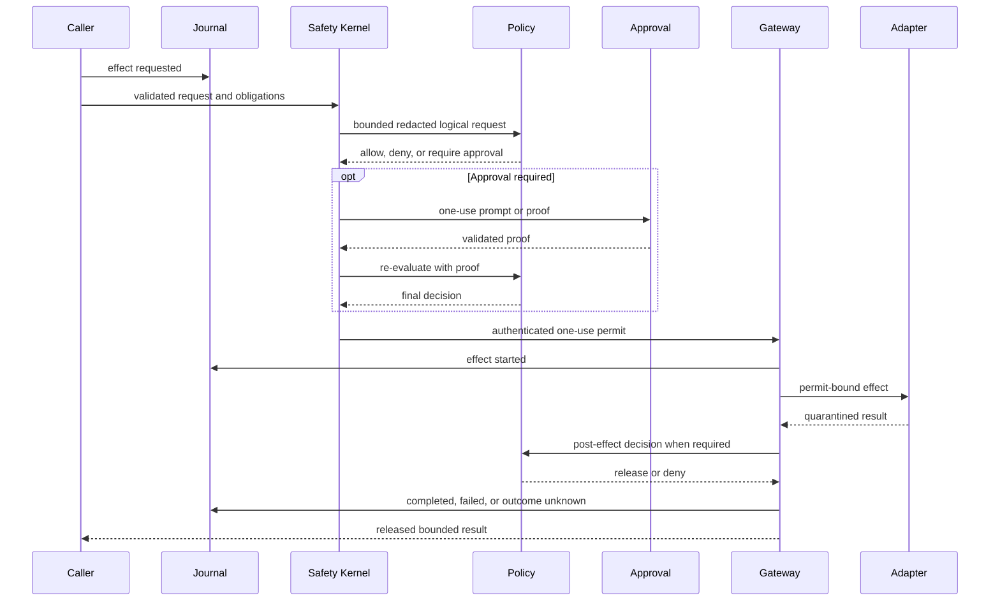

# Security architecture

Every external or sensitive operation is an effect. The only supported path to an
effectful adapter is centralized and evidence-producing.

Reading the diagram without color: request evidence precedes local validation and policy;
approval is an optional obligation followed by re-evaluation; only a minted one-use
permit reaches an adapter; output remains private until release policy; a terminal event
closes the lifecycle.

## Non-bypassable properties

- The Safety Kernel rejects unknown capabilities, invalid request shape, unsafe path
  obligations, absent audit durability, invalid/expired/reused permits, oversized policy
  input, and hard-secret disclosure regardless of policy engine.
- Adapter constructors remain private to runtime composition.
- Effectful adapter methods require an opaque permit external code cannot construct.
- A permit is authenticated, actor/request/decision-bound, expiring, and single-use.
- Built-in policy or OPA can authorize an action but cannot disable local validation,
  sandbox containment, permit checks, quarantine, or terminal journaling.
- Approval satisfies an obligation and triggers policy re-evaluation. It is not an
  alternate execution path.

## Disclosure and release

Policy receives complete logical content after raw credentials, authorization headers,
private keys, key material, and hidden reasoning are replaced by bounded hashes and
references. Filesystem reads, provider output, network responses, process output, and
memory retrieval remain quarantined until mandatory post-effect policy permits release.
A denial cannot leak private bytes through output, errors, audit payloads, or observers.

Provider and model diagnostics have an explicit local-operator release. The CLI
`--include-provider-response` option and the local TUI `/models doctor` and `/provider
doctor` commands can return the credential-free request plus at most 16 KiB of a failed
or transport-incompatible response body after exact configured-credential redaction. The TUI
`/provider diagnostics on` command applies the same release to failed provider turns in
the current TUI process, including post-tool continuations, until the operator runs
`/provider diagnostics off` or exits. These captures are represented as quarantined
adapter output and must pass the ordinary post-effect decision before the authenticated
local worker or direct TUI receives them. Default Doctor output, default run failures
and events, and durable audit payloads remain status-only and never receive the body.
An in-run diagnostic request can contain user, session, and tool-result content, so the
TUI warns the operator to review it before sharing.

Canonical tool identities are never renamed to accommodate a provider. Network adapters
build a request-local, one-to-one transport alias map that projects `.` to `_` under the
portable 64-byte function-name grammar. Definitions and continuation history use that
map, and streamed or non-streamed provider tool calls are restored to canonical names
before they cross back into agent policy or dispatch. Unrepresentable names and alias
collisions fail closed before network execution. Diagnostic request bodies intentionally
show the actual provider aliases because they are wire evidence, not authority records.

Canonical tool schemas likewise remain the local authority. Before network execution,
provider request validation requires every schema root to declare `type: object`. The
adapter clones each schema and removes root-level `oneOf`, `anyOf`, `allOf`, `enum`, and
`const` keywords from the provider copy; the Chat Completions copy also omits
`maxLength` recursively. Responses marks the projected function as non-strict and Chat
Completions leaves `strict` unset. These projections only shape model guidance. The tool
registry validates model arguments against the unchanged canonical schema before policy
or dispatch, and execution handlers independently recheck security-relevant cross-field
invariants.

## Adapter confinement

Filesystem paths are canonicalized against exact roots; read output is bounded and
writes reject symlink leaves and use same-directory atomic replacement. Processes run
through authenticated helpers with cleared environments, exact or trusted-profile
executables, bounded arguments, isolated shell homes/temp directories, sanitized
command paths, bounded process trees, and selected native, Windows, or OCI isolation.
The Linux helper is dispatched before the asynchronous CLI runtime starts so it can
establish and map its rootless user namespace while still single-threaded, then create
the private mount namespace used to mask protected paths. After mounting those masks,
it locks root and ambient-capability securebits, enables no-new-privileges, and clears
the ambient, bounding, permitted, effective, and inheritable capability sets before
the requested executable starts. The shell therefore cannot unmount its control-state
masks even though the helper needed namespace-local mount authority during setup.
On Linux, `sandbox doctor` re-executes the trusted helper in a bounded, no-I/O probe to
prove that user and mount namespaces can actually be established. Ubuntu hosts that
restrict unprivileged user namespaces require the shipped AppArmor profile, which grants
`userns` to one canonical root-owned executable path rather than weakening the
host-wide restriction.
The `workspace-development` profile derives workspace authority only for users and
agents without workflow lineage; control-state paths are denied or masked before the
command starts.

HTTP effects match either an exact canonical origin or the public HTTP(S)-only `*`
grant. The wildcard excludes loopback, private, link-local, and metadata destinations;
exact private origins remain possible. Provider, search, integration, brokered HTTP,
semantic memory, native/Windows process proxy, and OCI proxy paths share this matcher,
pin DNS results, validate TLS authority, reject ambient proxies and redirects, bound
connections, and quarantine responses. Process proxy results record a bounded list of
allowed observed origins.

Configured stdio MCP remains a process effect. Streamable HTTP MCP is a network effect
and uses the same exact-origin/public-wildcard matching, DNS pinning, proxy and redirect
rejection, CA roots, permit timeouts, and bounded response path. Remote
declarations contain only literal non-secret headers and environment credential
references; the permit-bearing adapter resolves those references immediately before the
request. OAuth authorization is an operator-only PKCE flow and never starts from an agent
tool call. Tokens are server/endpoint/repository-bound in the platform credential
namespace or a domain-separated XChaCha20-Poly1305 redb sidecar, and client secrets remain
behind their configured references. Stateful sessions remain the default. A strict,
request-bound `allowStateless` opt-in permits one top-level remote declaration to omit
`Mcp-Session-Id`; stdio and pack-provided servers reject that field. Each discovery page
and tool call uses a fresh initialized transport, disables request and expired-session
retries, accepts empty success responses only for one-way JSON-RPC frames, and treats an
uncertain tool call as `OutcomeUnknown`.

Codex/ChatGPT authentication is also operator-only. `colossus codex login` delegates the
OAuth ceremony to the official Codex CLI and forces its supported file credential store;
Colossus never handles the authorization code. The `open_ai_codex` adapter accepts only
`codex:default`, fixes the service and refresh endpoints, rejects symlinked or non-private
Unix auth files, resolves tokens only after a provider permit, and redacts both bearer and
ChatGPT account identifiers from quarantined responses. Only `open_ai_codex` may reference
`codex:default`, so a non-Codex profile cannot pass startup validation and then fail every
call in the standard credential resolver. Proactive refresh requires the OpenAI auth origin
in the same permit's network obligations and atomically updates the Codex-managed file
without changing accounts: the read-compare-write cycle holds a cross-process advisory lock
on a sibling `auth.json.lock` file and re-reads the stored tokens immediately before
persisting, so an external writer such as the official Codex CLI is never overwritten with a
stale snapshot. Backend requests distinguish the audited
Codex wire-contract version from the Colossus product version: `version` is compatibility
metadata pinned in the adapter, while `User-Agent` names the actual Colossus build.
Codex streaming requests explicitly accept SSE. The fixed backend can omit the response
media type, so only the Codex adapter permits an absent `Content-Type` before applying
the same bounded strict SSE and Responses-event validation; an explicit conflicting
media type still fails closed.

One explicit bounded PEM CA bundle may augment built-in roots across Colossus-owned
outbound clients. It is loaded once at runtime startup and never sourced from ambient
proxy or TLS environment variables. Adapter-specific OPA and PostgreSQL CA policies
remain exclusive overrides, and public API clients continue to verify their separately
provisioned leaf pin. Sandboxed and MCP child processes retain independent TLS stacks.

`risk-auto` is deliberately narrow: only model or child-agent `shell.run`, `web.search`,
bodyless `network.http` GET, and configured top-level `mcp.call` effects without workflow
lineage can use a low-risk `allow` recommendation to mint a request-bound approval
proof. The evaluator has no tools and receives redacted proposed-effect metadata:
network review includes the requested URL or search query, while MCP review includes
the exact endpoint identity, transport and stateless opt-in, configured server/tool, bounded advisory
description and annotations, fresh schema hash, and validated arguments. Resolved
credentials and authentication configuration are absent, environment values become
names, and sensitive argument fields are redacted. Field-name redaction is word based
after camelCase and separator normalization, so compound schema-specific names such as
`github_token`, `dbPassword`, `clientSecret`, or `apiKey` are redacted alongside the
plain names.

MCP descriptions and annotations are untrusted evaluator hints, not authority or hard
preconditions. Explicit and wildcard tool selection share the same review rule because
the proof binds one invocation, and stdio and Streamable HTTP share eligibility while
retaining their different process and network obligations. Pack-provided MCP action
prefixes, unsupported metadata, non-read-only network methods, workspace mutations,
dynamic integrations, workflows, system actors, and every non-low-risk assessment
preserve explicit approval or denial. Ineligible reviews record a bounded reason that an
attached prompt can display.

After the request-bound automatic proof is durably recorded as `approval.granted.v1`,
the approval provider may release a bounded `AutomaticApprovalNotice` to an attached
interface. That best-effort notice is presentation only: delivery failure cannot grant,
deny, retry, or otherwise change the effect decision. Worker delivery remains inside the
authenticated run channel.

Unavailable and malformed evaluator results are durably classified before attached
clients receive a best-effort fallback warning. The released warning contains only the
failure category and bounded effect display metadata; raw provider diagnostics and
malformed model output remain internal. A warning never mints proof or changes the
ordinary explicit-approval requirement.

## Public application transport

The public application API is a separate trust boundary from private worker IPC.
It binds only an IP-literal loopback address and requires TLS 1.3 plus a
per-application bearer credential. Discovery metadata and the public leaf certificate
are separate owner-only files; neither contains a credential or private key. Clients
validate the descriptor, endpoint, API and instance identity, normal TLS identity, and
an independently provisioned certificate SHA-256 before sending authorization
metadata. A descriptor fingerprint is only a consistency check: native connectors
require the trusted expected fingerprint separately and reject before credential
loading when it differs. The published PEM contains exactly one pinned end-entity
certificate with explicit `BasicConstraints CA=false`; Colossus does not accept a CA
certificate or chain as the local API identity.

Authentication creates the application actor and its exact scope, role, and tool
ceilings on the server. Public requests cannot submit identity or authority. Credential
verifiers and grants are encrypted in the journal under an API-specific authentication
root; bearer secrets exist only during issuance and in the application's platform
credential store. API TLS, API authentication, private worker IPC, journal encryption,
checkpoint signing, permit MAC, and provider keys are independent.

Owner-only discovery files and the generic OS credential store establish an OS-user
boundary, not portable same-user-process isolation. Keyring service/account values are
lookup labels. A deployment that treats another process under the same UID or account
as hostile must use platform-specific application-bound key storage and code identity,
and must provision the TLS pin through signed application configuration or app-owned
protected storage. Without those controls, same-user malware is outside the
transport's confidentiality boundary; per-application grants still constrain honest
applications, renderer-to-native capability boundaries, accidents, and independently
protected credentials.

The server and Rust client verifier reject TLS 1.2. The transport bounds handshake time,
connections, concurrent requests, authenticated protobuf decodes globally and per
application, HTTP/2 streams, header bytes, request bytes, response bytes, and repeated
field cardinality before durable work begins. Its independent active-watch ceiling is
lower than both global and per-connection request admission, reserving unary headroom
so watches cannot starve cancellation, interaction responses, or system RPCs.
`agent.delegate` is advertised only when it is present in the authenticated
application's tool ceiling. The delegated job durably records that exact ceiling, the
child run receives only that ceiling, and child runs always remove `agent.delegate`
before model tool discovery so delegation cannot recurse.

Artifacts use an explicit owner-bound release boundary. A caller with
`artifacts:write` first reserves an upload with an exact length and SHA-256 digest,
then sends bounded ordered chunks. Colossus exposes the opaque artifact ID only after
the complete bytes match the reservation. Metadata and downloads require
`artifacts:read` and the same authenticated application ID. Original paths, partial
uploads, and another application's artifacts are never released. Run-input
attachments are accepted only from available `run_input` artifacts with supported
bounded UTF-8 media types.

Public run listing is owner-indexed and never scans the shared global journal. The
idempotency claim, run creation, and per-application index entry commit atomically.
Newest-first reads, run reconstruction, and filter traversal have independent hard
bounds. Continuation tokens bind the authenticated application and canonical filters,
carry an immutable index snapshot and exclusive resume version, and validate their
referenced durable index entries before use.

Run-update payloads contain a versioned, encrypted prior-state projection and
cumulative released-byte count. Mutation paths authenticate only the creation and
two-event tail, derive state and accounting from the predecessor, validate the current
projection, and append with optimistic concurrency, keeping per-update work constant as
a run grows. Pending interactions block unrelated updates so their prompt projection
cannot be duplicated across the remaining event budget. Read reconstruction continues
to replay the complete bounded stream and verifies every projection against the
preceding state. The projection is journal-authenticated durable evidence, not a
mutable in-memory authority cache.

Finite loopback connection and handshake limits mitigate resource exhaustion but are
not an availability boundary against a hostile local process, including one running as
another OS user. Loopback TCP has no filesystem-style owner ACL, so such a process can
consume unauthenticated socket slots. Deployments requiring local-process availability
isolation must add an ACL-bound local transport or operating-system process isolation.

Public approval DTOs are a separate release boundary. They contain a generic bounded
prompt, a fresh randomized one-use binding, a fixed public action category, and only a
sanitized resource category or HTTP(S) origin. The private policy request hash remains
inside the native runtime. Raw internal action and tool names, absolute paths,
executables, URL user information, paths, queries, fragments, raw policy reasons,
effect arguments, and deterministic commitments to those values remain private.

Credential revocation blocks later authentication but does not alter work already
accepted under that application's captured authority. Cancellation is a separate
durable operation requiring a currently authenticated same-application caller with the
control scope.

Credential rotation delivers and durably activates the replacement before revoking the
prior credential. If prior revocation cannot be confirmed, administration preserves
the active replacement at its destination and reports both non-secret identifiers for
explicit reconciliation; it does not risk restoring a prior bearer whose revocation
may already have committed.

The renderer in a Tauri application is untrusted application input. It calls narrow
capability-scoped Rust commands and receives ordered released updates. It never receives
daemon credentials, private discovery paths, raw effect inputs or outputs, hidden
reasoning, or a generic process, filesystem, network, or SDK invocation escape hatch.
See [Public API and application SDKs](application-sdk.md) for the complete topology.

The read-only Desktop file viewer is a separate, narrow local-user disclosure surface,
not a generic filesystem bridge or an agent tool. It is available only while the exact
Managed Local target is selected with Development access, accepts the opaque current
workspace ID plus a bounded relative path, and revalidates the persisted object-bound
workspace identity before and after every operation. It rejects absolute paths, parent
components, links, non-files, non-directories, non-UTF-8 or unsafe-control text, large
files, and oversized directories. Control state, version-control internals, generated
dependency/build trees, environment files, credential files, and key/certificate
formats are excluded. The native boundary returns at most 256 KiB of text and exposes
no write, execute, process, network, arbitrary-open, or SDK command. Source changes
continue through ordinary permit-bound agent effects; the viewer cannot mutate them.

A managed desktop sidecar is a separate signed process, not an in-process extension of
renderer authority. Its exact signed executable and the bundled TUI CLI are named in a
SHA-256 manifest whose exact byte digest is patched into, and then sealed by, the signed
running desktop executable. The manifest is opened once without following symlinks;
selected executables are code-identity checked immediately before no-shell spawn and
bootstrapped only over inherited bounded channels. The release manifest is created
after nested signing because signing changes Mach-O bytes; an unset compile-time marker
or an unbound resource is never accepted as final executable authority.

Executable binding is platform-specific and fails closed. On macOS, native code hashes
and parses one private snapshot of the manifest-selected Mach-O, starts the bundle path
with the kernel's start-suspended flag, and verifies the suspended process's exact live
CodeDirectory identity under strict, network-disabled validation before `SIGCONT`.
Linux executes the verified bytes from a sealed, non-writable `memfd`; other Unix
platforms do not expose Managed Local until they provide an equivalent pre-instruction
binding.

Managed Local also binds the selected workspace by object identity rather than by
pathname alone. On macOS, Desktop derives a versioned opaque digest from the device,
inode, and birth timestamp read from one opened no-follow directory descriptor. It
persists that digest in owner-private settings, includes it in the managed state
partition, and supplies it as an exact launch and restart ceiling. Preview-era
path-only and device/inode-only records are migration input, never launch authority;
Desktop rotates their managed instance seed and requires explicit folder reselection.
The SDK holds the selected directory open and rejects identity drift before cloning
bootstrap secrets or spawning; the child independently opens and matches the same
object, and runtime lease acquisition reopens it against a runtime-owned identity
token. The runtime retains that descriptor and revalidates the pathname both before
tool dispatch and at permit-bearing filesystem and process adapter boundaries. A
renamed or replaced workspace therefore cannot inherit prior state or redirect an
active managed runtime.

Private worker IPC remains an authenticated owner-only Unix socket. When the canonical
state-derived pathname would exceed the portable Unix socket limit, Colossus places a
domain-separated digest of that state identity in the same fail-closed, owner-private
coordination directory used by the workspace writer lease. The sidecar binds this
endpoint before acknowledging bootstrap activation, so an unsafe or unavailable local
endpoint fails on the inherited control channel rather than being misreported as a
public TLS failure. No worker key or provider credential is written into the pathname.

Skill discovery is part of model input and therefore uses the same object-bound
discipline. On Unix, repository skill roots are traversed relative to the retained
workspace descriptor. App-private user and installed-pack roots receive independent
no-follow directory capabilities opened one component at a time; a not-yet-created
root is accepted only beneath a retained owner-private directory. Instruction,
manifest, and resource files are opened descriptor-relative, bounded, nonblocking,
and accepted only after their opened type is verified. Aggregate discovery roots are
capped at 128 before root descriptors are acquired, leaving conservative macOS file
descriptor headroom; each verified pack may contribute at most 64 skill references,
with the aggregate runtime ceiling remaining authoritative across packs. Runtime
pre/post identity checks still reject stable workspace drift, but path checks are not
treated as protection against an A-to-B-to-A swap.

The retained descriptor makes state selection, lease ownership, skill context, and TUI
attachment object-bound. Existing filesystem and sandbox effect adapters still consume
policy-authorized absolute paths after an immediate identity check; POSIX does not make
that multi-lookup handoff atomic against another native process with the same UID that
can rename the workspace namespace. Such a process is part of the same explicitly
excluded same-user-native-process boundary as the generic keyring provider, not a
renderer or remote-agent capability. Managed Desktop grants neither renderer nor agent
access to the workspace parent, and a stable rename or replacement fails closed. A
deployment that treats peer same-UID processes as hostile must add OS process isolation
or convert every effect adapter to descriptor-relative operations before relying on
this boundary.

Desktop's dedicated local Tauri terminal window can operate native-owned PTYs using
opaque window-bound sessions and a fixed native-selected workspace context. The main
renderer may request that window and one of the closed terminal kinds, but it cannot
open or control a PTY. The terminal DTO accepts only `colossus_tui` or `shell`; it
rejects renderer-selected processes, paths, working directories, environments, and
arguments.

A completed public Plan Mode run may expose its bounded canonical Plan ID, revision,
and status to the main renderer. The main renderer can request revision or execution
only by returning the caller-owned source run ID and exact visible revision in a typed
public run action; it cannot nominate a Plan ID. Server-side lookup rechecks source-run
ownership, session identity, released metadata, canonical revision, and Draft status.
Revision is constrained to Plan Mode; Direct or bounded Goal consumption is constrained
to Execute mode. These actions remain ordinary durable public runs and cross the same
interaction, policy, approval, permit, journal, audit, cancellation, and watch paths.
Authenticated discovery advertises this behavior as `plans.continue` only with both
run-read and run-execute scopes, and the SDK fails closed when it is absent so older
protobuf servers cannot silently ignore the typed field.

For the Managed Local advanced handoff, the main renderer may also return the Plan ID
with the owning public session ID only to the narrow `show_terminal_window` command.
Native code rejects missing, oversized, control-bearing, or shell-bound pairs. The
dedicated terminal renderer can then submit only the constructed `/session resume ID`
and `/plan use ID` selection text after opening the authenticated TUI. The main
renderer never receives PTY write authority.

The `shell` kind is a deliberately privileged local-user convenience, not an agent
tool. Enabling local terminals for the first time requires a fixed native operating-
system confirmation that states this authority. On macOS, native code revalidates the
persisted object-bound Managed Local workspace, validates the root-owned non-writable
system `/bin/zsh`, and launches exactly `/bin/zsh -l` with a native-constructed cleared
environment and that workspace. It receives no worker authentication and its commands,
input, output, and effects do not pass through the Safety Kernel, remote journal, or
Colossus audit path. It remains available while the managed runtime is unavailable so
the operator can inspect or repair the workspace directly. Consent is versioned;
settings created for the earlier TUI-only feature cannot silently enable shell
authority.

This is a VS Code-style renderer trust decision: compromise of the dedicated terminal
document while shell access is enabled can submit commands with the logged-in user's
authority. The terminal document is therefore a local-only, label-bound protocol with
its own narrow capability and CSP; remote navigation, automatic URL opening, clipboard
writes, and general Tauri shell, filesystem, HTTP, and process plugins remain disabled.
Compromise of the main WebView alone does not grant PTY input authority. Disabling the
feature, closing a tab, closing the terminal window, or exiting the app kills the
retained shell process group on a best-effort basis.

macOS has no supported race-free descendant job primitive for an ordinary desktop app
that can guarantee cleanup after arbitrary `setsid`, double-fork, and reparenting
behavior; `EVFILT_PROC/NOTE_TRACK` has been unsupported since macOS 10.5. Desktop
therefore explicitly does not claim containment of deliberately detached shell
descendants. The bundled TUI has the stronger path: it starts suspended in its own
session, its exact live code identity is verified against the manifest-bound
CodeDirectory before resume, then independently opens and changes directory through
the selected workspace descriptor and reports the same birthtime-bound identity. Only
after the parent verifies that attestation does it release worker authentication
through bounded one-use inherited anonymous pipes that are separate from the PTY.
The TUI connects to the existing worker and retains the ordinary Safety Kernel, remote
journal, and audit path. Closing its tab, window, or app freezes and kills that verified
CLI session.
Platforms without equivalent pre-instruction identity binding do not expose the
managed TUI launcher.

Discovery cleanup occurs only after the supervised process tree is confirmed dead. It
holds a no-follow file descriptor for the exact owner-private discovery directory and
may unlink only the fixed descriptor and certificate leaves after revalidating their
type, owner, mode, link count, device, and inode immediately before removal. Unsafe or
replaced state is preserved and reported rather than traversed or recursively deleted.

Managed Desktop approval authority is isolated from its ordinary run client. The
primary credential has the four run/read/control/prompt scopes and never
`approvals:respond`. A second same-application native broker credential has only that
approval scope, no tools, and no role outside the primary ceiling. The sidecar issues,
delivers, acknowledges, activates, and revokes the pair as one bootstrap lifecycle;
the SDK routes only approval answers over the broker's separately authenticated pinned
gRPC client. Renderer approval input still requires the native operating-system
confirmation before an allow response reaches this broker.
First-time Development access and every Minimal-to-Development elevation likewise
require a fixed native confirmation before the wider workspace and shell tool ceiling
is persisted. A renderer can request key rotation but cannot suppress the native key
prompt for first setup or a provider-kind change.

## Evidence and uncertainty

Every effect records requested, decision, approval, started, and terminal evidence. If a
process stops after `effect.started` without a trustworthy terminal record, recovery
derives the interruption from the canonical indexed effect stream and records
`effect.outcome_unknown`. A replaceable projection cursor cannot prove that no
interrupted effects exist. No generic layer automatically retries an uncertain effect.

Security-boundary changes require focused negative tests, permit-claim/replay tests,
adapter quarantine tests, journal evidence tests, and the relevant live platform
acceptance suite.
