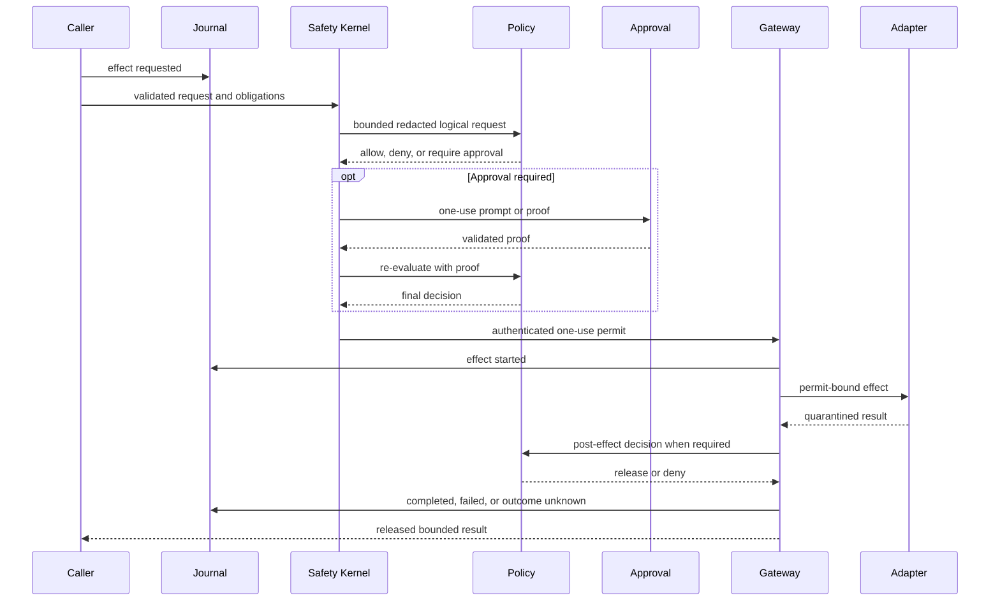

# Security architecture

Every external or sensitive operation is an effect. The only supported path to an
effectful adapter is centralized and evidence-producing.

Reading the diagram without color: request evidence precedes local validation and policy;
approval is an optional obligation followed by re-evaluation; only a minted one-use
permit reaches an adapter; output remains private until release policy; a terminal event
closes the lifecycle.

## Non-bypassable properties

- The Safety Kernel rejects unknown capabilities, invalid request shape, unsafe path
  obligations, absent audit durability, invalid/expired/reused permits, oversized policy
  input, and hard-secret disclosure regardless of policy engine.
- Adapter constructors remain private to runtime composition.
- Effectful adapter methods require an opaque permit external code cannot construct.
- A permit is authenticated, actor/request/decision-bound, expiring, and single-use.
- Built-in policy or OPA can authorize an action but cannot disable local validation,
  sandbox containment, permit checks, quarantine, or terminal journaling.
- Approval satisfies an obligation and triggers policy re-evaluation. It is not an
  alternate execution path.

## Disclosure and release

Policy receives complete logical content after raw credentials, authorization headers,
private keys, key material, and hidden reasoning are replaced by bounded hashes and
references. Filesystem reads, provider output, network responses, process output, and
memory retrieval remain quarantined until mandatory post-effect policy permits release.
A denial cannot leak private bytes through output, errors, audit payloads, or observers.

## Adapter confinement

Filesystem paths are canonicalized against exact roots; read output is bounded and
writes reject symlink leaves and use same-directory atomic replacement. Processes run
without an implicit shell through authenticated helpers, cleared environments, exact
executables and arguments, bounded process trees, and selected native or OCI isolation.
HTTP effects match exact origins, pin DNS results, reject ambient proxies and redirects,
and quarantine responses.

## Evidence and uncertainty

Every effect records requested, decision, approval, started, and terminal evidence. If a
process stops after `effect.started` without a trustworthy terminal record, recovery
records `effect.outcome_unknown`. No generic layer automatically retries it.

Security-boundary changes require focused negative tests, permit-claim/replay tests,
adapter quarantine tests, journal evidence tests, and the relevant live platform
acceptance suite.
