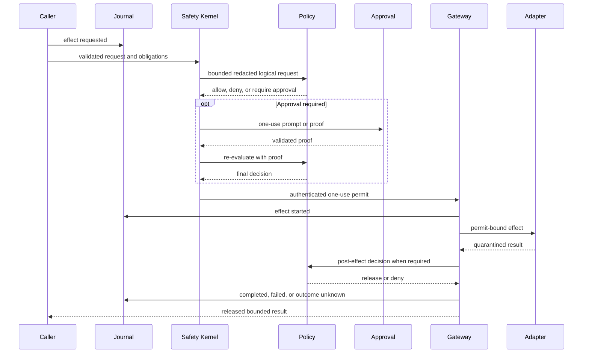

# Security architecture

Every external or sensitive operation is an effect. The only supported path to an
effectful adapter is centralized and evidence-producing.

Reading the diagram without color: request evidence precedes local validation and policy;
approval is an optional obligation followed by re-evaluation; only a minted one-use
permit reaches an adapter; output remains private until release policy; a terminal event
closes the lifecycle.

## Non-bypassable properties

- The Safety Kernel rejects unknown capabilities, invalid request shape, unsafe path
  obligations, absent audit durability, invalid/expired/reused permits, oversized policy
  input, and hard-secret disclosure regardless of policy engine.
- Adapter constructors remain private to runtime composition.
- Effectful adapter methods require an opaque permit external code cannot construct.
- A permit is authenticated, actor/request/decision-bound, expiring, and single-use.
- Built-in policy or OPA can authorize an action but cannot disable local validation,
  sandbox containment, permit checks, quarantine, or terminal journaling.
- Approval satisfies an obligation and triggers policy re-evaluation. It is not an
  alternate execution path.

## Disclosure and release

Policy receives complete logical content after raw credentials, authorization headers,
private keys, key material, and hidden reasoning are replaced by bounded hashes and
references. Filesystem reads, provider output, network responses, process output, and
memory retrieval remain quarantined until mandatory post-effect policy permits release.
A denial cannot leak private bytes through output, errors, audit payloads, or observers.

Provider text streaming preserves exact text and order while coalescing consecutive
token-sized deltas into batches of at most 4 KiB or 100 ms before they enter post-effect
release. A non-text event flushes the pending text first. Every resulting batch remains
quarantined, independently post-authorized when required, and durably evidenced; the
batching only prevents an external provider's fragment size from creating unbounded
policy, journal, projection, and shutdown work. If a later transport or decoding error
terminates the stream, already accepted buffered text is flushed through the same
release boundary before the error is returned.

Provider streaming uses two distinct bounded deadlines. `timeoutMs` limits connection setup and
each interval without response bytes; a successful read resets that inactivity timer.
`generationTimeoutMs` independently limits total wall time through the effect gateway, so a
provider cannot keep a generation alive indefinitely by dripping bytes. Catalog and other
non-streaming provider requests continue to use `timeoutMs` as their total transport ceiling.
The built-in policy adds a one-second cleanup allowance outside the configured generation
deadline. When an external policy supplies a stricter outer deadline, the streaming adapter
reserves that allowance inside the policy deadline so an already-accepted text batch can still
cross post-effect authorization and observation before the adapter returns an outcome-unknown
deadline error.

Tool execution and model observation have separate output bounds. After post-effect
release, the complete released `ToolResult` remains available to the terminal run event
and canonical run evidence. Before provider continuation or session persistence, the
agent projects that result into a bounded, valid JSON observation. Oversized structured
results retain salient fields; text and collection previews retain bounded head/tail
content; encoded binary payloads are replaced by metadata; and every truncated
observation records its original byte count and SHA-256 digest. The projection preserves
the canonical tool name and call ID, never grants access to unreleased bytes, and is
reapplied as a derived view when older session history is prepared for a provider.
Fresh released output always computes the byte count and digest from its own bytes; only
the derived history-reprojection path recognizes an existing observation envelope, so
tool-controlled JSON cannot supply trusted provenance. One
observation may occupy at most 64 KiB, and all observations after one user message and
before the next share a 256 KiB aggregate budget. Assistant continuation messages do not
reset that aggregate budget, so a long sequence of individually bounded MCP results
cannot accumulate into an unbounded protected turn.

A complete, bounded JSON-RPC error frame from an MCP server is a confirmed server
response. Colossus normalizes it into a quarantined `CallToolResult` with `isError: true`,
then applies credential redaction and the ordinary post-effect release decision before
the agent can inspect it. Missing, truncated, malformed, disconnected, or timed-out MCP
responses after dispatch retain outcome-unknown semantics and terminate the run rather
than inviting an unsafe retry.

Model-supplied MCP server names, live tool names, and live tool arguments are dynamic
inputs beneath the statically offered `mcp.call` tool. Unknown servers, tools that an
allow-all server does not advertise, and arguments rejected by the discovered schema
return bounded invalid-argument observations so a later model turn can correct them.
An exact tool excluded by an explicit configured allowlist remains a terminal policy
denial and never reaches the call adapter.

Provider and model diagnostics have an explicit local-operator release. The CLI
`--include-provider-response` option and the local TUI `/models doctor` and `/provider
doctor` commands can return the credential-free request plus at most 16 KiB of a failed
or transport-incompatible response body after exact configured-credential redaction. The TUI
`/provider diagnostics on` command applies the same release to failed provider turns in
the current TUI process, including post-tool continuations, until the operator runs
`/provider diagnostics off` or exits. These captures are represented as quarantined
adapter output and must pass the ordinary post-effect decision before the authenticated
local worker or direct TUI receives them. Default Doctor output, default run failures
and events, and durable audit payloads remain status-only and never receive the body.
An in-run diagnostic request can contain user, session, and tool-result content, so the
TUI warns the operator to review it before sharing.

Canonical tool identities are never renamed to accommodate a provider. Network adapters
build a request-local, one-to-one transport alias map that projects `.` to `_` under the
portable 64-byte function-name grammar. Definitions and continuation history use that
map, and streamed or non-streamed provider tool calls are restored to canonical names
before they cross back into agent policy or dispatch. Unrepresentable names and alias
collisions fail closed before network execution. Diagnostic request bodies intentionally
show the actual provider aliases because they are wire evidence, not authority records.

Canonical tool schemas likewise remain the local authority. Before network execution,
provider request validation requires every schema root to declare `type: object`. The
adapter clones each schema and removes root-level `oneOf`, `anyOf`, `allOf`, `enum`, and
`const` keywords from the provider copy; the Chat Completions copy also omits
`maxLength` recursively. Responses marks the projected function as non-strict and Chat
Completions leaves `strict` unset. These projections only shape model guidance. The tool
registry validates model arguments against the unchanged canonical schema before policy
or dispatch, and execution handlers independently recheck security-relevant cross-field
invariants.

## Journal protection tiers

The canonical journal always retains optimistic stream concurrency, record hashes, the
global hash chain, indexes, projection outbox, per-read payload validation, and complete
`audit verify`. `storage.keys.kind: none` encodes canonical JSON with
`plaintext-json-v1`; it intentionally provides no confidentiality, signed checkpoint,
or external rollback anchor. `platform` and `environment` enable authenticated payload
encryption, Ed25519 checkpoints, and a separately protected anchor as one complete tier.

Native sidecar bootstrap defaults to platform protection. Its explicit
development-plaintext flag travels only over inherited bootstrap IPC and never comes
from a renderer or public run request. Desktop debug builds select that flag and use a
separate `development-plaintext/` runtime partition and instance identity; release
builds retain platform protection. This separation prevents a debug build from
reinterpreting or migrating an existing protected journal.

Desktop Aside creation accepts an owned source-run identifier, never renderer-supplied
transcript content or a renderer-guessed canonical message boundary. The runtime
resolves the end of that source run from canonical session records, then copies only
bounded visible user and assistant messages. Tool calls, tool results, system messages,
and their payloads remain excluded from the child conversation.

`storage.adapter: ephemeral` retains those keyless integrity checks only for the life of
one process. It rejects protected keys because their anchor would outlive the journal,
emits a security-posture warning, and cannot provide crash recovery or durable evidence
for uncertain external effects. Operators must select redb or PostgreSQL whenever that
evidence is required across retry or restart.

Each redb file and PostgreSQL schema stores a protection marker. Empty stores initialize
from configuration; nonempty markerless stores are conservatively classified as
encrypted. A mismatch aborts runtime construction before event writes. Mixed algorithms
and in-place protection migration are unsupported. Incremental plaintext startup checks
only bounded local head/index invariants, while full startup and explicit audit
verification replay all payloads. Runtime-owned structured posture findings feed CLI,
worker, and TUI diagnostics. The dangerous full-access finding is emitted on stderr even
for non-interactive CLI invocations, while JSON stdout remains machine-readable; other
automatic posture cards remain terminal-oriented.

## Adapter confinement

Filesystem paths are canonicalized against exact roots; read output is bounded and
writes reject symlink leaves and use same-directory atomic replacement. Processes run
through authenticated helpers with bounded arguments and supervised process groups,
plus selected native, Windows, or OCI isolation. Isolating and `external` modes use
cleared environments, exact or trusted-profile executables, isolated shell homes/temp
directories, and sanitized command paths. Acknowledged `danger_full_access` retains the
authenticated permit/audit path and configured effect bounds but deliberately enables
a distinct ambient resource-authority mode for all effect lineages. Process execution
permits ambient executables, environment, working directories, filesystem, and child
networking; private helper-control variables are not inherited. Structured filesystem,
repository, patch, trace, and related path effects may bind exact host paths outside the
selected workspace, including Colossus and version-control control paths. Structured
network effects may bind any exact canonical HTTP(S) origin, including loopback,
private, link-local, and metadata destinations. Ambient authority is carried explicitly
in the policy obligation and permit; it is not encoded as filesystem `/` or network
`*`, and the Safety Kernel rejects it unless the runtime's danger boundary is
acknowledged. Configured time, output, process-count, memory, and concurrency ceilings
remain mandatory. Native process accounting counts OS process leaders and sums resident
memory once per process rather than treating Linux task entries as separate processes.
The Linux helper is dispatched before the asynchronous CLI runtime starts so it can
establish and map its rootless user namespace while still single-threaded, then create
the private mount namespace used to mask protected paths. After mounting those masks,
it locks root and ambient-capability securebits, enables no-new-privileges, and clears
the ambient, bounding, permitted, effective, and inheritable capability sets before
the requested executable starts. The shell therefore cannot unmount its control-state
masks even though the helper needed namespace-local mount authority during setup.
On Linux, `sandbox doctor` re-executes the trusted helper in a bounded, no-I/O probe to
prove that user and mount namespaces can actually be established. Ubuntu hosts that
restrict unprivileged user namespaces require the shipped AppArmor profile, which grants
`userns` to one canonical root-owned executable path rather than weakening the
host-wide restriction.
The `workspace-development` profile derives workspace authority only for users and
agents without workflow lineage; control-state paths are denied or masked before the
command starts.

HTTP effects match either an exact canonical origin or the public HTTP(S)-only `*`
grant. The wildcard excludes loopback, private, link-local, and metadata destinations;
exact private HTTPS origins and exact loopback HTTP origins remain possible. Under
declared authority, even an exact origin cannot authorize non-loopback plaintext HTTP.
Provider, search, integration, brokered HTTP,
semantic memory, native/Windows process proxy, and OCI proxy paths share this matcher,
pin DNS results, validate TLS authority, reject ambient proxies and redirects, bound
connections, and quarantine responses. Process proxy results record a bounded list of
allowed observed origins.

Under ambient authority, the destination classifier no longer rejects a requested
non-public HTTP(S) origin and no configured destination entry is required. URL
canonicalization, HTTP(S)-only transport, credential-in-URL rejection, safe headers,
DNS pinning, disabled ambient proxies and redirects, response bounds, quarantine,
post-effect policy, and durable evidence remain mandatory. HTTPS still receives normal
certificate and hostname validation. Ambient authority also accepts canonical
non-loopback plaintext HTTP, which has no TLS confidentiality or server authentication
and can expose request content and credentials in transit. Provider routes,
MCP servers and tool allowlists, integrations, credentials, plugin trust, and all other
capability declarations remain configured-only.

Direct Unix process supervision is not a kernel containment boundary. The effect
timeout and output ceiling cover the supervised request and attached process group, but
process-count, memory, whole-tree termination, and cleanup are best-effort against code
that deliberately calls `setsid`, double-forks, or reparents itself. An escaped
descendant may outlive the effect and its later activity is not represented by that
effect's audit record. Strict descendant containment requires native or OCI isolation,
a Windows Job Object, or an asserted external host boundary that owns the complete
process namespace/job.

Agent Plugin scripts run only through ordinary process tools, and plugin MCP servers
require explicit runtime enablement. Their signatures, trust state, portable declarations,
and selected-root grants remain necessary under every boundary and never grant ambient
authority.

Plugin registry effects identify the exact registry origin as their network resource;
local layout paths are separately checked against the transfer permit. Docker config
is parsed only after that authorization and an explicit file grant. Selected credential
helpers require a nested process permit, and only an opaque credential handle crosses
their result-release boundary. Verification and installation also check every selected
trust-profile key and local trust-root path before reading it, including re-verification
of installed content. Outside-workspace trust paths require explicit operator approval
under the built-in policy; external policy must supply the corresponding file grants.
Public discovery may request unavailable installation metadata, but this does not expand
the active run catalog or authorize instruction/resource reads for those installations.

Ambient destination authority does not weaken dedicated security-channel contracts.
Remote OPA remains HTTPS with pinned CA trust and mTLS identity. WORM audit export
remains HTTPS-only, create-only, and hash-bound.

Standalone CLI distribution is a separate operator-initiated network boundary, not an
agent effect. Repository-owned Unix and PowerShell bootstrap installers contact only
`api.github.com` for bounded published-release metadata and `github.com` for exact
versioned assets; release downloads may follow HTTPS redirects only to
`release-assets.githubusercontent.com`. The origin is compiled into the reviewed
scripts and has no environment or command-line override. Metadata, checksum sidecars,
archives, redirect counts, and expanded archive bytes have fixed limits. Stable and
preview release identity, exact target asset names, version metadata, and SHA-256 must
agree before any downloaded executable or packaged installer runs.

Bootstrap extraction accepts one exact version-and-target package root containing only
the reviewed release members. It rejects traversal, duplicate paths, links, reparse
points, device or special files, unexpected entries, and version mismatches. Packaged
installers reject linked destination components and unsafe ownership or permission
boundaries. The Unix installer creates missing destination directories under a private
umask after validating the existing prefix ancestry cannot be replaced by an untrusted
user. It may remove group-write permission from an existing current-user-owned `bin`
directory only when the prefix itself is owner-private. A group-writable `bin` beneath
a group- or other-accessible prefix, a missing `bin` beneath a replaceable prefix, and
every world-writable destination remain rejected. Installers stage replacements in the
destination directory and write a bounded credential-free direct-install receipt.
Binary replacement is rolled back if the receipt cannot commit. The bootstrap never
elevates, mutates shell profiles, logs headers or home-directory contents, or treats a
package-manager installation as direct ownership.

The CLI package installer creates or validates only the empty Colossus home root:
absolute `COLOSSUS_HOME` or the user's `.colossus` directory. It rejects linked,
foreign-owned, or shared directories, verifies that ancestors cannot be replayed by an
untrusted owner or ACL principal, and applies mode `0700` on Unix or an owner-private
Windows DACL. It never generates configuration, state, credentials, or instruction
files. A privileged or system-token install defers home creation until runtime has the
actual end-user identity, and bootstrap dry-run remains non-mutating.

Windows Desktop separately honors an explicit absolute `COLOSSUS_HOME` but otherwise
creates its generated home at `%LOCALAPPDATA%\ColossusDesktopHome` under the interactive
user identity. This keeps Desktop settings, native credentials, and managed runtime
state out of a pre-existing CLI home whose ACL may permit another local principal.

Runtime update discovery is a second application-owned distribution boundary. The
standalone `update check` command runs before workspace, configuration, worker, or model
initialization, while the TUI starts it only as a detached one-shot notice task after
terminal startup. Both use the same fixed, credential-free GitHub latest-stable
endpoint with DNS pinning, ambient proxies disabled, redirects disabled, an eight-second
timeout, and a 1 MiB response limit. Metadata must identify a non-draft,
non-prerelease exact semantic version, the fixed public release page, and exactly one
native archive plus its adjacent checksum asset before Colossus reports an update.
Direct ownership is claimed only when a receipt matches the running version, target, and
fixed origin *and* names the canonical path of the running executable, so a receipt left
behind by a removed direct install never speaks for a Homebrew, Nix, or source binary.

Successful metadata, ETags, and bounded failure categories use strict owner-local cache
records with same-directory atomic replacement. Receipt and cache records are read only
from a current-user-owned directory that grants no group or other access, and only when
the record itself carries the same owner-private permissions or Windows DACL; a shared
directory cannot supply a forged latest version or a forged failure that suppresses
checks. Unsafe, linked, foreign-owned, group- or world-accessible, malformed, oversized,
or unavailable cache state is ignored with a warning. The cache contains no workspace,
session, credential, header, or response-body data. Checks are throttled for 24 hours,
including failures. DNS, connection, timeout, rate-limit, service, and validation
failures become typed `unavailable` results: they cannot stop normal CLI or TUI use,
and the TUI remains silent unless a newer stable version was validated. Discovery does
not download or replace an executable.

The operator-only `update` command also enters before runtime construction and reuses
that validated stable discovery result, or accepts one exact newer stable `vX.Y.Z`. It
can replace only a direct installation whose owner-private receipt matches the running
version, target, fixed origin, canonical executable, and exact
`PREFIX/bin/colossus[.exe]` location. Unknown, source, Homebrew, Nix, stale, preview,
and downgrade cases fail closed without replacement. Package-manager wrappers may set
one bounded advisory marker so check/refusal output names the owning upgrade command;
the marker is never accepted as direct ownership or replacement authority.

The release build embeds the exact reviewed fixed-origin bootstrap source rather than
downloading mutable code. Unix runs it from a private temporary directory with bounded
execution time; Windows stages it with a literal launcher and waits for the parent
image to exit before replacing the locked executable. The bootstrap performs the same
bounded metadata, redirect, archive, checksum, layout, and version validation as a new
install, then delegates to the packaged same-directory atomic installer. Failed
download, validation, extraction, launch, replacement, or receipt commit preserves the
prior executable. Unix `curl` and Windows `HttpClient` both disable ambient proxies.

Configured stdio MCP remains a process effect. Streamable HTTP MCP is a network effect
and uses the same exact-origin/public-wildcard matching, DNS pinning, proxy and redirect
rejection, CA roots, permit timeouts, and bounded response path. Remote
declarations contain only literal non-secret headers and environment credential
references; the permit-bearing adapter resolves those references immediately before the
request. OAuth authorization is an operator-only PKCE flow and never starts from an agent
tool call. Tokens are server/endpoint/repository-bound in the platform credential
namespace, a domain-separated XChaCha20-Poly1305 redb sidecar, or an explicitly reported
owner-only plaintext sidecar selected by keyless `auto`; client secrets remain behind
their configured references. Stateful sessions remain the default. A strict,
request-bound `allowStateless` opt-in permits one top-level remote declaration to omit
`Mcp-Session-Id`; stdio and plugin-provided servers reject that field. Each discovery page
and tool call uses a fresh initialized transport, disables request and expired-session
retries, accepts empty success responses only for one-way JSON-RPC frames, and treats an
uncertain tool call as `OutcomeUnknown`. For stdio, the authenticated process job may
hold stdin open after writing the complete one-shot batch until the final response or an
initialization error is observed in bounded JSONL stdout. Malformed or truncated output,
child exit, and the normal effect deadline terminate that hold; stdin is then closed and
the same resource supervision and process-tree cleanup continue.

Codex/ChatGPT authentication is also operator-only. `colossus codex login` delegates the
OAuth ceremony to the official Codex CLI and forces its supported file credential store;
Colossus never handles the authorization code. The `open_ai_codex` adapter accepts only
`codex:default`, fixes the service and refresh endpoints, rejects symlinked or non-private
Unix auth files, resolves tokens only after a provider permit, and redacts both bearer and
ChatGPT account identifiers from quarantined responses. Only `open_ai_codex` may reference
`codex:default`, so a non-Codex profile cannot pass startup validation and then fail every
call in the standard credential resolver. Proactive refresh requires the OpenAI auth origin
in the same permit's network obligations and atomically updates the Codex-managed file
without changing accounts: the read-compare-write cycle holds a cross-process advisory lock
on a sibling `auth.json.lock` file and re-reads the stored tokens immediately before
persisting, so an external writer such as the official Codex CLI is never overwritten with a
stale snapshot. Backend requests distinguish the audited
Codex wire-contract version from the Colossus product version: `version` is compatibility
metadata pinned in the adapter, while `User-Agent` names the actual Colossus build.
Codex streaming requests explicitly accept SSE. The fixed backend can omit the response
media type, so only the Codex adapter permits an absent `Content-Type` before applying
the same bounded strict SSE and Responses-event validation; an explicit conflicting
media type still fails closed.

Desktop exposes the same Codex contract only through native commands. The renderer can
request status, login, or logout, but it receives only a bounded state and message. The
native backend confirms account mutations, invokes the official CLI, validates the
owner-private store, and passes only its absolute path over the inherited managed-sidecar
bootstrap channel. The protocol requires that private path exactly when a managed Codex
provider is present, rejects a renderer-selected Codex base URL or key reference, and
keeps both the path and credential material out of generated runtime YAML and debug
output.

One explicit bounded PEM CA bundle may augment built-in roots across Colossus-owned
outbound clients. It is loaded once at runtime startup and never sourced from ambient
proxy or TLS environment variables. Adapter-specific OPA and PostgreSQL CA policies
remain exclusive overrides, and public API clients continue to verify their separately
provisioned leaf pin. Sandboxed and MCP child processes retain independent TLS stacks.

`risk-auto` is deliberately narrow: only model or child-agent `shell.run`, `web.search`,
bodyless `network.http` GET, and configured top-level `mcp.call` effects without workflow
lineage can use a low-risk `allow` recommendation to mint a request-bound approval
proof. The evaluator has no tools and receives redacted proposed-effect metadata:
network review includes the requested URL or search query, while MCP review includes
the exact endpoint identity, transport and stateless opt-in, configured server/tool, bounded advisory
description and annotations, fresh schema hash, and validated arguments. Resolved
credentials and authentication configuration are absent, environment values become
names, and sensitive argument fields are redacted. Field-name redaction is word based
after camelCase and separator normalization, so compound schema-specific names such as
`github_token`, `dbPassword`, `clientSecret`, or `apiKey` are redacted alongside the
plain names.

MCP descriptions and annotations are untrusted evaluator hints, not authority or hard
preconditions. Explicit and wildcard tool selection share the same review rule because
the proof binds one invocation, and stdio and Streamable HTTP share eligibility while
retaining their different process and network obligations. Plugin-provided MCP action
prefixes, unsupported metadata, non-read-only network methods, workspace mutations,
dynamic integrations, workflows, system actors, and every non-low-risk assessment
preserve explicit approval or denial. Ineligible reviews record a bounded reason that an
attached prompt can display.

After the request-bound automatic proof is durably recorded as `approval.granted.v1`,
the approval provider may release a bounded `AutomaticApprovalNotice` to an attached
interface. That best-effort notice is presentation only: delivery failure cannot grant,
deny, retry, or otherwise change the effect decision. Worker delivery remains inside the
authenticated run channel.

Unavailable and malformed evaluator results are durably classified before attached
clients receive a best-effort fallback warning. The released warning contains only the
failure category and bounded effect display metadata; raw provider diagnostics and
malformed model output remain internal. A warning never mints proof or changes the
ordinary explicit-approval requirement.

## Public application transport

The public application API is a separate trust boundary from private worker IPC.
It binds only an IP-literal loopback address and requires TLS 1.3 plus a
per-application bearer credential. Discovery metadata and the public leaf certificate
are separate owner-only files; neither contains a credential or private key. Clients
validate the descriptor, endpoint, API and instance identity, normal TLS identity, and
an independently provisioned certificate SHA-256 before sending authorization
metadata. A descriptor fingerprint is only a consistency check: native connectors
require the trusted expected fingerprint separately and reject before credential
loading when it differs. The published PEM contains exactly one pinned end-entity
certificate with explicit `BasicConstraints CA=false`; Colossus does not accept a CA
certificate or chain as the local API identity.

Authentication creates the application actor and its exact scope, role, and tool
ceilings on the server. Public requests cannot submit identity or authority. Credential
verifiers are keyed under an API-specific authentication root and the verifier plus
grant are recorded in the journal; bearer secrets exist only during issuance and in
the application's platform
credential store. API TLS, API authentication, private worker IPC, journal encryption,
checkpoint signing, permit MAC, and provider keys are independent.

Owner-only discovery files and the generic OS credential store establish an OS-user
boundary, not portable same-user-process isolation. Keyring service/account values are
lookup labels. A deployment that treats another process under the same UID or account
as hostile must use platform-specific application-bound key storage and code identity,
and must provision the TLS pin through signed application configuration or app-owned
protected storage. Without those controls, same-user malware is outside the
transport's confidentiality boundary; per-application grants still constrain honest
applications, renderer-to-native capability boundaries, accidents, and independently
protected credentials.

The server and Rust client verifier reject TLS 1.2. The transport bounds handshake time,
connections, concurrent requests, authenticated protobuf decodes globally and per
application, HTTP/2 streams, header bytes, request bytes, response bytes, and repeated
field cardinality before durable work begins. Its independent active-watch ceiling is
lower than both global and per-connection request admission, reserving unary headroom
so watches cannot starve cancellation, interaction responses, or system RPCs.
`agent.delegate` is advertised only when it is present in the authenticated
application's tool ceiling. The delegated job durably records that exact ceiling, the
child run receives only that ceiling, and child runs always remove `agent.delegate`
before model tool discovery so delegation cannot recurse.

Artifacts use an explicit owner-bound release boundary. A caller with
`artifacts:write` first reserves an upload with an exact length and SHA-256 digest,
then sends bounded ordered chunks. Colossus exposes the opaque artifact ID only after
the complete bytes match the reservation. Metadata and downloads require
`artifacts:read` and the same authenticated application ID. Original paths, partial
uploads, and another application's artifacts are never released. Run-input
attachments are accepted only from available `run_input` artifacts with supported
bounded UTF-8 media types or validated static PNG, JPEG, and WebP content. Durable model
history contains only verified image metadata. Exact bytes remain encrypted artifacts
and are re-resolved and reverified only after the provider permit is issued; policy,
audit, diagnostics, logs, and released errors never receive the bytes or data URL.

Public run listing is owner-indexed and never scans the shared global journal. The
idempotency claim, run creation, and per-application index entry commit atomically.
Newest-first reads, run reconstruction, and filter traversal have independent hard
bounds. Continuation tokens bind the authenticated application and canonical filters,
carry an immutable index snapshot and exclusive resume version, and validate their
referenced durable index entries before use.

Run-update payloads contain a versioned prior-state projection and cumulative
released-byte count. Protected storage encrypts that payload; keyless storage keeps
canonical plaintext with payload and record hashes. Mutation paths authenticate only
the creation and two-event tail, derive state and accounting from the predecessor,
validate the current projection, and append with optimistic concurrency, keeping
per-update work constant as a run grows. Pending interactions block unrelated updates
so their prompt projection cannot be duplicated across the remaining event budget. Read
reconstruction continues to replay the complete bounded stream and verifies every
projection against the preceding state. The projection is journal-authenticated durable
evidence, not a mutable in-memory authority cache.

Finite loopback connection and handshake limits mitigate resource exhaustion but are
not an availability boundary against a hostile local process, including one running as
another OS user. Loopback TCP has no filesystem-style owner ACL, so such a process can
consume unauthenticated socket slots. Deployments requiring local-process availability
isolation must add an ACL-bound local transport or operating-system process isolation.

Public approval DTOs are a separate release boundary. They contain a generic bounded
prompt, a fresh randomized one-use binding, a fixed public action category, and only a
sanitized resource category or HTTP(S) origin. The private policy request hash remains
inside the native runtime. Raw internal action and tool names, absolute paths,
executables, URL user information, paths, queries, fragments, raw policy reasons,
effect arguments, and deterministic commitments to those values remain private.

Credential revocation blocks later authentication but does not alter work already
accepted under that application's captured authority. Cancellation is a separate
durable operation requiring a currently authenticated same-application caller with the
control scope.

Credential rotation delivers and durably activates the replacement before revoking the
prior credential. If prior revocation cannot be confirmed, administration preserves
the active replacement at its destination and reports both non-secret identifiers for
explicit reconciliation; it does not risk restoring a prior bearer whose revocation
may already have committed.

The renderer in a Tauri application is untrusted application input. It calls narrow
capability-scoped Rust commands and receives ordered released updates. It never receives
daemon credentials, private discovery paths, effect inputs, quarantined effect output,
hidden reasoning, or a generic process, filesystem, network, or SDK invocation escape
hatch. A successful tool lifecycle update may include a bounded preview of the tool
output only after the same post-effect policy release that makes that output available to
the model. The preview is capped at 64 KiB and marked when truncated; failed, cancelled,
unstarted, and outcome-unknown tools do not release an output preview.
Once permit-bound execution starts, its lifecycle update may also include at most 64 KiB
of the validated structured tool input so an operator can see what actually ran.
Requested, denied, and cancelled-before-start calls do not release that execution input.
Delegated child lifecycle updates follow the same release discipline. They contain the already
bounded durable child job, and a terminal update includes only the released child output or
bounded redacted error. Child provider deltas, hidden reasoning, and private transcript history
are never copied into the parent interface event stream.
See [Public API and application SDKs](application-sdk.md) for the complete topology.

Desktop Workspaces are native-owned folder bindings, persisted as neutral
`WorkspaceProfile` records. The renderer can add a Workspace only through the native folder
picker, and duplicate canonical object identities are rejected or explicitly restored
from archive. At most four Managed Local sidecars remain live. Starting a fifth evicts
only the least-recently-used sidecar with no queued, running, waiting, cancelling, or
terminal work; an all-busy set fails without changing selection. Each live Workspace owns
its lifecycle generation, health, worker control client, approval mode, terminal
context, and last-use state. Approval resets to Ask on every start or restart, and one
Workspace's failure cannot replace another Workspace's state.

All renderer-issued run, response, cancellation, permission, file, and terminal actions
remain bound to the natively selected Workspace. Switching closes selected terminal sessions
before activating the new context but does not stop background runs. Native status
refreshes read only released run summaries from live sidecars and publish bounded
`space-status-changed` and `space-attention` events. Global thread search uses a
replaceable app-private redb index containing only bounded Workspace/run/session IDs, Workspace
name, title, mode, status, timestamp, and attention state. It never stores prompts,
messages, tool input/output, secrets, credentials, or canonical paths.

The read-only Desktop file viewer is a separate, narrow local-user disclosure surface,
not a generic filesystem bridge or an agent tool. It is available only while the exact
Managed Local target is selected with non-Minimal workspace-tool access (Development or
Allow all), accepts the opaque current workspace ID plus a bounded relative path, and
revalidates the persisted object-bound workspace identity before and after every
operation. It rejects absolute paths, parent components, links, non-files,
non-directories, non-UTF-8 or unsafe-control text, large files, and oversized
directories. Control state, version-control internals, generated dependency/build trees,
environment files, credential files, and key/certificate formats are excluded. The
native boundary returns at most 256 KiB of text and exposes no write, execute, process,
network, arbitrary-open, or SDK command. Source changes continue through ordinary
permit-bound agent effects; the viewer cannot mutate them.

A managed desktop sidecar is a separate signed process, not an in-process extension of
renderer authority. Its exact signed executable and the bundled TUI CLI are named in a
SHA-256 manifest whose exact byte digest is patched into, and then sealed by, the signed
running desktop executable. The manifest is opened once without following symlinks;
selected executables are code-identity checked immediately before no-shell spawn and
bootstrapped only over inherited bounded channels. The release manifest is created
after nested signing because signing changes Mach-O bytes; an unset compile-time marker
or an unbound resource is never accepted as final executable authority.

Executable binding is platform-specific and fails closed. On macOS, native code hashes
and parses one private snapshot of the manifest-selected Mach-O, starts the bundle path
with the kernel's start-suspended flag, and verifies the suspended process's exact live
CodeDirectory identity under strict, network-disabled validation before `SIGCONT`.
Linux executes the verified bytes from a sealed, non-writable `memfd`; other Unix
platforms do not expose Managed Local until they provide an equivalent pre-instruction
binding.

Every Managed Local Workspace binds its selected workspace by object identity rather than
by pathname alone. On macOS, Desktop derives a versioned opaque digest from the device,
inode, and birth timestamp read from one opened no-follow directory descriptor. It
persists that digest in owner-private settings, includes it in the managed state
partition, and supplies it as an exact launch and restart ceiling. Preview-era
path-only and device/inode-only records are migration input, never launch authority;
Desktop rotates their managed instance seed and requires explicit folder reselection.
The SDK holds the selected directory open and rejects identity drift before cloning
bootstrap secrets or spawning; the child independently opens and matches the same
object, and runtime lease acquisition reopens it against a runtime-owned identity
token. The runtime retains that descriptor and revalidates the pathname both before
tool dispatch and at permit-bearing filesystem and process adapter boundaries. A
renamed or replaced workspace therefore cannot inherit prior state or redirect an
active managed runtime.

On Linux, CLI/TUI workspace identity continues to use the version-4 device, inode, and
birthtime digest when `statx` supplies valid birthtime. When an opened NFS directory
genuinely has no birthtime, version 5 instead hashes a bounded opaque file handle with
durable NFS filesystem-scoping evidence captured for that descriptor. Transient device,
inode, and mount identifiers remain useful for same-capture race checks but are not the
durable version-5 identity. A claimed but malformed birthtime, conflicting descriptor
metadata, an unsupported or malformed handle, or missing or ambiguous filesystem scope
fails closed. Colossus never weakens this case to a pathname-only or device/inode-only
identity, and runtime acquisition and revalidation independently reproduce the selected
identity kind. A version-5 NFS workspace rejects legacy device/inode-only expected
tokens at runtime acquisition. The Linux SDK-managed sidecar bootstrap still carries
those legacy tokens, so it cannot launch a birthtime-less NFS workspace until its
bootstrap contract carries the complete version-5 identity.
Across version-5 captures, an unchanged scoped digest identifies the same remote
directory even if a remount changes client device or inode numbers. The retained
descriptor must still pass its original metadata and identity checks; a stale or
invalid descriptor remains a failure.

The same identity feeds a versioned domain-separated SHA-256 home partition. CLI/TUI
and Desktop select disjoint children, preventing a shared redb writer lease, worker
bootstrap secret, or provider namespace. User-level configuration, Desktop settings,
and every partition remain beneath the validated owner-private, no-follow home. The NFS
identity fallback establishes workspace binding only; it does not claim that every NFS
implementation provides the locking and durability required for canonical state.
Operators with an NFS user home should select an owner-private local `COLOSSUS_HOME` and
`storage.location: home_workspace` when state must remain local. An explicit
configuration path outranks the repository file, which outranks the home file; the
first selected document is complete and a malformed candidate fails without fallback.
Automatic repository and home candidates additionally use confined no-follow opens and
fail when unsafe; an explicit path retains the caller's normal explicit-file authority.
`storage.location: home_workspace` additionally confines relative storage paths beneath
the CLI partition, while omitted `location` preserves the workspace-relative
compatibility boundary.

Home and repository `AGENTS.md` files are model-input data, never authority. Each
top-level user-facing run reads at most those two no-follow UTF-8 regular files, bounded
to 64 KiB each and 128 KiB combined, then freezes their content and SHA-256 provenance
for provider turns, Goal iterations, and delegated-subagent recovery. A later run
refreshes the files. Present unsafe or invalid files fail closed. Explicit invocation
and immutable runtime-mode instructions retain higher precedence. The snapshot is not
injected into risk evaluation, summarization, provider diagnostics, or other internal
security roles and cannot add tools, sandbox roots, network origins, policy grants, or
approval authority.

Private worker IPC remains an authenticated owner-only Unix socket. When the canonical
state-derived pathname would exceed the portable Unix socket limit, Colossus places a
domain-separated digest of that state identity in the same fail-closed, owner-private
coordination directory used by the workspace writer lease. The sidecar binds this
endpoint before acknowledging bootstrap activation, so an unsafe or unavailable local
endpoint fails on the inherited control channel rather than being misreported as a
public TLS failure. No worker key or provider credential is written into the pathname.
Protocol v15 keeps authenticated client requests bounded at 1 MiB and serialized
response frames bounded at 8 MiB, enough for a permitted 4 MiB effect result after the
nested base64 encoding without turning worker IPC into an unbounded allocation path.
For ordinary CLI-started workers, the server creates or loads a versioned random key
from the owner-only, no-follow regular file at `<storage.path>.worker-auth`; clients
never create or repair that file. This key is independent of journal encryption,
checkpoint signing, permit MACs, and sandbox job authentication. Managed Local instead
retains inherited-channel delivery and never persists its worker bootstrap key. The
native Desktop backend may use that same memory-only key through the narrow
`colossus-worker-protocol` control client to read or change the worker-wide approval
mode. The renderer receives only the four-value mode DTO and cannot access the key,
endpoint, or generic worker operations. Elevation to `risk-auto` or `full-access`
requires a fixed operating-system confirmation, and native code rejects mode changes
while a managed run is active. This control changes only satisfaction of later approval
obligations; policy denials, tool grants, permits, and sandbox boundaries remain
unchanged.

Agent Plugin discovery is part of model input and therefore follows the same object-bound
discipline. Portable paths resolve within an immutable content root selected by an OCI
manifest digest. Fixed discovery admits only root `plugin.json`, immediate
`skills/NAME/SKILL.md`, and root `mcp.json`; invalid skills and MCP entries fail at their
component boundary. Metadata is bounded for discovery, while instruction and resource
bodies are loaded progressively. Only explicitly selected qualified skills add their
plugin root as a read/execute permit grant. `allowed-tools` is advisory and never grants
authority.

The `com.obscuritylabs.colossus` client extension may declare an icon beneath its own
directory. Icon discovery uses the same no-follow contained reads, admits only PNGs
within 64 KiB and 512 × 512 pixels, and decodes with an allocation limit before
re-encoding pixels. Authorized inventory releases only the bounded normalized PNG data
URL; raw client extensions remain excluded from live inventory. The renderer accepts
only bounded PNG data URLs and cannot fetch remote or local icon paths. Invalid display
assets produce a component diagnostic without granting authority or disabling skills.
The store bounds total inventory icon data to 2 MiB before any worker or API release,
prioritizing bundled identity without discarding plugins or changing catalog order.
External gRPC discovery validates and normalizes icons again before constructing SDK
records. Each page remains within 2 MiB, and the server includes at most 2 MiB of icon
data across the sorted catalog. The SDK retains its 8 MiB aggregate metadata limit, a
separate 2 MiB retained-icon budget, and a 10 MiB total transfer bound. Additional valid
icons fall back to monograms without removing plugins from the catalog. A cumulative
budget admits at most 64 image normalizations and 8 Mi decoded pixels per discovery.
The SDK checks the fixed PNG header before decoder construction; icons past the work
budget are discarded without decompressing image or ancillary data. Retained icons
receive full codec validation, and malformed icon envelopes remain protocol errors.

The owner-private `$COLOSSUS_HOME/plugins` store uses a dedicated redb writer lease for
lifecycle changes and shared cross-process snapshot leases for immutable content. Disable,
uninstall, and garbage collection cannot invalidate a running snapshot. Stable writable
`PLUGIN_DATA` is separate from read-only content and is preserved unless purge is explicit.
Registry transfers validate exact origins, independently pin DNS and CA policy for registry,
token, and blob redirect services, strip authorization on redirects, and verify every
descriptor before extraction. Runtime pre/post identity checks still reject stable
workspace drift, but path checks are not treated as protection against an A-to-B-to-A swap.

The retained descriptor makes state selection, lease ownership, plugin skill context, and TUI
attachment object-bound. Existing filesystem and sandbox effect adapters still consume
policy-authorized absolute paths after an immediate identity check; POSIX does not make
that multi-lookup handoff atomic against another native process with the same UID that
can rename the workspace namespace. Such a process is part of the same explicitly
excluded same-user-native-process boundary as the generic keyring provider, not a
renderer or remote-agent capability. Managed Desktop grants neither renderer nor agent
access to the workspace parent, and a stable rename or replacement fails closed. A
deployment that treats peer same-UID processes as hostile must add OS process isolation
or convert every effect adapter to descriptor-relative operations before relying on
this boundary.

Desktop's dedicated local Tauri terminal window can operate native-owned PTYs using
opaque window-bound sessions and the selected Workspace's fixed native workspace context. The main
renderer may request that window and one of the closed terminal kinds, but it cannot
open or control a PTY. The terminal DTO accepts only `colossus_tui` or `shell`; it
rejects renderer-selected processes, paths, working directories, environments, and
arguments.

A completed public Plan Mode run may expose its bounded canonical Plan ID, revision,
and status to the main renderer. The main renderer can request revision or execution
only by returning the caller-owned source run ID and exact visible revision in a typed
public run action; it cannot nominate a Plan ID. Server-side lookup rechecks source-run
ownership, session identity, released metadata, canonical revision, and Draft status.
Revision is constrained to Plan Mode; Direct or bounded Goal consumption is constrained
to Execute mode. These actions remain ordinary durable public runs and cross the same
interaction, policy, approval, permit, journal, audit, cancellation, and watch paths.
Authenticated discovery advertises this behavior as `plans.continue` only with both
run-read and run-execute scopes, and the SDK fails closed when it is absent so older
protobuf servers cannot silently ignore the typed field.

For the Managed Local advanced handoff, the main renderer may also return the Plan ID
with the owning public session ID only to the narrow `show_terminal_window` command.
Native code rejects missing, oversized, control-bearing, or shell-bound pairs. The
dedicated terminal renderer can then submit only the constructed `/session resume ID`
and `/plan use ID` selection text after opening the authenticated TUI. The main
renderer never receives PTY write authority.

The `shell` kind is a deliberately privileged local-user convenience, not an agent
tool. Enabling local terminals for the first time requires a fixed native operating-
system confirmation that states this authority. On macOS, native code revalidates the
persisted object-bound Managed Local workspace, validates the root-owned non-writable
system `/bin/zsh`, and launches exactly `/bin/zsh -l` with a native-constructed cleared
environment and that workspace. It receives no worker authentication and its commands,
input, output, and effects do not pass through the Safety Kernel, remote journal, or
Colossus audit path. It remains available while the managed runtime is unavailable so
the operator can inspect or repair the workspace directly. Consent is versioned;
settings created for the earlier TUI-only feature cannot silently enable shell
authority.

This is a VS Code-style renderer trust decision: compromise of the dedicated terminal
document while shell access is enabled can submit commands with the logged-in user's
authority. The terminal document is therefore a local-only, label-bound protocol with
its own narrow capability and CSP; remote navigation, automatic URL opening, clipboard
writes, and general Tauri shell, filesystem, HTTP, and process plugins remain disabled.
Compromise of the main WebView alone does not grant PTY input authority. Disabling the
feature, closing a tab, closing the terminal window, or exiting the app kills the
retained shell process group on a best-effort basis.

macOS has no supported race-free descendant job primitive for an ordinary desktop app
that can guarantee cleanup after arbitrary `setsid`, double-fork, and reparenting
behavior; `EVFILT_PROC/NOTE_TRACK` has been unsupported since macOS 10.5. Desktop
therefore explicitly does not claim containment of deliberately detached shell
descendants. The bundled TUI has the stronger path: it starts suspended in its own
session, its exact live code identity is verified against the manifest-bound
CodeDirectory before resume, then independently opens and changes directory through
the selected workspace descriptor and reports the same birthtime-bound identity. Only
after the parent verifies that attestation does it release worker authentication
through bounded one-use inherited anonymous pipes that are separate from the PTY.
The TUI connects to the existing worker and retains the ordinary Safety Kernel, remote
journal, and audit path. Closing its tab, window, or app freezes and kills that verified
CLI session.
Platforms without equivalent pre-instruction identity binding do not expose the
managed TUI launcher.

Discovery cleanup occurs only after the supervised process tree is confirmed dead. It
holds a no-follow file descriptor for the exact owner-private discovery directory and
may unlink only the fixed descriptor and certificate leaves after revalidating their
type, owner, mode, link count, device, and inode immediately before removal. Unsafe or
replaced state is preserved and reported rather than traversed or recursively deleted.

Managed Desktop approval authority is isolated from its ordinary run client. The
primary credential has the four run/read/control/prompt scopes and never
`approvals:respond`. A second same-application native broker credential has only that
approval scope, no tools, and no role outside the primary ceiling. The sidecar issues,
delivers, acknowledges, activates, and revokes the pair as one bootstrap lifecycle;
the SDK routes only approval answers over the broker's separately authenticated pinned
gRPC client. Renderer approval input still requires the native operating-system
confirmation before an allow response reaches this broker.
First-time non-Minimal access and every access-rank elevation, including
Development-to-Allow-all, require a fixed native confirmation before the wider tool
ceiling is persisted. Execution-boundary elevation is confirmed independently, including
changes from either isolated boundary to Full access. A renderer can request key rotation
but cannot suppress the native key prompt for first setup or a provider-kind change.

## Evidence and uncertainty

Every effect records requested, decision, approval, started, and terminal evidence. If a
process stops after `effect.started` without a trustworthy terminal record, recovery
derives the interruption from the canonical indexed effect stream and records
`effect.outcome_unknown`. A replaceable projection cursor cannot prove that no
interrupted effects exist. No generic layer automatically retries an uncertain effect.

The built-in policy gives the outer `research.run` orchestration a derived deadline that
contains the configured sequential provider-call, evidence-collection, and orchestration
budgets. Every nested provider, search, MCP, filesystem, and release effect retains its
own narrower timeout and terminal evidence. This prevents the generic sandbox deadline
from interrupting valid research while an inner external operation is active; external
OPA policy remains responsible for supplying an equivalent bounded research deadline.

Provider-visible tool turns preserve the same certainty boundary. The agent stages an
assistant tool-call message with exactly one terminal tool-observation message per emitted
call and commits the structurally complete turn to the session in one journal transaction;
the complete released result remains in the canonical run evidence rather than the
provider-visible session projection. Before any tool
effect begins, the session records a pending-turn marker with the exact provider call IDs;
pre-effect validation rejects duplicate or reused IDs. The atomic message batch also settles
that marker. A crash or uncertain batch commit therefore leaves a durable replay guard that
blocks later provider dispatch until an operator reconciles the turn from effect evidence.
Denial, cancellation, calls skipped after an earlier terminal error, and outcome-unknown
execution use distinct non-retryable results; an uncertain external effect remains explicitly
`outcome_unknown`. Session continuation and both OpenAI-compatible request projections
validate exact call/result pairing before provider dispatch. Legacy sessions with dangling
calls fail locally before a new user message is appended and require explicit recovery from
durable effect evidence or a new session; they are never silently truncated or guessed.

Security-boundary changes require focused negative tests, permit-claim/replay tests,
adapter quarantine tests, journal evidence tests, and the relevant live platform
acceptance suite.
