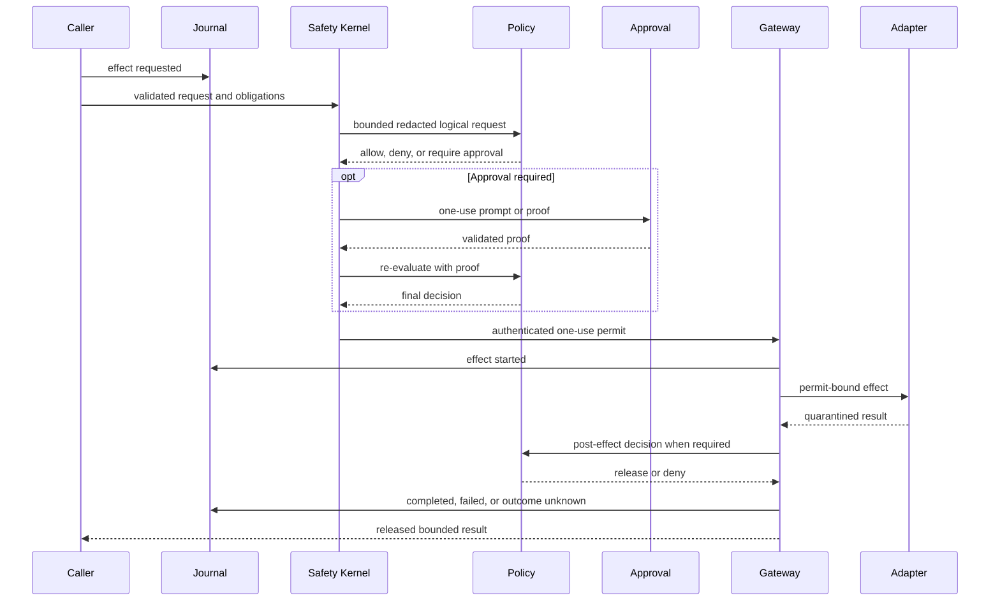

# Security architecture

Every external or sensitive operation is an effect. The only supported path to an
effectful adapter is centralized and evidence-producing.

Reading the diagram without color: request evidence precedes local validation and policy;
approval is an optional obligation followed by re-evaluation; only a minted one-use
permit reaches an adapter; output remains private until release policy; a terminal event
closes the lifecycle.

## Non-bypassable properties

- The Safety Kernel rejects unknown capabilities, invalid request shape, unsafe path
  obligations, absent audit durability, invalid/expired/reused permits, oversized policy
  input, and hard-secret disclosure regardless of policy engine.
- Adapter constructors remain private to runtime composition.
- Effectful adapter methods require an opaque permit external code cannot construct.
- A permit is authenticated, actor/request/decision-bound, expiring, and single-use.
- Built-in policy or OPA can authorize an action but cannot disable local validation,
  sandbox containment, permit checks, quarantine, or terminal journaling.
- Approval satisfies an obligation and triggers policy re-evaluation. It is not an
  alternate execution path.

## Disclosure and release

Policy receives complete logical content after raw credentials, authorization headers,
private keys, key material, and hidden reasoning are replaced by bounded hashes and
references. Filesystem reads, provider output, network responses, process output, and
memory retrieval remain quarantined until mandatory post-effect policy permits release.
A denial cannot leak private bytes through output, errors, audit payloads, or observers.

## Adapter confinement

Filesystem paths are canonicalized against exact roots; read output is bounded and
writes reject symlink leaves and use same-directory atomic replacement. Processes run
through authenticated helpers with cleared environments, exact or trusted-profile
executables, bounded arguments, isolated shell homes/temp directories, sanitized
command paths, bounded process trees, and selected native, Windows, or OCI isolation.
The Linux helper is dispatched before the asynchronous CLI runtime starts so it can
establish and map its rootless user namespace while still single-threaded, then create
the private mount namespace used to mask protected paths. After mounting those masks,
it locks root and ambient-capability securebits, enables no-new-privileges, and clears
the ambient, bounding, permitted, effective, and inheritable capability sets before
the requested executable starts. The shell therefore cannot unmount its control-state
masks even though the helper needed namespace-local mount authority during setup.
On Linux, `sandbox doctor` re-executes the trusted helper in a bounded, no-I/O probe to
prove that user and mount namespaces can actually be established. Ubuntu hosts that
restrict unprivileged user namespaces require the shipped AppArmor profile, which grants
`userns` to one canonical root-owned executable path rather than weakening the
host-wide restriction.
The `workspace-development` profile derives workspace authority only for users and
agents without workflow lineage; control-state paths are denied or masked before the
command starts.

HTTP effects match either an exact canonical origin or the public HTTP(S)-only `*`
grant. The wildcard excludes loopback, private, link-local, and metadata destinations;
exact private origins remain possible. Provider, search, integration, brokered HTTP,
semantic memory, native/Windows process proxy, and OCI proxy paths share this matcher,
pin DNS results, validate TLS authority, reject ambient proxies and redirects, bound
connections, and quarantine responses. Process proxy results record a bounded list of
allowed observed origins.

`risk-auto` is deliberately narrow: only model or child-agent `shell.run`,
`web.search`, and bodyless `network.http` GET effects without workflow lineage can use
a low-risk `allow` recommendation to mint a request-bound approval proof. The evaluator
has no tools and receives redacted proposed-effect metadata: network review includes the
requested URL or search query, while credentials remain references and environment
values are replaced by names. Non-read-only network methods, workspace mutations,
dynamic integrations, workflows, system actors, and every non-low-risk assessment
preserve explicit approval or denial.

After the request-bound automatic proof is durably recorded as `approval.granted.v1`,
the approval provider may release a bounded `AutomaticApprovalNotice` to an attached
interface. That best-effort notice is presentation only: delivery failure cannot grant,
deny, retry, or otherwise change the effect decision. Worker delivery remains inside the
authenticated run channel.

Unavailable and malformed evaluator results are durably classified before attached
clients receive a best-effort fallback warning. The released warning contains only the
failure category and bounded effect display metadata; raw provider diagnostics and
malformed model output remain internal. A warning never mints proof or changes the
ordinary explicit-approval requirement.

## Public application transport

The public application API is a separate trust boundary from private worker IPC.
It binds only an IP-literal loopback address and requires TLS 1.3 plus a
per-application bearer credential. Discovery metadata and the public leaf certificate
are separate owner-only files; neither contains a credential or private key. Clients
validate the descriptor, endpoint, API and instance identity, normal TLS identity, and
an independently provisioned certificate SHA-256 before sending authorization
metadata. A descriptor fingerprint is only a consistency check: native connectors
require the trusted expected fingerprint separately and reject before credential
loading when it differs. The published PEM contains exactly one pinned end-entity
certificate with explicit `BasicConstraints CA=false`; Colossus does not accept a CA
certificate or chain as the local API identity.

Authentication creates the application actor and its exact scope, role, and tool
ceilings on the server. Public requests cannot submit identity or authority. Credential
verifiers and grants are encrypted in the journal under an API-specific authentication
root; bearer secrets exist only during issuance and in the application's platform
credential store. API TLS, API authentication, private worker IPC, journal encryption,
checkpoint signing, permit MAC, and provider keys are independent.

Owner-only discovery files and the generic OS credential store establish an OS-user
boundary, not portable same-user-process isolation. Keyring service/account values are
lookup labels. A deployment that treats another process under the same UID or account
as hostile must use platform-specific application-bound key storage and code identity,
and must provision the TLS pin through signed application configuration or app-owned
protected storage. Without those controls, same-user malware is outside the
transport's confidentiality boundary; per-application grants still constrain honest
applications, renderer-to-native capability boundaries, accidents, and independently
protected credentials.

The server and Rust client verifier reject TLS 1.2. The transport bounds handshake time,
connections, concurrent requests, authenticated protobuf decodes globally and per
application, HTTP/2 streams, header bytes, request bytes, response bytes, and repeated
field cardinality before durable work begins. Its independent active-watch ceiling is
lower than both global and per-connection request admission, reserving unary headroom
so watches cannot starve cancellation, interaction responses, or system RPCs. Public
runs cannot expose `agent.delegate` until child-run authority ceilings are durably
propagated; naming that tool in a caller grant does not widen the runtime boundary.

Public run listing is owner-indexed and never scans the shared global journal. The
idempotency claim, run creation, and per-application index entry commit atomically.
Newest-first reads, run reconstruction, and filter traversal have independent hard
bounds. Continuation tokens bind the authenticated application and canonical filters,
carry an immutable index snapshot and exclusive resume version, and validate their
referenced durable index entries before use.

Run-update payloads contain a versioned, encrypted prior-state projection and
cumulative released-byte count. Mutation paths authenticate only the creation and
two-event tail, derive state and accounting from the predecessor, validate the current
projection, and append with optimistic concurrency, keeping per-update work constant as
a run grows. Pending interactions block unrelated updates so their prompt projection
cannot be duplicated across the remaining event budget. Read reconstruction continues
to replay the complete bounded stream and verifies every projection against the
preceding state. The projection is journal-authenticated durable evidence, not a
mutable in-memory authority cache.

Finite loopback connection and handshake limits mitigate resource exhaustion but are
not an availability boundary against a hostile local process, including one running as
another OS user. Loopback TCP has no filesystem-style owner ACL, so such a process can
consume unauthenticated socket slots. Deployments requiring local-process availability
isolation must add an ACL-bound local transport or operating-system process isolation.

Public approval DTOs are a separate release boundary. They contain a generic bounded
prompt, a fresh randomized one-use binding, a fixed public action category, and only a
sanitized resource category or HTTP(S) origin. The private policy request hash remains
inside the native runtime. Raw internal action and tool names, absolute paths,
executables, URL user information, paths, queries, fragments, raw policy reasons,
effect arguments, and deterministic commitments to those values remain private.

Credential revocation blocks later authentication but does not alter work already
accepted under that application's captured authority. Cancellation is a separate
durable operation requiring a currently authenticated same-application caller with the
control scope.

Credential rotation delivers and durably activates the replacement before revoking the
prior credential. If prior revocation cannot be confirmed, administration preserves
the active replacement at its destination and reports both non-secret identifiers for
explicit reconciliation; it does not risk restoring a prior bearer whose revocation
may already have committed.

The renderer in a Tauri application is untrusted application input. It calls narrow
capability-scoped Rust commands and receives ordered released updates. It never receives
daemon credentials, private discovery paths, raw effect inputs or outputs, hidden
reasoning, or a generic process, filesystem, network, or SDK invocation escape hatch.
See [Public API and application SDKs](application-sdk.md) for the complete topology.

A managed desktop sidecar is a separate signed process, not an in-process extension of
renderer authority. Its exact signed executable and the bundled TUI CLI are named in a
SHA-256 manifest whose exact byte digest is patched into, and then sealed by, the signed
running desktop executable. The manifest is opened once without following symlinks;
selected executables are code-identity checked immediately before no-shell spawn and
bootstrapped only over inherited bounded channels. The release manifest is created
after nested signing because signing changes Mach-O bytes; an unset compile-time marker
or an unbound resource is never accepted as final executable authority.

Executable binding is platform-specific and fails closed. On macOS, native code hashes
and parses one private snapshot of the manifest-selected Mach-O, starts the bundle path
with the kernel's start-suspended flag, and verifies the suspended process's exact live
CodeDirectory identity under strict, network-disabled validation before `SIGCONT`.
Linux executes the verified bytes from a sealed, non-writable `memfd`; other Unix
platforms do not expose Managed Local until they provide an equivalent pre-instruction
binding.

Managed Local also binds the selected workspace by object identity rather than by
pathname alone. On macOS, Desktop derives a versioned opaque digest from the device,
inode, and birth timestamp read from one opened no-follow directory descriptor. It
persists that digest in owner-private settings, includes it in the managed state
partition, and supplies it as an exact launch and restart ceiling. Preview-era
path-only and device/inode-only records are migration input, never launch authority;
Desktop rotates their managed instance seed and requires explicit folder reselection.
The SDK holds the selected directory open and rejects identity drift before cloning
bootstrap secrets or spawning; the child independently opens and matches the same
object, and runtime lease acquisition reopens it against a runtime-owned identity
token. The runtime retains that descriptor and revalidates the pathname both before
tool dispatch and at permit-bearing filesystem and process adapter boundaries. A
renamed or replaced workspace therefore cannot inherit prior state or redirect an
active managed runtime.

Private worker IPC remains an authenticated owner-only Unix socket. When the canonical
state-derived pathname would exceed the portable Unix socket limit, Colossus places a
domain-separated digest of that state identity in the same fail-closed, owner-private
coordination directory used by the workspace writer lease. The sidecar binds this
endpoint before acknowledging bootstrap activation, so an unsafe or unavailable local
endpoint fails on the inherited control channel rather than being misreported as a
public TLS failure. No worker key or provider credential is written into the pathname.

Skill discovery is part of model input and therefore uses the same object-bound
discipline. On Unix, repository skill roots are traversed relative to the retained
workspace descriptor. App-private user and installed-pack roots receive independent
no-follow directory capabilities opened one component at a time; a not-yet-created
root is accepted only beneath a retained owner-private directory. Instruction,
manifest, and resource files are opened descriptor-relative, bounded, nonblocking,
and accepted only after their opened type is verified. Aggregate discovery roots are
capped at 128 before root descriptors are acquired, leaving conservative macOS file
descriptor headroom; each verified pack may contribute at most 64 skill references,
with the aggregate runtime ceiling remaining authoritative across packs. Runtime
pre/post identity checks still reject stable workspace drift, but path checks are not
treated as protection against an A-to-B-to-A swap.

The retained descriptor makes state selection, lease ownership, skill context, and TUI
attachment object-bound. Existing filesystem and sandbox effect adapters still consume
policy-authorized absolute paths after an immediate identity check; POSIX does not make
that multi-lookup handoff atomic against another native process with the same UID that
can rename the workspace namespace. Such a process is part of the same explicitly
excluded same-user-native-process boundary as the generic keyring provider, not a
renderer or remote-agent capability. Managed Desktop grants neither renderer nor agent
access to the workspace parent, and a stable rename or replacement fails closed. A
deployment that treats peer same-UID processes as hostile must add OS process isolation
or convert every effect adapter to descriptor-relative operations before relying on
this boundary.

Desktop's dedicated local Tauri window can operate only a native-owned PTY for the
bundled TUI, using opaque window-bound sessions and fixed native-selected workspace
context. The TUI connects to the existing worker and retains the ordinary Safety Kernel
and audit path. The renderer cannot select a process, path, environment, or arguments.

The macOS MVP rejects a general Shell PTY at the native DTO boundary. macOS has no
supported race-free descendant job primitive for an ordinary desktop app that can
guarantee cleanup after arbitrary `setsid`, double-fork, and reparenting behavior;
`EVFILT_PROC/NOTE_TRACK` has been unsupported since macOS 10.5. Desktop therefore does
not claim process-tree containment it cannot enforce. The bundled TUI starts suspended
in its own session, its exact live code identity is verified against the manifest-bound
CodeDirectory before resume, then independently opens and changes directory through the
selected workspace descriptor and reports the same birthtime-bound identity. Only
after the parent verifies that attestation does it release worker authentication
through bounded one-use inherited anonymous pipes that are separate from the PTY.
Closing the window or app freezes and kills that verified CLI session.
Platforms without equivalent pre-instruction identity binding do not expose the
managed TUI launcher.

Discovery cleanup occurs only after the supervised process tree is confirmed dead. It
holds a no-follow file descriptor for the exact owner-private discovery directory and
may unlink only the fixed descriptor and certificate leaves after revalidating their
type, owner, mode, link count, device, and inode immediately before removal. Unsafe or
replaced state is preserved and reported rather than traversed or recursively deleted.

Managed Desktop approval authority is isolated from its ordinary run client. The
primary credential has the four run/read/control/prompt scopes and never
`approvals:respond`. A second same-application native broker credential has only that
approval scope, no tools, and no role outside the primary ceiling. The sidecar issues,
delivers, acknowledges, activates, and revokes the pair as one bootstrap lifecycle;
the SDK routes only approval answers over the broker's separately authenticated pinned
gRPC client. Renderer approval input still requires the native operating-system
confirmation before an allow response reaches this broker.
First-time Development access and every Minimal-to-Development elevation likewise
require a fixed native confirmation before the wider workspace and shell tool ceiling
is persisted. A renderer can request key rotation but cannot suppress the native key
prompt for first setup or a provider-kind change.

## Evidence and uncertainty

Every effect records requested, decision, approval, started, and terminal evidence. If a
process stops after `effect.started` without a trustworthy terminal record, recovery
records `effect.outcome_unknown`. No generic layer automatically retries it.

Security-boundary changes require focused negative tests, permit-claim/replay tests,
adapter quarantine tests, journal evidence tests, and the relevant live platform
acceptance suite.
