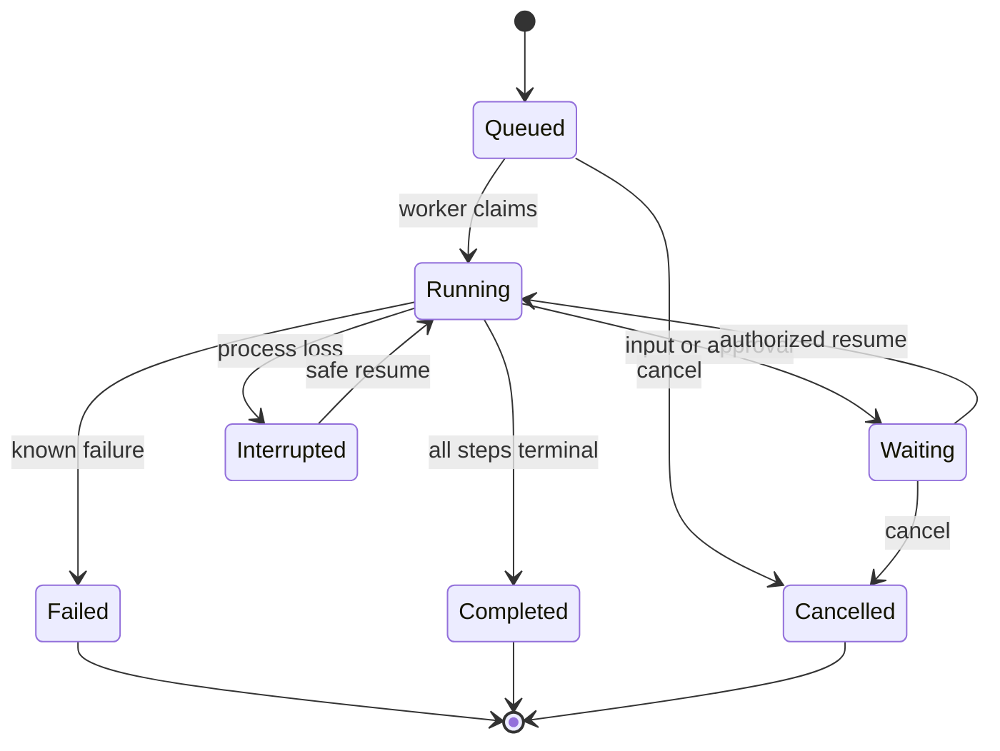

# Triggers and recovery

## Goal

Bind an exact registered workflow to a durable trigger, operate its queue through the
worker, and recover interrupted work without replaying an uncertain external effect.

## Prerequisites

- A validated and registered workflow.
- Input JSON that conforms to the workflow schema.
- A running worker for unattended dispatch.
- For webhooks, an environment reference to at least 32 bytes of HMAC secret material.

## Steps

### 1. Choose one trigger

Create a fixed UTC cadence:

```bash
colossus --config .colossus/config.yaml workflow schedule create nightly \
  release 1.0.0 --cadence-seconds 86400 \
  --inputs '{"branch":"main"}' --misfire fire-once
```

Or subscribe to one canonical domain-event type:

```bash
colossus --config .colossus/config.yaml workflow subscription create new-tasks \
  task-handler 1.0.0 --event-type task.created.v1 \
  --stream-prefix task:
```

Or bind an authenticated webhook:

```bash
colossus --config .colossus/config.yaml workflow webhook create release-hook \
  release 1.0.0 \
  --secret-reference env:COLOSSUS_RELEASE_WEBHOOK_SECRET \
  --replay-window-seconds 300 --max-body-bytes 65536
```

Each trigger pins the exact registered workflow hash and a validated input contract.

### 2. Inspect before enabling unattended work

```bash
colossus --config .colossus/config.yaml workflow schedule show nightly
colossus --config .colossus/config.yaml workflow subscription show new-tasks
colossus --config .colossus/config.yaml workflow webhook show release-hook
```

Keep only the trigger type you actually created. Disable a binding to pause future
dispatch without deleting lifecycle history.

### 3. Run the worker

```bash
colossus --config .colossus/config.yaml worker
```

The worker owns the writer lease, evaluates due schedules and subscriptions, and drains
queued workflow and child-agent work. Use `worker --once` for one coordinated pass.

### 4. Reconcile interrupted work

```bash
colossus --config .colossus/config.yaml workflow status RUN_ID
colossus --config .colossus/config.yaml workflow resume RUN_ID
```

Supply awaited durable input with:

```bash
colossus --config .colossus/config.yaml workflow input \
  RUN_ID '{"approved":true}'
```

Cancel work that should not continue with `workflow cancel RUN_ID`.

## Workflow lifecycle

<div class="diagram-scroll" markdown tabindex="0" role="region" aria-label="Workflow lifecycle state diagram">



</div>

A run moves from queued to running when claimed. Waiting work can resume after input or
approval. Process loss records interruption. If an external effect started without a
terminal event, its step becomes outcome-unknown and is not silently replayed. The
state names and arrows carry the lifecycle independently of color.

## Expected result

The trigger produces deterministic queued runs, the worker records each transition, and
restart reconstructs a run as queued, running, waiting, completed, failed, cancelled, or
interrupted.

## Verification

Inspect the trigger, run status, and recent audit envelopes. For a schedule, use an
explicit `workflow schedule tick --at UTC_TIMESTAMP` in a test configuration to verify
due-time behavior without changing the system clock.

## Failure path

- **Pinned definition changed:** re-register intentionally and create or re-enable a
  binding only after reviewing the new hash.
- **Dispatch is denied:** the item remains pending; resolve the exact policy decision.
- **Webhook authentication fails:** verify exact signed bytes, UTC timestamp, delivery
  ID, and secret reference without logging the secret.
- **Run has outcome-unknown:** reconcile the target system or require operator input;
  do not blindly resume the effect.
- **Schedule backlog is unexpected:** inspect its `fire-once` or `skip` misfire policy.

## Next step

Use [Agent Plugins](../plugins.md) for reusable Agent Skills or
[Integrations](../integrations.md) for strict external operations.
