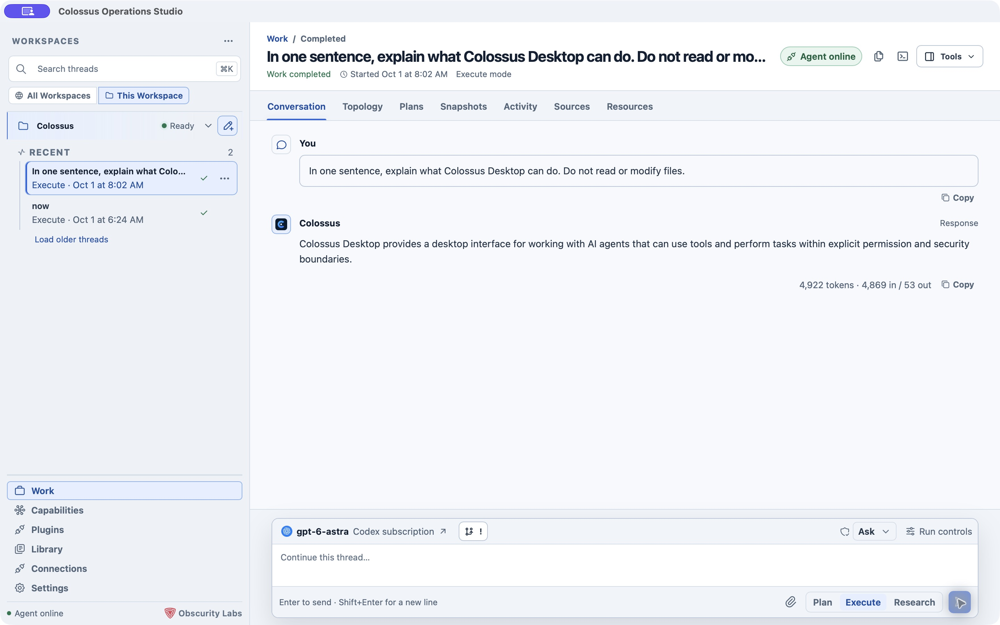

# Start with Desktop on macOS

Colossus Desktop opens a project folder and starts its own local agent runtime. You can begin with an offline self-test, then connect a model when you are ready to work. For the feature tour, see [Desktop overview](../desktop/index.md). Windows users can start with the [Windows installation guide](windows-desktop.md).

## Install the app

On macOS 13 or later with Apple silicon, download the Desktop archive and its adjacent `.sha256` file from [Colossus releases](https://github.com/obscuritylabs/Colossus/releases). Keep the files together and verify the archive before opening it:

```bash
shasum -a 256 -c Colossus-Desktop-*.zip.sha256
```

Expand the ZIP and move **Colossus Desktop** to Applications. Check the release notes for its signing and notarization status. A Developer Preview may need a first-launch **Control-click → Open** approval in macOS; it is a preview build, not a stable production release. A checksum detects changes relative to the published checksum, but does not authenticate the publisher by itself.

## Choose a workspace

First launch walks through **Desktop → Workspace → Provider → Model → Start**.

1. Choose the appearance you want. If your organization gave you a `.colossus-setup` file, select **Import setup file** to review its providers, models, instructions, and optional certificates. [How setup files work](desktop-setup-files.md)
2. On **Workspace**, select a folder with the native picker. Use a project you intend Colossus to inspect or change. Desktop names the workspace after that folder.
3. Review the access profile and execution boundary on the final setup step. **Allow all** with **Full access** lets authorized tools reach host resources outside the selected folder. Choose **Workspace isolated** or **Offline isolated** when the folder must be an execution boundary. [Understand these controls](../desktop/settings.md#access-and-execution-boundaries)

Desktop keeps its managed configuration and conversation state in a private partition under the Colossus home, not in your repository. The app selects **Managed Local** for this path and supervises its bundled runtime. When the workspace reaches **Ready**, the sidebar shows the local agent as online.

### Check startup without a provider

Use the setup flow's **offline self-test** if you only want to check the local runtime. It needs no API key or network connection. A provider-backed conversation becomes available after you select a model.

## Connect a model

On **Provider**, pick a preset such as OpenAI, OpenRouter, or **Codex (ChatGPT subscription)**. For a compatible service, enter its API base URL. On **Model**, choose **Load models** to browse the provider catalog or enter a model ID manually.

For an API-key provider, Desktop opens a native credential prompt. Enter the key there; the conversation view does not receive it. For Codex, install the official Codex CLI, select **Sign in with ChatGPT**, and complete its sign-in flow. Imported setup files can recommend models, but they never contain your API key.

Review the workspace, model, access profile, and execution boundary on **Start**, then choose **Save and start**. When the runtime is ready, the Work composer shows your model and an **Agent online** indicator.

## Run a first task

In **Work**, choose **Plan**, **Execute**, or **Research** beside the prompt box. A gentle first request is:

```text
Explain the structure of this repository. Do not change files.
```

**Plan** creates a plan for review, **Execute** performs an authorized task, and **Research** gathers and organizes sources when that mode is available for the selected runtime. Your thread appears under its workspace in the sidebar. Open it later to continue the conversation or inspect [plans, activity, sources, and resources](../desktop/session-views.md).

[](../assets/screenshots/desktop-conversation.png)

*This response was produced by a live local Managed Local session using a connected Codex model. Its prompt requested no file access or changes.*

## Keep the app available

On macOS, closing the main window hides Desktop in the menu bar while managed work continues. Use the menu bar icon to reopen it, start **New Work**, or open a loaded pinned thread. Choose **Shut Down Colossus** to exit and stop its managed runtime. When work finishes or needs input while the window is hidden or unfocused, macOS may show a notification with the thread title and a short response or error preview. Control these notifications in macOS settings.

## If setup does not finish

- **Needs workspace:** choose an ordinary folder you own through Desktop's native picker. A folder moved or replaced since a previous preview may need to be selected again.
- **Needs provider or model:** select a supported provider and model, complete its sign-in or native API-key prompt, or use the offline self-test first.
- **Provider unavailable:** check the provider preset, endpoint, model ID, credential status, and the workspace's provider test in [Settings](../desktop/settings.md).
- **Runtime integrity failure:** reinstall an intact Desktop release rather than replacing files inside its bundle.
- **Workspace already owned:** leave the existing worker running and use an [External target](../desktop/external-targets.md) if you need to reach it from Desktop.

## What's next?

- [Work with threads](../desktop/work.md) to queue follow-ups and control a run.
- [Open tools beside the conversation](../desktop/tools.md) to inspect files, changes, and outputs.
- [Configure Desktop](../desktop/settings.md) to choose models, access, search, MCP, and other workspace settings.
