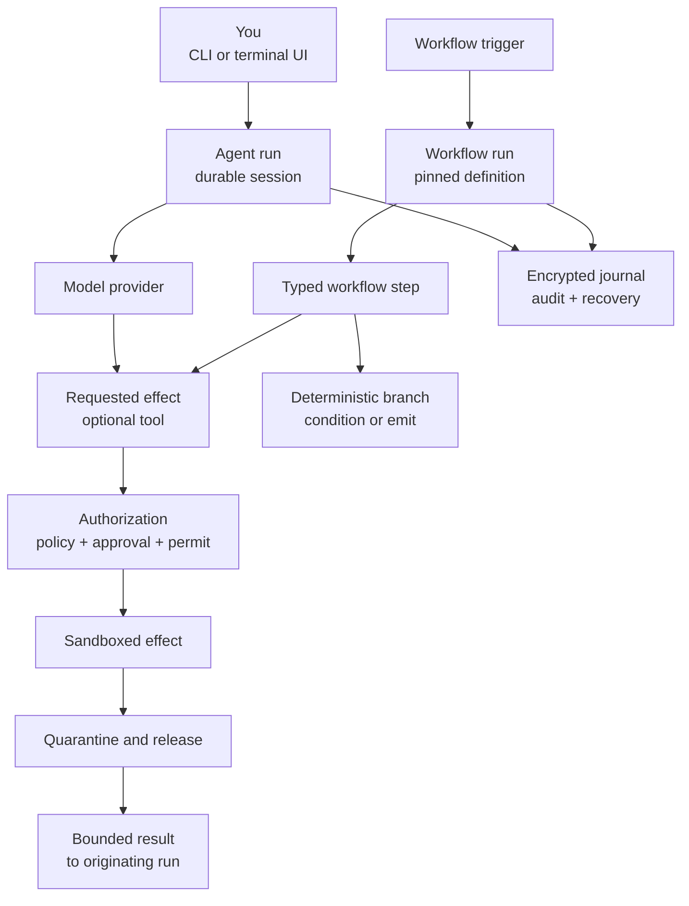

# Colossus

Run auditable AI agents, durable workflows, and policy-controlled tools from one
local-first runtime. Colossus keeps effects, approvals, state, and evidence visible
instead of hiding them behind an opaque assistant.

[Install Colossus](get-started/install.md){ .md-button .md-button--primary }
[Run the five-minute quickstart](get-started/quickstart.md){ .md-button }

## Why Colossus

### Work interactively

Use the terminal UI for repository tasks, streamed responses, approvals, durable
sessions, plans, goals, memories, and subagents. The transcript and current work survive
restart.

### Automate durable work

Author versioned YAML workflows with bounded steps, explicit inputs, schedules,
authenticated webhooks, repository-event triggers, recovery, and audit evidence.

### Control every effect

Tools are visible only when selected and configured. Policy, approval, one-use permits,
sandbox grants, result quarantine, and audit remain separate checks around every
effectful operation.

{ .tui-shot }

## The product mental model

Read the diagram from left to right: an interactive agent run and a triggered workflow
run are separate durable run types. Agent runs use a model; workflows may stay entirely
deterministic or execute an agent/tool step. Colossus authorizes and constrains each
requested effect before execution, releases allowed results back to the originating
run, and appends lifecycle evidence to the encrypted journal. Color is decorative—the
labels and arrows carry the meaning.

## Choose your path

### Get started

Install Colossus and complete a deterministic offline run in five minutes.

[Start here](get-started/index.md)

### Use Colossus

Run daily repository work with the terminal UI, durable sessions, goals, and research.

[Follow a user guide](use/index.md)

### Automate and extend

Build workflows, skills, integrations, MCP connections, packs, and collections.

[Build an extension](extend/index.md)

### Administer and secure

Configure providers, access, policy, sandboxing, storage, audit, and offline operation.

[Operate Colossus](admin/index.md)

### Reference

Look up exact commands, keys, fields, schemas, formats, and limits.

[Open Reference](reference/index.md)

### Develop

Set up the source tree and understand runtime, security, state, and presentation
boundaries.

[Contribute to Colossus](develop/index.md)

For migration guidance, see
[Upgrade and compatibility](get-started/upgrade-compatibility.md).
