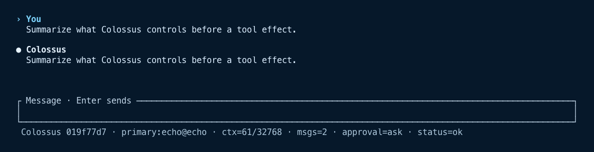
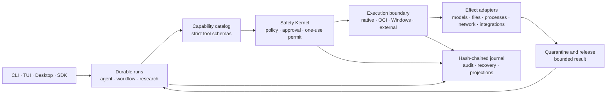

<section class="home-hero" markdown>

COLOSSUS · ALPHA

# Agent operations for mission environments

Colossus is an alpha-stage runtime for organizations that need
AI agents to perform real work under explicit authority. Policy, approvals, sandbox
boundaries, durable state, and audit evidence stay part of the operation whether the
system is connected, local, or offline.

[Start offline](get-started/quickstart.md){ .md-button .md-button--primary }
[Read the security model](develop/security-architecture.md){ .md-button }

Alpha software means change is expected. Review
[upgrade and compatibility guidance](get-started/upgrade-compatibility.md) before
updating a deployment you depend on.

</section>

<figure class="home-proof" tabindex="0">
  
  <figcaption class="home-proof__caption">The current terminal launch rail names the
  workspace, model route, sandbox profile, approval mode, and security posture before
  work begins.</figcaption>
</figure>

<section class="home-outcomes" aria-labelledby="operational-assurance" markdown>

## Operational assurance, not hidden autonomy { #operational-assurance }

Colossus is being built for enterprise, public-sector,
regulated, and disconnected environments where an agent action must be reviewable,
bounded, and recoverable.

:lucide-file-check-2:{ .home-outcome__icon }

### Account for every effect

Requested actions, policy decisions, approvals, execution, release, and uncertain
outcomes produce durable evidence in a hash-chained journal.

[Audit and recovery](admin/audit-telemetry-recovery.md)

:lucide-shield-check:{ .home-outcome__icon }

### Enforce the boundary

Strict schemas, one-use permits, sandbox profiles, resource ceilings, and quarantined
output keep authority explicit from request through release.

[Sandbox and isolation](admin/sandbox.md)

:lucide-unplug:{ .home-outcome__icon }

### Operate online or offline

Use hosted or local models, run a credential-free offline proof, and prepare controlled
or air-gapped deployments without changing the core authorization path.

[Offline operation](admin/offline-airgap.md)

</section>

<section class="home-mental-model" aria-labelledby="how-colossus-governs-work" markdown>

## How Colossus governs work

Interfaces start durable work but do not own model, policy, tool, or state behavior.
The runtime validates a requested capability, authorizes one exact effect, binds it to
an execution boundary, and releases bounded output only after the required checks.
Lifecycle evidence remains available for audit and recovery.

[Explore the architecture](develop/architecture.md) or
[inspect the effect lifecycle](develop/security-architecture.md).

</section>

<section class="home-audiences" aria-labelledby="choose-your-path" markdown>

## Choose your path

Start with the operational outcome you need.

[Evaluate Colossus](get-started/index.md)

Install it and prove the runtime offline before adding credentials.

[Secure a deployment](admin/index.md)

Configure identity, access, isolation, storage, policy, and audit.

[Connect your systems](extend/index.md)

Add workflows, enterprise integrations, standalone MCP servers, and OCI-distributed Agent Plugins.

[Build with Colossus](develop/index.md)

Use the application SDKs or work on the Rust runtime and Desktop.

Looking for exact commands, fields, schemas,
formats, or limits? [Open the Reference](reference/index.md).

</section>

