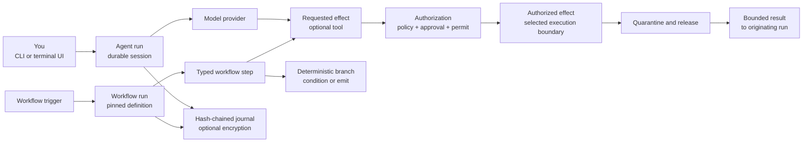

# Colossus

Run auditable AI agents, durable workflows, and
policy-controlled tools from one local-first runtime. Effects, approvals, state, and
evidence stay visible.

[Run the five-minute quickstart](get-started/quickstart.md){ .md-button .md-button--primary }
[Install Colossus](get-started/install.md){ .md-button }

<figure class="home-proof" tabindex="0">
  
</figure>

<section class="home-outcomes" aria-labelledby="why-colossus" markdown>

## Why Colossus { .home-visually-hidden }

:lucide-message-square:{ .home-outcome__icon }

### Work interactively

Use the terminal UI for conversational control with full visibility into every step.

[Use the terminal UI](use/terminal-ui.md)

:lucide-network:{ .home-outcome__icon }

### Automate durable work

Author versioned YAML workflows with retries, checkpoints, and approvals.

[Build your first workflow](extend/workflows/first-workflow.md)

:lucide-shield-check:{ .home-outcome__icon }

### Control every effect

Inspect every effect and choose acknowledged full host access or an explicit
least-privilege boundary for tools, data, network, and execution.

[Understand access and approvals](admin/access-and-approvals.md)

</section>

<section class="home-audiences" aria-labelledby="find-your-path" markdown>

## Find your path

Documentation organized around your role and the outcome
you need.

[User](get-started/index.md)

Install Colossus and complete your first task.

[Operator](admin/index.md)

Run, monitor, and secure workloads.

[Extension author](extend/index.md)

Build workflows, skills, and integrations.

[Developer](develop/index.md)

Work with the source tree and architecture.

Looking for exact commands, fields, schemas, formats,
or limits? [Open the Reference](reference/index.md).

</section>

<section class="home-mental-model" aria-labelledby="the-product-mental-model" markdown>

## The product mental model

Interactive agent runs and triggered workflow runs are separate durable run types.
Colossus authorizes and constrains each requested effect before execution, releases an
allowed result only to its originating run, and records lifecycle evidence in the
hash-chained journal. Configured platform or environment keys add authenticated payload
encryption. The labels and arrows carry the meaning; color is decorative.

</section>

Moving from an earlier release? See
[Upgrade and compatibility](get-started/upgrade-compatibility.md).

