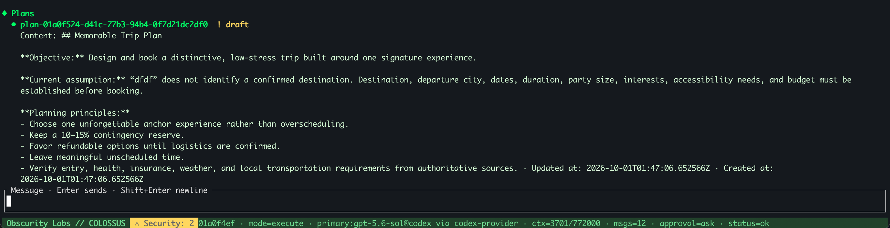

# Planning

For a change that spans several steps, start in Plan Mode. Colossus can inspect the
repository and save a plan you can review before any implementation starts. After you
approve it, choose one execution run or a bounded Goal Mode loop for longer work.

The handoff is **Draft → Review and refine → Approved → Direct or Goal Mode**. The
plan and its revisions are durable records; Goal Mode adds a durable goal. The
terminal's current mode and selected plan are temporary UI state.

## Draft a plan in the terminal

Start from the session where you want the work to live:

```text
/plan new
```

Then send a planning prompt, for example:

> Plan an authentication change in this repository. Include implementation,
> verification, risks, and steps that will change files.

`/plan new` enters Plan Mode with no plan selected. Your prompt creates a Draft.
Plan Mode permits inspection and a single durable plan write per completed turn. It
does not offer file writes, command execution, network requests, or delegation to the
model. A plan can describe those later actions, but creating it does not perform them.

### Read the saved Draft

This shortened result from a trip-planning run shows the two statuses you may see:

```text
✓ Completed plan.create
  Status    ok

  Status    draft
  Id        plan-01a0f524-d41c-77b3-94b4-0f7d21dc2df0
  Revision  1
  Steps     10 items
```

The first **Status** says the `plan.create` call succeeded. The second says the saved
plan is still a **Draft**. Copy its ID if you want to select it later. The output also
contains the plan's prompt and model-written content; **Steps** counts its ordered
steps. Refining the Draft advances its revision.

The review dock shows the plan's ordered steps. Choose **Keep refining** to add
specifics, **Approve** when it is ready, or **Discard** if the approach is wrong. You
can also inspect the saved record directly:

```text
/plan show
```

While the Draft is selected, another ordinary prompt in Plan Mode updates that same
plan and advances its revision. For example:

> Add a focused failure-path test and a way to verify the migration before changing
> production data.

Plan steps describe work to do; they are separate from the durable Tasks shown by
`/tasks`. Use Tasks when you want independent status tracking.

## Approve and choose the control loop

Review the latest revision, then approve it:

```text
/plan show
/plan approve
```

Approval opens the execution choice. Choose **Direct** for one model run or **Goal
Mode** for work that may need several iterations. No strategy is preselected. The
dock's Goal Mode choice uses five iterations. To set a different budget, press **Esc**
to close the dock, then enter an explicit command:

=== "Direct"

    ```text
    /plan execute direct
    ```

=== "Goal Mode"

    ```text
    /plan execute goal 12
    ```

Run only one strategy for a given plan. Goal Mode accepts a budget from 1 to
50 iterations; omitting the number uses 5. The budget is a ceiling, not a promise that
Colossus will use every iteration or finish the task.

| Execution choice | What happens |
| --- | --- |
| Direct | One ordinary execution run follows the approved plan. |
| Goal Mode | A durable goal keeps the plan as its source and runs bounded iterations in the same session. Each iteration can make progress, finish the goal, or mark it blocked. |

### How the Goal loop works

Each iteration uses the normal model, tools, policy, approvals, sandbox, and audit
path. Approval of the plan does not preapprove its future tool calls. If the goal is
still **Active** after an iteration, Colossus starts another until the budget is
spent. The model can mark it **complete** when the objective is met, or **blocked**
when progress needs your input or an external change.

Once execution starts, the approved plan is consumed and cannot be run again. The
plan and its execution evidence remain inspectable, including when the later run
fails or is cancelled.

## Return to work after an interruption

Use the same workspace and session to find the records:

```text
/plans
/goals
```

The `/plans` listing shows the saved plan even when the footer says
`mode=execute`. Here is the trip-planning Draft from the example above:



[Open the full-size plans screenshot](../assets/screenshots/plans-list.png).

After restarting the TUI, Plan Mode and its selection reset. To work with an existing
Draft or Approved plan, select it again with `/plan use PLAN_ID`. An Approved plan
cannot be refined; create a new Draft if the approach needs to change.

If execution already created a Goal, inspect its status and remaining budget:

```bash
colossus goals show GOAL_ID
```

A cancelled or failed Goal remains **Active**. Resume it in the same session only
when iterations remain:

```text
/goal resume GOAL_ID
```

Resume continues the existing goal and its remaining budget. It does not start a new
plan or reset the iteration count. If the budget is exhausted or the Goal is complete
or blocked, inspect the recorded result and decide on a new piece of work. When an
external effect has an unknown outcome, inspect its evidence before attempting it
again.

## Plan from a shell command

For a noninteractive workflow, create a Draft in an existing session and inspect the
saved plan before approving it:

```bash
colossus run --plan --session SESSION_ID \
  "Plan the repository change and its verification"
colossus plans list --session SESSION_ID
colossus plans show PLAN_ID
```

The CLI also provides `plans approve PLAN_ID` and `run --execute-plan PLAN_ID`; add
`--goal --goal-max-iterations 12` to use the bounded Goal loop. A noninteractive run
may need an explicitly chosen approval mode for the approval and later effects. See
[Tasks, decisions, and plans](tasks-decisions-plans.md) for the full record lifecycle
and [TUI commands and keys](../reference/tui.md#plan-workflow) for every interactive
command.

## What's next?

<div class="grid cards" markdown>

-   :lucide-rotate-cw:{ .lg .middle } **Goals and subagents**

    ---

    Run a bounded goal without a plan or delegate independent work.

    [Explore goals :lucide-arrow-right:](goals-subagents.md)

-   :lucide-messages-square:{ .lg .middle } **Sessions**

    ---

    Find the conversation and continue its work later.

    [Resume a session :lucide-arrow-right:](sessions.md)

</div>
