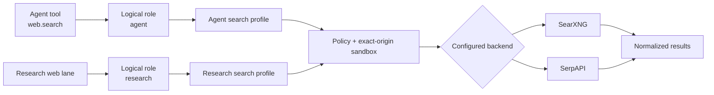

# Research and web search

## Goal

Run offline repository research, inspect its sources and claims, and use a configured
provider-neutral web route without letting the model select the search backend.

## Prerequisites

- A provider route suitable for research planning and synthesis.
- A readable repository root for the offline lane.
- For web evidence, an operator-configured `search.roles.research` route, exact network
  origin, and credential reference when required.
- For MCP evidence, an explicitly configured and allowed server.

## Steps

### 1. Run repository-only research

```bash
colossus --config .colossus/config.yaml --approval-mode ask \
  research run \
  "How does effect authorization work?" \
  --source repo --depth standard
```

Repository evidence works offline. Missing web or MCP lanes become durable limitations
rather than fabricated sources. The development access profile conservatively classifies
`research.run` as approval-required even for a repository-only lane, so the noninteractive
CLI must opt into the terminal approval prompt with the global `--approval-mode ask`
option.

### 2. Inspect evidence and claims

```bash
colossus --config .colossus/config.yaml research list
colossus --config .colossus/config.yaml research show RESEARCH_RUN_ID
colossus --config .colossus/config.yaml research sources RESEARCH_RUN_ID
colossus --config .colossus/config.yaml research claims RESEARCH_RUN_ID
```

The final report is appended as an assistant message. Raw sources and extracted claims
remain in their research streams.

### 3. Diagnose a web route directly

```bash
colossus --config .colossus/config.yaml search profiles
colossus --config .colossus/config.yaml --approval-mode ask \
  search query \
  "provider-neutral search" --role research --limit 5
```

`search profiles` does not resolve credentials or open a socket. `search query` crosses
the normal effect gateway. Under the development access profile it requires approval;
`--approval-mode ask` lets this noninteractive command prompt instead of failing closed.

### 4. Run research with selected lanes

```bash
colossus --config .colossus/config.yaml --approval-mode ask \
  research run \
  "Compare the repository design with its published security claims" \
  --source repo,web --depth deep
```

The operator chooses route metadata in configuration. The model supplies only a query
and bounded result limit. The web lane dispatches only after the operator approves the
external-network obligation at the prompt.

## Search routing

<div class="diagram-scroll diagram-scroll--wide" markdown tabindex="0" role="region" aria-label="Search routing diagram">



</div>

The two consumers resolve separate logical roles. Each role names one configured
profile, which crosses policy and exact-origin enforcement before reaching its backend.
Both adapters return the same bounded result shape. There is no automatic fallback,
load balancing, or implicit retry; labels and arrows make the flow understandable
without color.

## Expected result

The research record contains a cited report, stable source labels, extracted claims, and
explicit limitations. Web results contain normalized rank, title, URL, snippet, and
optional source—not provider-specific envelopes.

## Verification

Open `research sources` and confirm each material claim has released evidence. Compare
the configured route shown by `search profiles` with the intended operator route.

## Failure path

- **Research route unavailable:** map the needed research roles or rely on the
  repository lane.
- **Search route unavailable:** configure `search.roles.research`; routes do not fall
  back.
- **Origin is denied:** add the exact scheme, host, and port through operator
  configuration.
- **Search outcome is unknown:** inspect provider state or billing before retrying.
- **A result page is needed:** search returns metadata only; fetch the selected exact URL
  through the separately authorized `web.fetch` operation.

## Next step

Operators can configure providers and search under
[Providers and routing](../admin/providers-routing.md#configure-search-routing). The
exhaustive fields live in [Configuration fields](../reference/configuration.md#search).
Extension authors can connect new sources through [Integrations](../extend/integrations.md) or
[MCP](../extend/mcp.md).
