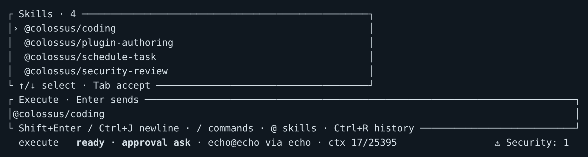

# Skills and plugins

A **skill** gives Colossus instructions for a particular kind of work. A **plugin**
packages skills and may also include resources or MCP server declarations. The CLI
includes the `colossus` plugin with `coding`, `plugin-authoring`, `schedule-task`, and
`security-review` skills.

Use `coding` to implement features, fix bugs, debug failures, or refactor software. It
guides repository inspection, implementation, and verification. Follow your environment's
instructions for internal package registries, documentation locations, and network
constraints, including in air-gapped deployments. The former bundled `offline-dev`
skill has been removed; use `coding` with your environment's development guidance.

## Choose a skill for one message

Type `@` in the terminal composer to open the skill picker. Use **Up/Down** to choose
a qualified name and **Tab** to insert it. Then write your request and press
**Enter**:

```text
@colossus/coding Fix the error handling in this module and verify the failure paths.
```



The selected skill applies to this message. The picker shows skills from plugins
available in the current workspace; type a qualified `@PLUGIN/SKILL` name directly
if you already know it. [Open the full-size screenshot](../assets/screenshots/skill-picker.png).

## Keep a skill selected for the conversation

Use `/plugin skills` to see available qualified skills, then select one for later
messages in this conversation:

```text
/plugin skills
/plugin use colossus/coding
/plugin active
```

The sticky selection stays active until you remove it, clear all selections, or end
the conversation. You can still add a skill to a single message with `@`.

```text
/plugin remove colossus/coding
/plugin clear
```

If an existing conversation selected `colossus/offline-dev`, switch it to `coding`:

```text
/plugin remove colossus/offline-dev
/plugin use colossus/coding
```

Use `@colossus/schedule-task` to create or control recurring tasks through the scheduling tools. See [Workflows and schedules](../desktop/schedules.md#start-with-an-example-or-an-agent) for prompts and timing behavior.

Use `/plugin show colossus/coding` to read the skill instructions. A plugin can offer
several skills; selecting its name in plugin inventory does not select them all.

## Inspect plugins

Enter `/plugins` to see installed plugin candidates and their status. Use
`/plugins show colossus` for one plugin. A plugin must be enabled and available in
the workspace before its skills can be selected. Installing a plugin and enabling it
are separate operations.

Skills guide the agent's behavior; they do not add tool permissions or bypass
approvals. An MCP server packaged with a plugin also needs its own explicit server
enablement and tool selection. See [MCP servers](mcp-servers.md) to inspect
configured servers.

## What's next?

<div class="grid cards" markdown>

-   :lucide-box:{ .lg .middle } **Agent Plugins**

    ---

    Author, install, verify, and enable a plugin with its own skills and resources.

    [Explore Agent Plugins :lucide-arrow-right:](../extend/plugins.md)

-   :lucide-network:{ .lg .middle } **MCP servers**

    ---

    See which external tool servers are configured and discover their tools.

    [Explore MCP servers :lucide-arrow-right:](mcp-servers.md)

</div>
