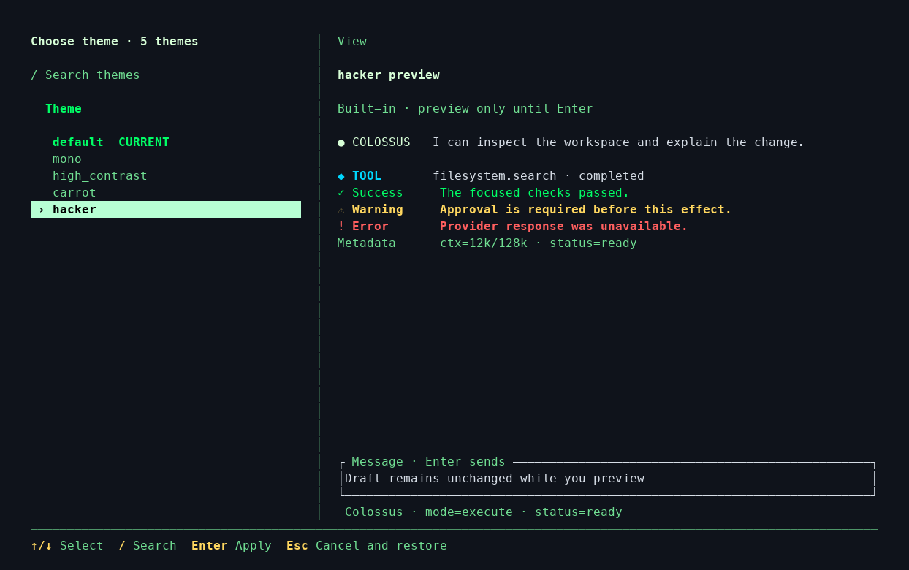

# Theme

Enter `/theme` in the terminal UI to open the full-screen theme browser. Themes
and search appear on the left, with a view of the selected theme on the right. Moving through the list
previews each theme immediately. Press **Enter** to apply and save the selected theme,
or **Esc** to restore the one you were using.

```text
/theme
```



The screenshot previews `hacker` while `default` remains marked as the current
theme. Press **Enter** to save the selection.
[Open the full-size screenshot](../assets/screenshots/theme-picker.png).

Use **Up/Down** to move between themes and **/** to search by name. When search is
active, the first **Esc** leaves search; press **Esc** again to close the browser.
The selected theme remains in your terminal preferences after you leave the TUI.

## Built-in themes

| Theme | Appearance |
| --- | --- |
| `default` | Balanced blue |
| `mono` | Color-free |
| `high_contrast` | Strong contrast |
| `carrot` | Warm orange |
| `hacker` | Green terminal |

You can also choose a theme directly from the composer:

```text
/theme high_contrast
```

## List, preview, or reset

```text
/theme list
/theme preview hacker
/theme reset
```

`/theme list` shows the active theme, all installed choices, and the folders searched
for custom themes. `/theme preview NAME` shows a sample without changing your
selection. `/theme reset` restores `default`. For the other terminal commands and
keys, see [TUI commands and keys](../reference/tui.md).

## Create your own theme

<div class="grid cards" markdown>

-   :lucide-paintbrush:{ .lg .middle } **Author a terminal theme**

    ---

    Start with a TOML file, choose colors and labels, then load it in the TUI.

    [Create your own theme :lucide-arrow-right:](../extend/author-theme.md)

</div>
