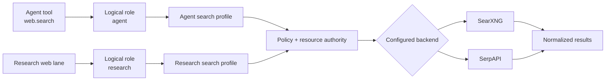

# Web search

## Goal

Run one explicit web search, receive normalized result metadata, and understand when to
use the `agent` or `research` route. A direct search does not create a durable research
run, extract claims, or synthesize a cited report.

## Prerequisites

- An operator-configured `search.roles.agent` or `search.roles.research` route.
- Under an isolating boundary, the search profile's exact HTTPS origin (or exact
  loopback HTTP origin) in `sandbox.networkDestinations`.
- The profile's environment-backed credential when its backend requires one.
- Permission to perform the `web.search` action. Under the development access profile,
  a noninteractive command needs `--approval-mode ask` to prompt instead of failing
  closed.

Operators can complete these prerequisites in
[Providers and routing](../admin/providers-routing.md#configure-search-routing).

## Steps

### 1. Inspect safe profile metadata

```bash
colossus --config .colossus/config.yaml search profiles
```

This command shows profile names, adapter kinds, endpoints, credential references, and
timeouts. It does not resolve credential values or open a network connection. Review
`search.roles` with `config show` when you need to confirm which profile a role names:

```bash
colossus --config .colossus/config.yaml config show
```

### 2. Choose a logical role

Use `agent` for the model-facing `web.search` tool path. Use `research` to exercise the
route reserved for a durable research run's web-evidence lane. The two roles are
configured independently and never fall back to each other.

A direct CLI query may select either role. Selecting `research` here still performs only
one search; it does not start deep research.

### 3. Run a one-shot search

```bash
colossus --config .colossus/config.yaml \
  --output json \
  --approval-mode ask \
  search query \
  "provider-neutral search" \
  --role agent \
  --limit 5
```

Set the role and limit explicitly when a reproducible diagnostic matters. Exact defaults
and accepted bounds live in the
[CLI reference](../reference/cli.md#important-defaults-and-bounds). Colossus sends the
query through the selected profile, policy gateway, request-bound declared or ambient
network-authority check, quarantine, and post-effect release decision.

### 4. Read the normalized response

The JSON root is an object, not a provider-specific result array:

```json
{
  "query": "provider-neutral search",
  "count": 1,
  "results": [
    {
      "rank": 1,
      "title": "Example result",
      "url": "https://example.com/result",
      "snippet": "A bounded provider-supplied snippet.",
      "source": "example-engine"
    }
  ]
}
```

Every result has a one-based `rank`, `title`, credential-free HTTP(S) `url`, and
`snippet`. `source` is nullable. Colossus discards unsafe URLs and returns normalized
fields rather than the backend's raw response envelope.

### 5. Fetch a result only when needed

Search returns result metadata and snippets; it does not retrieve the selected page.
Fetching an exact URL is a separate `web.fetch` or `network.http` effect with its own
authorization and network-origin requirements. For a direct CLI fetch, use the
separately approved network command:

```bash
colossus --config .colossus/config.yaml \
  --approval-mode ask \
  network get https://example.com/result
```

## Search routing

<div class="diagram-scroll diagram-scroll--wide" markdown tabindex="0" role="region" aria-label="Search routing diagram">



</div>

Reading the diagram without color: the agent tool and research web lane resolve distinct
logical roles. Each role names one operator-configured profile. Both profiles cross the
same policy and request-bound resource-authority check before their backend results are
normalized. Isolation uses declared exact origins; acknowledged full access uses
ambient HTTP(S) authority.

## Expected result

The command returns one `SearchResponse` object containing the original query, a bounded
count, and normalized ranked results. It does not create a session, research run,
canonical research sources, extracted claims, or a synthesized report.

## Verification

Confirm that:

- `search profiles` shows the intended safe profile metadata.
- `config show` maps the selected logical role to that profile.
- `count` equals the number of objects in `results`.
- Every returned URL uses HTTP or HTTPS and contains no embedded credentials.
- A fetched page body appears only after a separately authorized fetch.

## Failure path

- **Role is unavailable:** configure the exact `agent` or `research` mapping; there is no
  cross-role fallback.
- **Origin is denied under isolation:** add the profile's exact scheme, host, and
  effective port to `sandbox.networkDestinations`.
- **Approval is unavailable:** run from a terminal with `--approval-mode ask`, or ask an
  operator to grant the action through the configured policy.
- **Credential is unavailable:** set the environment variable named by the profile's
  credential reference. Colossus does not accept an inline secret.
- **Outcome is unknown:** a transport failure after dispatch may have consumed provider
  quota. Inspect provider state or billing before retrying.
- **The result lacks page detail:** authorize and fetch the chosen exact URL separately;
  search intentionally returns metadata and snippets only.

## Next step

Use [Deep research](deep-research.md) when you need a durable multi-query run with
repository, web, or MCP evidence, stable source labels, claims, limitations, and a cited
report. Operators can change routes in
[Providers and routing](../admin/providers-routing.md#configure-search-routing).
Exhaustive fields and bounds remain in
[Search configuration](../reference/configuration/search.md).
Version-specific notes live in
[Upgrade and compatibility](../get-started/upgrade-compatibility.md).
