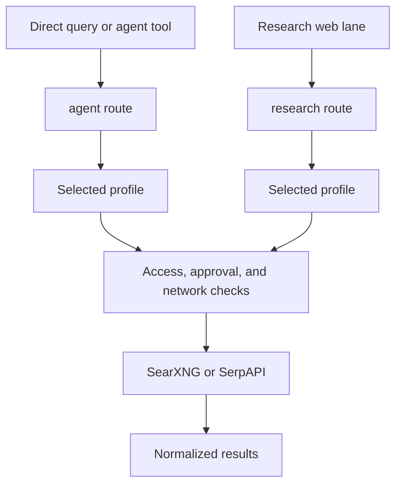

# Search

Search gives Colossus ranked web results and snippets through a configured search
provider. You can issue one query from the CLI, let an agent use the `web.search`
tool, or use search as the web evidence lane of a research run. The provider is
chosen in configuration, so a prompt cannot switch the destination or credential.

## Run a direct search

In a configured workspace, inspect the available search profiles:

```bash
colossus -w /absolute/path/to/repository search profiles
```

The listing shows profile names, adapters, endpoints, and credential references,
without exposing credential values. From the same workspace, use `config show` to
check which profile the `agent` and `research` roles name.

Then run a bounded query. This example asks for five results on the `agent` route
and selects JSON so the result shape is explicit:

```bash
colossus -w /absolute/path/to/repository \
  --output json --approval-mode ask \
  search query "Colossus release notes" --role agent --limit 5
```

The default role for `search query` is `agent`, and the default limit is 10;
the maximum is 20. A search route, any required credential, tool access, and
network authority must already be configured. One-shot commands default to
`deny` for outstanding approval requests; `ask` prompts in an attached terminal.
See [Search configuration](../reference/configuration/search.md)
for the profile fields and [Access and approvals](../admin/access-and-approvals.md)
for the approval modes.

## Read the result

A search returns one provider-neutral object. This is an illustrative response:

```json
{
  "query": "Colossus release notes",
  "count": 1,
  "results": [
    {
      "rank": 1,
      "title": "Example release page",
      "url": "https://example.com/releases",
      "snippet": "A short excerpt supplied by the search provider.",
      "source": "example-engine"
    }
  ]
}
```

`count` is the number of returned results. Each result has a one-based `rank`, a
`title`, an HTTP(S) `url` without embedded userinfo credentials, and a bounded
`snippet`. `source` may be `null`; it is provider metadata, not a verified
citation. Colossus drops results with invalid or unsafe URLs and normalizes
provider fields before releasing them.

A snippet helps you choose what to inspect next. Search does not fetch the page
body. Fetching a selected URL is a separate authorized effect, for example:

```bash
colossus -w /absolute/path/to/repository \
  --approval-mode ask network get https://example.com/releases
```

## Choose the right search path

| Path | What happens | Route |
| --- | --- | --- |
| `colossus search query` | Runs one explicit query and returns normalized results. | `agent` by default; `--role research` is also available. |
| Agent `web.search` tool | Lets a model request a search during a task when the tool is available. | `agent` |
| Research web lane | Searches planned queries and retains released evidence in a durable, cited report. | `research` |

The `agent` and `research` routes can use different profiles and do not fall back
to one another. Selecting `--role research` for a direct query still returns only
search results; it does not start a research run. In the Terminal UI, you can ask an
agent to find information; when `web.search` is available, the agent may call it.
Use the direct CLI command when you need a specific query and limit. Use
[Deep research](deep-research.md)
when you need planned queries, source records, claims, limitations, and a report.
For repository files, inspect the available [filesystem and repository tools](tools.md).

## How search reaches a provider

An operator maps each logical route to a named search profile. The profile selects
either a SearXNG JSON endpoint or SerpAPI. Before a query leaves the workspace,
Colossus checks the `web.search` action, any approval obligation, and the
configured network authority. It then adapts the provider response into the
same `query` / `count` / `results` shape for both backends.

<div class="diagram-scroll" markdown tabindex="0" role="region" aria-label="Search route and provider diagram">


```mermaid
flowchart TB
    A["Direct query or agent tool"] --> AR["agent route"]
    R["Research web lane"] --> RR["research route"]
    AR --> AP["Selected profile"]
    RR --> RP["Selected profile"]
    AP --> G["Access, approval, and network checks"]
    RP --> G
    G --> B["SearXNG or SerpAPI"]
    B --> N["Normalized results"]
```

</div>

Reading the diagram without color: a direct or agent search uses the `agent`
route unless the direct command explicitly selects `research`. A research run's
web lane uses the `research` route. Each route resolves a configured profile,
passes the same effect checks, and returns normalized results. Under an isolating
sandbox, the provider's exact origin must be allowed. See
[Providers and routing](../admin/providers-routing.md#configure-search-routing)
for setup choices.

## If search is unavailable

| Symptom | What to check |
| --- | --- |
| No search route | Run `search profiles` and inspect `search.roles` with `config show`; configure the exact `agent` or `research` route. |
| Approval or policy denial | Review the action and approval mode. Approval cannot reverse a policy denial. |
| Origin blocked | Under isolation, allow the profile's exact scheme, host, and port. |
| Credential missing | Set the environment variable referenced by the profile; keep its value out of YAML. |
| Results lack page detail | Fetch the chosen URL separately after authorizing that effect. |

A transport failure after dispatch can leave provider usage uncertain. Inspect the
provider's state before retrying a query that could consume quota.

## What's next?

<div class="grid cards" markdown>

-   :lucide-book-open:{ .lg .middle } **Deep research**

    ---

    Build a durable, cited report from repository, web, or MCP evidence.

    [Investigate a question :lucide-arrow-right:](deep-research.md)

-   :lucide-settings:{ .lg .middle } **Search configuration**

    ---

    Review exact profile, route, credential, and network settings.

    [Configure search :lucide-arrow-right:](../reference/configuration/search.md)

</div>
